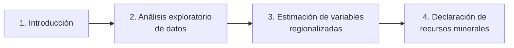

---
tags:
  - ICMI222
  - Apuntes de clase
---

# PPT 00 · Presentación del curso

!!! quote "Fuente"
    Resumen propio de la presentación **PPT 00** del curso ICMI222. No reemplaza el material
    original de clases.

## De qué se trata el ramo

El curso recorre el camino completo de una **estimación de recursos minerales**, en cuatro bloques:

| Bloque | Qué se aprende | Apuntes |
|---|---|---|
| Introducción | Qué es la geoestadística, sondajes, persona competente, QA/QC | [PPT 01](01-introduccion.md) |
| Análisis exploratorio | Estadística descriptiva, gráficos, soporte, dominios, capping | [PPT 02](02-aed-estadisticas-basicas.md) · [PPT 03](03-aed-decisiones.md) |
| Estimación | Variable regionalizada, dominios, compósitos, variograma, kriging | [PPT 04](04-variable-regionalizada.md) a [PPT 07](07-modelamiento-variogramas.md) |
| Declaración de recursos | Clasificación y reporte según código (Comisión Minera / CRIRSCO) | pendiente |

## Evaluaciones (sede Concepción)

| Evaluación | Peso | Fecha |
|---|---|---|
| Solemne 1 | 15 % | 31 de agosto |
| **Solemne 2** | 15 % | **5 de octubre** |
| Laboratorio | 12 % | 16 de noviembre |
| Solemne 3 | 16 % | 23 de noviembre |
| Terreno | 12 % | sujeto a factibilidad |

!!! tip "Solemne 2"
    Según la PPT 07, la Solemne 2 cubre **variogramas experimentales y modelamiento**:
    repasar [PPT 06](06-variograma-experimental.md) y [PPT 07](07-modelamiento-variogramas.md).

## Bibliografía del curso

| Texto | Para qué sirve |
|---|---|
| Comisión Minera (2015). *Código para informar sobre los resultados de exploración, recursos y reservas minerales.* | Norma chilena de reporte; base del bloque 4 |
| Rossi, M.E. & Deutsch, C.V. (2014). *Mineral Resource Estimation.* Springer. | Texto guía de la práctica de estimación |
| Isaaks, E.H. & Srivastava, R.M. (1989). *An Introduction to Applied Geostatistics.* Oxford. | El clásico introductorio: AED, variograma, kriging |
| Alfaro, M. (2007). *Estimación de Recursos Mineros.* USACH. | Teoría en español (variable regionalizada, variograma) |
| Deutsch, C.V. (2002). *Geostatistical Reservoir Modeling.* Oxford. | Modelamiento y simulación |
| Remy, Boucher & Wu (2009). *Applied Geostatistics with SGeMS.* Cambridge. | Práctica con software libre |
| Leuangthong, Khan & Deutsch (2008). *Solved Problems in Geostatistics.* Wiley. | Ejercicios resueltos |
| Chilès & Delfiner (2012). *Geostatistics: Modeling Spatial Uncertainty.* Wiley. | Referencia avanzada |
| Pitard, F.F. (2019). *Theory of Sampling and Sampling Practice.* CRC Press. | Teoría del muestreo y QA/QC |

Otra fuente que se recomienda en clases: los **reportes técnicos NI 43-101**, que muestran el
flujo real de una estimación (compositación, AED, valores extremos, variografía, modelo de
bloques y estimación).
