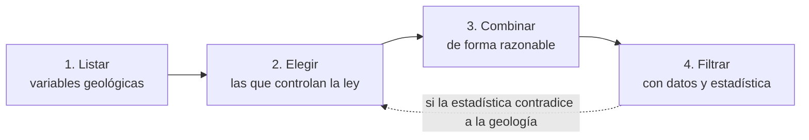

---
tags:
  - ICMI222
  - Apuntes de clase
  - Dominios
  - Compositación
---

# PPT 05 · Dominios, contactos y compositación

!!! quote "Fuente"
    Resumen propio de la presentación **PPT 05** del curso ICMI222 (semana 7).
    Lectura: Rossi & Deutsch (2014), caps. 4 y 5; Alfaro (2007), cap. II.

## La pregunta de la clase

> Tengo un bloque que estimar. ¿Con cuáles muestras lo estimo?

- Si uso **todas**, mezclo óxidos con sulfuros y el resultado no describe a ninguno.
- Si uso solo las **muy cercanas**, me quedan tan pocas que nada es confiable.
- La respuesta del medio: las muestras **del mismo dominio**, llevadas al **mismo tamaño**.

## Dominio de estimación

Volumen de roca donde la mineralización se comporta **parecido en todas partes**: misma media,
misma dispersión, misma continuidad. No significa leyes iguales, sino propiedades estadísticas
consistentes, de modo que las muestras del dominio sirven para estimar sus bloques. A eso se le
llama **estacionariedad** (ver [PPT 04](04-variable-regionalizada.md#estacionariedad)).

### Geológico no es lo mismo que de estimación

| Dominio geológico | Dominio de estimación |
|---|---|
| Se describe con una variable (por ejemplo, litología) | Se define por **lo que controla la ley**; puede juntar varias litologías |

- En depósitos de varios elementos, los dominios del Cu no siempre sirven para el Au. En un pórfido
  Cu-Au, el oro puede no lixiviarse como el cobre y quedar concentrado arriba.
- El dominio debe tener **sentido geológico y espacial**, no solo estadístico.

!!! info "La estacionariedad es una decisión"
    No se le puede preguntar a la roca si es estacionaria. El ingeniero decide qué datos agrupar,
    lo justifica y lo deja escrito. Dos profesionales pueden decidir distinto. Si no puedes explicar
    por qué esos datos van juntos, el dominio está mal definido.

### Cómo se definen: cuatro pasos

1. **Listar** las variables geológicas disponibles: litología, alteración, mineralogía, estructuras.
2. **Elegir** cuáles controlan de verdad la ley en este depósito.
3. **Combinar** esas variables en unidades razonables.
4. **Filtrar**: descartar o agrupar según la cantidad de datos y la estadística.

El proceso empieza y termina en la geología: la estadística confirma o descarta, pero no decide sola.

### Filtros prácticos

- Una unidad con **menos del 1 %** de los intervalos no alcanza para estimarse sola.
- **Óxidos y sulfuros no se mezclan**: van a plantas distintas.
- **Proximidad**: no se junta una unidad de la periferia con una del centro aunque se parezcan.
- A veces se unen dos dominios porque uno tiene pocos sondajes: se gana estadística y se pierde detalle.
- Muchos dominios → ninguno tiene datos. Muy pocos → se mezclan poblaciones.

### Herramientas para comparar dominios

- **Estadística por dominio**: si al separar baja el CV (por ejemplo, de 0,73 con todo junto a
  menos de 0,47 en cada dominio), la separación funcionó.
- **Gráfico Q-Q**: si los cuantiles de dos unidades siguen la diagonal, pueden agruparse.

!!! example "En el dataset ICMI222"
    Los cuatro dominios combinan **oxidación** (óxidos R11x arriba, sulfuros R10x abajo) con
    **ley** (alta 1, halo 2). Separar óxidos de sulfuros sigue el filtro de "van a plantas distintas".

## Contactos duros y blandos

¿Para estimar un bloque de la unidad A puedo usar muestras de la unidad B vecina?

| | Contacto duro | Contacto blando |
|---|---|---|
| Cómo cambia la ley al cruzar | Bruscamente | Gradualmente |
| ¿Se comparten datos? | No | Sí, hasta cierta distancia |
| Cómo se ve en el análisis de contactos | Salto en la ley media | Transición suave |

El **análisis de contactos** grafica la ley media a distintas distancias del contacto, a ambos
lados. La decisión **no se toma mirando el mapa**.

!!! warning "Las zonas cercanas a los contactos son siempre las más inciertas"
    Cerca de un contacto blando la media cambia con la distancia, así que ahí el dominio no es
    estacionario.

## Compositación

**Compositar** es promediar las muestras originales a un **largo fijo**. Sirve para:

- dejar todos los datos en el **mismo soporte** (el software de estimación lo supone);
- corregir tramos muestreados de forma incompleta o irregular;
- **reducir la variabilidad** de tramos muy cortos, que ensucian el variograma;
- **bajar el efecto pepita**, en proporción al grado de compositación;
- incorporar una **dilución realista**: la mina no extrae tramos de 20 cm.

### Cálculo

Se pondera por el **largo** \(l_i\) de cada tramo (un tramo largo representa más roca):

\[ z_c = \frac{\sum_i l_i\, z_i}{\sum_i l_i} \]

Si la densidad \(\rho_i\) cambia entre tramos (por ejemplo, en un contacto óxido-sulfuro), se
pondera por **masa**:

\[ z_c = \frac{\sum_i l_i\, \rho_i\, z_i}{\sum_i l_i\, \rho_i} \]

!!! example "Ejemplo"
    Compósito de 5 m con tres tramos: 1 m a 1,2 % Cu, 3 m a 0,4 % y 1 m a 0,6 %.

    - Promedio simple: \((1{,}2 + 0{,}4 + 0{,}6)/3 = 0{,}733\ \%\) ✗
    - Ponderado por largo: \((1{,}2 \cdot 1 + 0{,}4 \cdot 3 + 0{,}6 \cdot 1)/5 = 0{,}600\ \%\) ✓

    Un 22 % de diferencia en un solo compósito, repetido en toda la base.

**Qué le hace a los datos:** la media se conserva y la dispersión baja (CV menor), y el variograma
queda mucho más limpio.

### Cómo elegir el largo

- Criterio principal: la **selectividad** de la mina.
    - Rajo abierto: igual a la **altura de banco**.
    - Subterránea: altura del corte o tajada, según el método.
- Más corto: más datos para la variografía y contactos mejor definidos.
- Más largo: menos ruido, pero se pierde detalle.
- El variograma final se calcula con **los mismos compósitos** que se usan para estimar.

### Tres decisiones prácticas

1. **¿Se corta el compósito en el contacto geológico?** Si se corta: dominios más limpios y menos
   dilución, pero aparecen compósitos cortos.
2. **¿Qué hacer con tramos sin análisis?** Ponderar por el largo realmente muestreado; si el vacío
   es grande, se descarta el compósito.
3. **¿Largo mínimo aceptable?** La industria usa ~50 % del largo nominal (es arbitrario). Lo correcto
   es revisar si el largo del compósito se correlaciona con la ley.

**Por sondaje o por banco:** compositar por banco solo se recomienda con sondajes de más de 70° de
inclinación, y nunca mezclando verticales con inclinados.

## Errores frecuentes

- Definir dominios solo con estadística (sin geología) o solo con geología (sin comprobar las leyes).
- Suponer contactos duros sin hacer el análisis de contactos.
- Promediar leyes sin ponderar por largo.
- Compositar por banco con sondajes muy inclinados.
- Buscar valores extremos en los compósitos: ya están suavizados; se analizan en las muestras originales.

## Preguntas de repaso

??? question "¿Por qué compositar baja el efecto pepita?"
    Porque promediar tramos cortos cancela parte de su variabilidad aleatoria a pequeña escala
    (errores de muestreo y microestructuras), que es justamente lo que el efecto pepita mide.

??? question "¿Cuándo conviene un contacto blando?"
    Cuando el análisis de contactos muestra una transición gradual de la ley media al cruzar el
    límite. Entonces las muestras del otro lado (hasta cierta distancia) aportan información útil.

??? question "¿Qué largo de compósito usarías para un rajo con bancos de 15 m?"
    15 m, igual a la altura de banco, que es la selectividad vertical de la operación. Si se
    necesitan más datos para la variografía o contactos más finos, se podría usar un submúltiplo.
