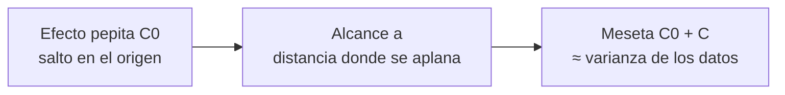

---
tags:
  - ICMI222
  - Apuntes de clase
  - Variografía
---

# PPT 06 · Continuidad espacial y variograma experimental

!!! quote "Fuente"
    Resumen propio de la presentación **PPT 06** del curso ICMI222 (semana 8).
    Lectura: Alfaro (2007), cap. III; Isaaks & Srivastava (1989), caps. 7 y 12.

!!! tip "Materia de la Solemne 2"
    Según la PPT 07, la Solemne 2 cubre variogramas experimentales y modelamiento.

## La idea en una frase

**Dos muestras cercanas se parecen; a medida que se alejan, dejan de parecerse.** El variograma mide
eso con números. Sin variograma no hay kriging, no hay simulación ni varianza de estimación.

## Definición

**Teórica:** la mitad del valor esperado del cuadrado de la diferencia entre dos puntos separados por \(h\):

\[ \gamma(h) = \frac{1}{2}\, E\!\left[\big(Z(x+h) - Z(x)\big)^2\right] \]

**Experimental** (la que se calcula): promedio sobre los \(N(h)\) pares separados por \(h\):

\[ \hat\gamma(h) = \frac{1}{2N(h)} \sum_{i=1}^{N(h)} \big[z(x_i + h) - z(x_i)\big]^2 \]

Se eleva al cuadrado para que las diferencias positivas y negativas **no se cancelen**.

**Propiedades:** \(\gamma(0) = 0\), nunca es negativo y es simétrico, \(\gamma(h) = \gamma(-h)\).

## Ejemplo a mano

Ocho muestras cada 5 m a lo largo de un sondaje (% Cu):

| Posición (m) | 0 | 5 | 10 | 15 | 20 | 25 | 30 | 35 |
|---|---|---|---|---|---|---|---|---|
| Ley | 0,5 | 0,7 | 0,6 | 0,9 | 1,1 | 0,8 | 0,4 | 0,6 |

**h = 5 m** → 7 pares. Diferencias: 0,2 · −0,1 · 0,3 · 0,2 · −0,3 · −0,4 · 0,2.
Cuadrados: 0,04 + 0,01 + 0,09 + 0,04 + 0,09 + 0,16 + 0,04 = **0,47**.

\[ \hat\gamma(5) = \frac{0{,}47}{2 \cdot 7} = 0{,}034 \]

**h = 10 m** → 6 pares, suma de cuadrados 0,84 → \(\hat\gamma(10) = 0{,}84 / 12 = 0{,}070\).

**h = 15 m** → 5 pares, suma 0,86 → \(\hat\gamma(15) = 0{,}086\).

El variograma **crece con la distancia**, como se esperaba. Fíjate en que la varianza de los datos
es 0,045 y \(\hat\gamma(15)\) ya la supera con solo 5 pares: con tan pocos pares el valor es ruidoso
y no debería interpretarse (regla de los 30 pares, más abajo).

## Lo que se lee en un variograma

### Efecto pepita (\(C_0\))

El salto del variograma junto al origen: variabilidad que existe **incluso a distancia casi cero**.
En teoría \(\gamma(0) = 0\), pero el experimental no parte de cero. Causas:

1. **Estructuras más pequeñas que el espaciamiento** de los datos (vetillas, pepitas de oro).
2. **Errores** de muestreo, preparación y análisis → se conecta con el [QA/QC](01-introduccion.md#qaqc-aseguramiento-y-control-de-calidad).

Un efecto pepita alto respecto de la meseta anticipa estimaciones poco precisas y mucho suavizamiento.
Compositar lo reduce.

### Alcance (\(a\))

Distancia desde la cual el variograma se estabiliza. Más allá, dos muestras son prácticamente
**independientes**. Es la **zona de influencia** de una muestra y define el **radio de búsqueda**
de la estimación.

### Meseta (\(C_0 + C\))

Valor donde se estabiliza el variograma. Es **aproximadamente la varianza** de los datos: sirve para
comprobar que el cálculo tiene sentido.

### La forma cerca del origen

Mientras más erráticas son las leyes a lo largo del sondaje, más bruscamente sube el variograma
junto al origen. Leyes que cambian suave → subida gradual.

## Cómo se eligen los pares con datos irregulares

Con datos reales casi nunca hay pares exactamente a la distancia \(h\): se define un **cono de búsqueda**.

| Parámetro | Qué es | Valor típico |
|---|---|---|
| **Paso (lag)** | Distancia base entre clases | Cercano al espaciamiento medio; múltiplo del largo de compósito |
| **Tolerancia del paso** | Cuánto puede variar la distancia del par | La mitad del paso |
| **Dirección** | Azimut e inclinación del variograma | Según la geología |
| **Tolerancia angular** | Apertura del cono | 15° a 30° |
| **Ancho de banda** | Limita cuánto se abre el cono a gran distancia | Según la geometría del dominio |

Más tolerancia → curvas más suaves pero mezcla de direcciones. Menos tolerancia → curvas más fieles
pero ruidosas.

## Reglas prácticas

- Calcular **por dominio** y **con compósitos**.
- Cada punto con al menos **30 pares**; con menos, no se interpreta.
- No graficar más allá de la **mitad de la dimensión del campo**.
- Calcular siempre el variograma **a lo largo del sondaje**: es la dirección mejor muestreada y la
  que mejor define el efecto pepita.
- Probar **varias direcciones** antes de concluir que el depósito es isótropo.
- Leer el variograma **junto con el número de pares** de cada punto.

## Anisotropía

Casi ningún depósito se comporta igual en todas las direcciones.

| Tipo | Qué cambia | Interpretación |
|---|---|---|
| **Geométrica** | El alcance, con la misma meseta | La más frecuente; define un **elipsoide de continuidad** |
| **Zonal** | También la meseta | Suele indicar estratificación |

El elipsoide es el que después orienta la búsqueda de muestras en el kriging. La dirección de mayor
continuidad **debe coincidir con la geología**; si no, revisa el dominio.

## Comportamiento a grandes distancias

- Variograma con máximos y mínimos (**efecto agujero**) → alternancia de zonas ricas y pobres.
- Variograma que **crece sin detenerse** → deriva (tendencia); revisar el dominio.

## Errores frecuentes

- Un solo variograma para todo el depósito, mezclando dominios.
- Interpretar puntos con muy pocos pares.
- Usar un paso mucho menor que el espaciamiento: puro ruido.
- Tomar un efecto pepita alto como error de cálculo, cuando muchas veces es un problema de muestreo.
- Concluir anisotropía con una sola dirección mal muestreada.
- Leer un variograma que crece sin parar como "continuidad infinita" en vez de deriva.

## Preguntas de repaso

??? question "¿Por qué el variograma se divide por 2N(h) y no por N(h)?"
    Por la definición: \(\gamma\) es la **mitad** del promedio de las diferencias al cuadrado
    (por eso se llama *semi*variograma). Así, cuando las muestras son independientes, la meseta
    coincide con la varianza.

??? question "La meseta de tu variograma es el doble de la varianza de los datos. ¿Qué revisas?"
    Que el cálculo no mezcle dominios, que haya deriva (variograma que sigue subiendo) o que los
    puntos lejanos tengan muy pocos pares. La meseta debería parecerse a la varianza de los
    compósitos usados.

??? question "¿Qué te dice un efecto pepita igual al 70 % de la meseta?"
    Que la variable es muy errática a escala corta o que el muestreo tiene mucho error. Se esperan
    estimaciones con mucho suavizamiento y poca precisión. Antes de modelar conviene revisar el
    QA/QC y los compósitos.

??? question "¿Por qué se calcula primero el variograma a lo largo del sondaje?"
    Porque es la dirección con más pares a distancias cortas (las muestras son consecutivas), y por
    eso es la que mejor define el efecto pepita.
