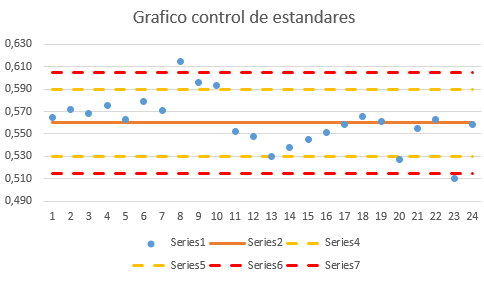

---
tags:
  - ICMI222
  - Cuaderno
---

# Geoestadística, sondajes y QA/QC (semana 2)

!!! quote "Cuaderno de clases"
    Mis apuntes de esa clase, ordenados y corregidos. Las capturas son de Vulcan y de los laboratorios.
    Teoría de esta clase: [apunte de clase](../clases/01-introduccion.md).

## Operaciones unitarias en minería

Son **cuatro operaciones unitarias básicas**: **perforación, tronadura, carguío y transporte**. Su rendimiento se sigue con gráficos de **tonelaje versus tiempo**.

## Qué es la geoestadística

La geoestadística es la ciencia de la ingeniería que entrega la base para la **planificación minera**, a través de la **estimación de recursos** o **evaluación de yacimientos**.

- **Danie Krige (1952)** aplicó por primera vez la estadística a la minería (minas de oro de Sudáfrica).
- **Georges Matheron** continuó su trabajo y formalizó la teoría de las variables regionalizadas.
- **Marco Alfaro (2007)** es el autor del texto de referencia en Chile, *Estimación de Recursos Mineros*.

## Variable regionalizada

En minería, la variable es normalmente la **concentración del mineral de interés**, y es **regionalizada** porque su valor depende de **dónde está ubicada**. También puede ser, por ejemplo, la calidad de la roca.

**Definición:** es una función que representa la variación en el espacio de una cierta magnitud asociada a un fenómeno natural.

**Ejemplo:** z(x) = ley de cobre en el punto x.

Para describirla se usan funciones como la **esférica** y la **exponencial** (se ven en el modelamiento de variogramas, sección 9).

## Sondajes

Perforaciones en el subsuelo que permiten extraer muestras físicas y registrar datos geológicos. Gracias a los sondajes se construyen los **modelos geológicos**, se interpreta la **mineralización** y se hace la **estimación de recursos**.

| Tipo | Qué recupera | Uso |
|---|---|---|
| **Aire reverso (RC)** | Detritos (chips) de roca | Más rápido y barato; densificar la malla |
| **Diamantina (DDH)** | Testigo de roca intacto | Geología detallada, estructuras y estimación |

## Persona competente

La **Comisión Minera** certifica a las **personas competentes**: los profesionales que pueden firmar estimaciones de recursos y reservas. Es una certificación a considerar para el futuro.

*Pendiente anotado en clase: estudiar **variografía**, revisar ejemplos de variogramas y cómo se componen (ver secciones 8 y 9).*

## QA/QC en minería

Al generar un sondaje, una primera porción de cada muestra se envía al laboratorio y se guarda una **contramuestra**. El objetivo del QA/QC es certificar que el muestreo sea **limpio**, **exacto** y que el laboratorio sea capaz de **replicar** sus resultados.

- Se insertan **blancos** (material estéril, por ejemplo bolas de sílice), justo después de una muestra de ley alta, para detectar contaminación.
- Se insertan **estándares** de ley conocida y se grafican en un **gráfico de control**.
- Entre 2 y 3 desviaciones estándar del valor esperado, el resultado es **cuestionable**; sobre 3 desviaciones, es **erróneo** y se rechaza.

<figure markdown="span">
  { width="484" loading=lazy }
  <figcaption>Gráfico de control de estándares. Líneas amarillas: ±2 desviaciones estándar; rojas: ±3.</figcaption>
</figure>

**Lectura del gráfico:** se **rechazan** las muestras 8 y 23, porque están sobre la tercera desviación estándar, y se **cuestionan** las muestras 9, 10 y 20, porque están entre 2 y 3 desviaciones.

**Límite de detección:** es el valor mínimo que puede detectar el laboratorio; para el cobre, 0,01 %.

!!! note "Complemento · Las tres muestras de control"
    - **Blanco:** material estéril. Detecta **contaminación** entre muestras.
    - **Estándar (CRM):** material con ley certificada. Mide **exactitud** (si el laboratorio tiene sesgo).
    - **Duplicado (contramuestra):** otra parte de la misma muestra. Mide **precisión** (si el resultado se repite).
    - Los errores de muestreo y análisis reaparecen después como **efecto pepita** en el variograma (sección 8).
