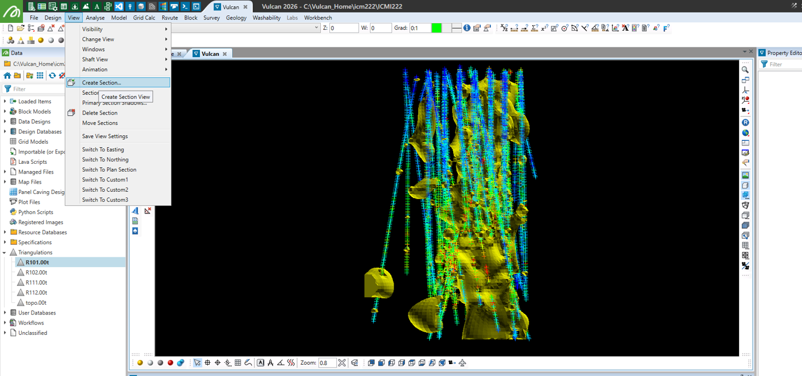
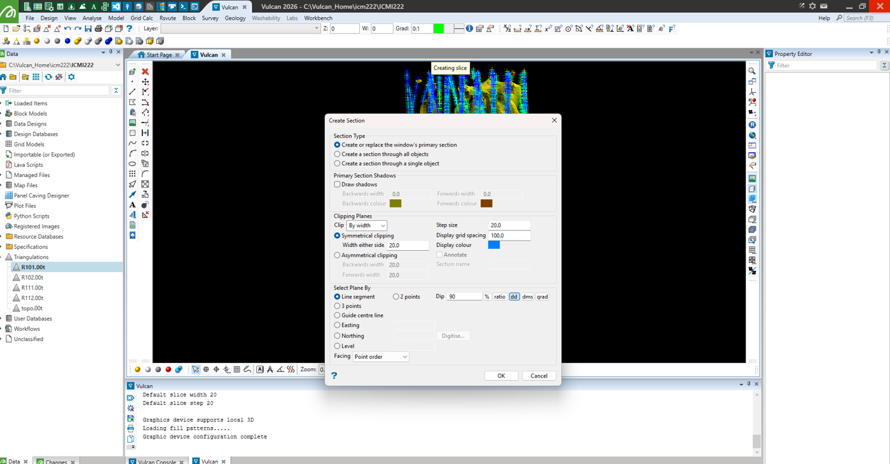
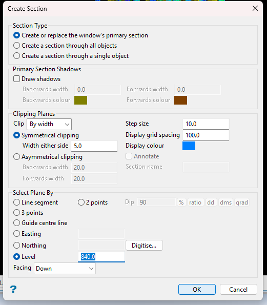
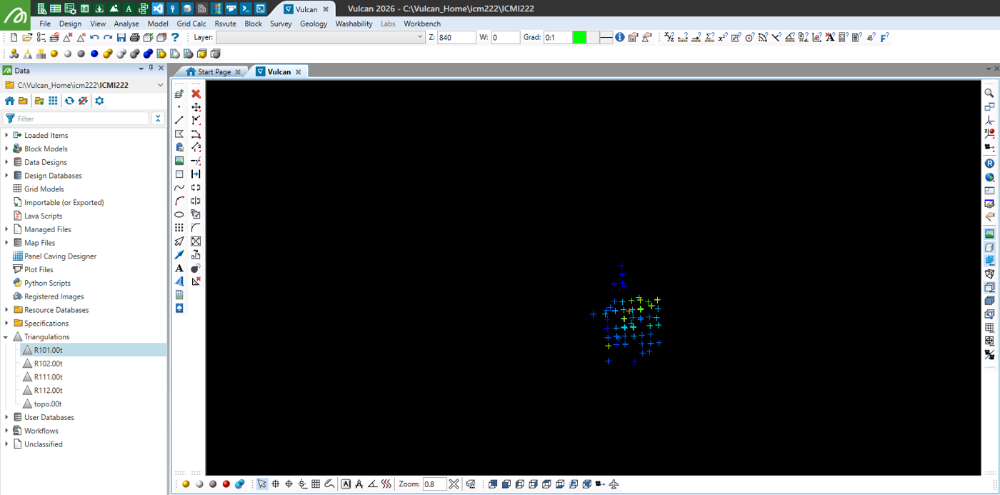
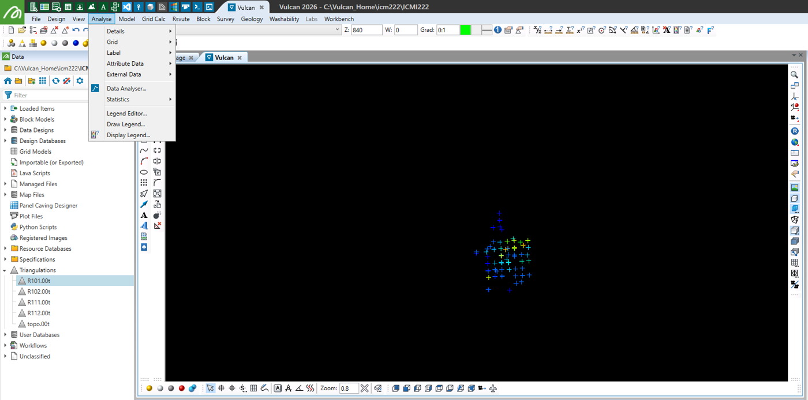
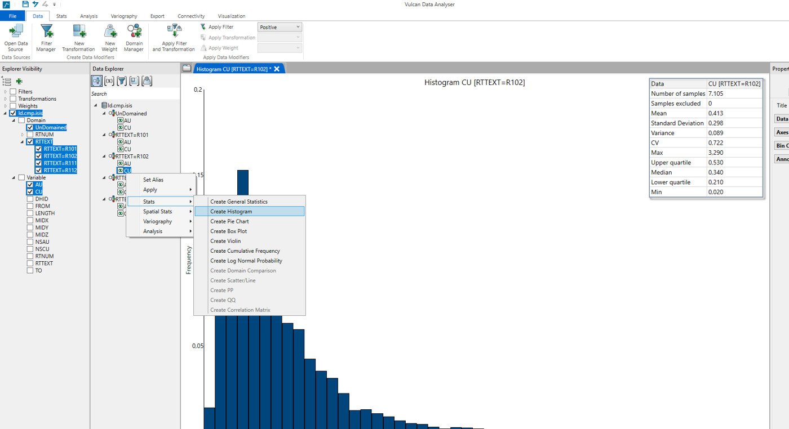
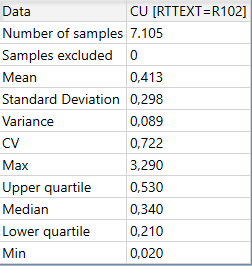
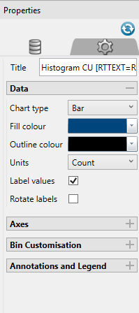

---
tags:
  - ICMI222
  - Cuaderno
---

# AED bivariado: de la descripción a la decisión (semana 4 · 24/08)

!!! quote "Cuaderno de clases"
    Mis apuntes de esa clase, ordenados y corregidos. Las capturas son de Vulcan y de los laboratorios.
    Las 9 diapositivas del curso que acompañaban estas notas no se publican: su contenido está resumido en [el apunte de clase](../clases/03-aed-decisiones.md).

## 4.1 Las preguntas que responde el AED

| Pregunta | Herramienta o decisión |
|---|---|
| ¿Los datos provienen de una sola población o de varias? | **Definición de dominios** |
| ¿La media calculada representa al dominio? | **Desagrupamiento** |
| ¿Los valores extremos son reales o erráticos? | **Capping** |
| ¿Las muestras son comparables entre sí? | **Soporte y compositación** |
| ¿Puedo apoyarme en una variable para estimar otra? | **Correlación y regresión** |

## 4.2 Estadística y conceptos de la clase

- La **variable regionalizada** explica por qué la estadística clásica no basta: las muestras vecinas se parecen.
- Se repasaron intervalo de confianza, asimetría (skewness) positiva, media, desviación estándar y varianza.
- **Densidad** = toneladas / m³.
- Bloque de ejemplo: **10 × 10 × 10 m**.
- A mayor cantidad de datos, menor dispersión de la estimación.
- **Agrupamiento:** los sondajes se concentran en ciertas zonas.

## 4.3 Crear una sección en Vulcan

!!! example "En Vulcan · Crear una sección horizontal"
    - **View → Create Section...** (o el botón de sección).
    - Section Type: *Create or replace the window's primary section*.
    - Clipping: *Symmetrical clipping* con el ancho a cada lado (*Width either side*).
    - Select Plane By: **Level** con la cota deseada (por ejemplo, 840) y *Facing: Down*.

<figure markdown="span">
  { width="760" loading=lazy }
  <figcaption>Compósitos y sólidos en 3D antes de crear la sección.</figcaption>
</figure>

<figure markdown="span">
  { width="760" loading=lazy }
  <figcaption>Ventana de creación de sección sobre los datos.</figcaption>
</figure>

<figure markdown="span">
  { width="441" loading=lazy }
  <figcaption>Create Section: plano por cota (Level) con recorte simétrico.</figcaption>
</figure>

<figure markdown="span">
  { width="760" loading=lazy }
  <figcaption>Resultado: solo se ven los puntos en torno a la cota 840.</figcaption>
</figure>

## 4.4 Media desagrupada

Para estimar no sirve la media aritmética simple: algunos datos deben **ponderar menos** (los agrupados) y otros **más** (los aislados). Si los pesos no suman 100 %, se produce un **sesgo**: subestimación o sobreestimación.

## 4.5 Histograma en Vulcan (Data Analyser)

!!! example "En Vulcan · Generar un histograma"
    - Abrir el **Data Analyser** con la base de compósitos.
    - Seleccionar la variable y el dominio (por ejemplo, CU con RTTEXT = R102) → **Create Histogram**.
    - En *Properties*, activar **Label values** para que muestre la cantidad de datos en cada barra.

<figure markdown="span">
  { width="760" loading=lazy }
  <figcaption>Menú para abrir el Data Analyser.</figcaption>
</figure>

<figure markdown="span">
  { width="760" loading=lazy }
  <figcaption>Data Analyser: histograma de Cu y tabla de estadísticas.</figcaption>
</figure>

<figure markdown="span">
  { width="360" loading=lazy }
  { width="360" loading=lazy }
  <figcaption>Estadísticas que se rescatan del histograma (Cu en R102, n = 7.105) y opción Label values.</figcaption>
</figure>

Un histograma con **pocos datos no sirve mucho**: las barras dependen demasiado de cada valor.

**Diferenciación de dominios:** si el histograma muestra más de una curva (más de una moda), probablemente hay **dos dominios**; una sola curva sugiere un dominio.

## 4.6 Análisis de contactos

- **Caso 1 (contacto duro):** la ley salta bruscamente al cruzar el contacto; no hay relación entre dominios y se estiman por separado.
- **Caso 2 (contacto blando):** la ley cambia gradualmente y la transición cruza la frontera; existe relación entre dominios y se pueden compartir datos cerca del contacto.

## 4.7 Gráfico de probabilidad (probability plot)

Sirve para ver el comportamiento de los datos. El **quiebre** en la parte superior indica valores extremos que pueden producir una **sobreestimación**: es el punto de partida para definir el **capping**.

## 4.8 Covarianza y correlación

Sirve para ver la relación entre, por ejemplo, el cobre y el oro. Si es **positiva**, cuando una variable sube la otra también sube; si es **negativa**, son inversamente proporcionales: una sube y la otra baja.

Indica si un modelo matemático lineal explica o no la relación entre las variables.

- **Pearson:** mide relaciones **lineales** (regresiones lineales).
- **Spearman:** mide la relación por **rangos** (tramos); detecta relaciones monótonas aunque no sean rectas.
- Como regla de clase: desde |r| ≈ 0,70 la correlación se considera **buena**, y conviene que ambos coeficientes estén sobre 0,7.

## 4.9 Medidas de la distribución

- **Media aritmética:** el valor que se esperaría tener, pero es muy sensible a los valores atípicos altos.
- **Media vs. mediana:** en leyes con sesgo positivo, media > mediana. Reportar solo la media sobrestima el depósito.
- **Asimetría (skewness) positiva:** la mayor cantidad de datos está en los valores bajos, con una cola de valores altos.
- **Curtosis ≈ 0 (mesocúrtica):** forma parecida a la normal.
- **Curtosis > 0 (leptocúrtica):** colas pesadas, con valores atípicos extremos.
- **Curtosis < 0 (platicúrtica):** distribución aplanada, casi sin valores atípicos.

!!! note "Complemento · ¿Qué significa asimetría negativa con curtosis alta?"
    - La pregunta quedó abierta en los apuntes. La lectura es correcta: la mayoría de los datos son de **ley alta** y hay una **cola de valores bajos** pesada (curtosis alta).
    - En leyes es raro. Suele indicar **mezcla de poblaciones** (por ejemplo, un dominio rico con muestras de estéril o de otro dominio) o valores bajo el límite de detección registrados con una convención. Conviene revisar los dominios.

## 4.10 Otras ideas de la clase

- **Variable regionalizada:** variable con coordenadas (x, y, z) en cada punto.
- **Topografía:** representación de la superficie; según la zona, no se pueden hacer mallas de sondajes perfectas.
- A mayor concentración vista en una zona, mayor cantidad de sondajes ahí (**agrupamiento preferencial**).
- Si los valores extremos tienen una tendencia espacial, se analizan como población; si son aislados y sin tendencia, se aplica **capping**.
- **Desagrupamiento (declustering):** corrige la media inflada por los sondajes agrupados.
- **Soporte:** volumen, forma y orientación con que se mide una variable.

!!! warning "Ojo · corrección · La media agrupada está sobrestimada, no subestimada"
    - En los apuntes decía que la media calculada con datos agrupados queda "inflada (subestimada)". Inflada es lo correcto: como los sondajes se concentran en zonas ricas, la media simple queda **sobrestimada**.

!!! note "Complemento · Sondaje vs. compósito"
    - **Sondaje:** la perforación real hecha en terreno, con tramos de muestreo de largos distintos.
    - **Compósito:** una regularización matemática de esas muestras a un largo fijo, para que todas tengan el mismo soporte.
