---
tags:
  - ICMI222
  - Cuaderno
---

# Estacionariedad, dominios y compositación (semana 7 · 14/09)

!!! quote "Cuaderno de clases"
    Mis apuntes de esa clase, ordenados y corregidos. Las capturas son de Vulcan y de los laboratorios.
    Las 4 diapositivas del curso que acompañaban estas notas no se publican: su contenido está resumido en [el apunte de clase](../clases/05-dominios-compositacion.md).

- La **estacionariedad** es una hipótesis estadística: se decide, se justifica y se documenta.
- Los dominios pueden variar entre minerales: los del cobre no siempre sirven para el oro.

## 7.1 Definición y comparación de dominios

*Esta parte de la clase se vio con diapositivas: está resumida en el [apunte de clase](../clases/05-dominios-compositacion.md).*

## 7.2 Análisis de contactos en el dataset del curso

<figure markdown="span">
  { width="686" loading=lazy }
  <figcaption>Perfil de contacto de Cu entre R102 y R112.</figcaption>
</figure>

- Según este gráfico, se pueden tomar datos del dominio **112** para estimar el **102**, porque es un **contacto blando**.
- Para estimar el dominio **102** se usan aproximadamente **25 m** del dominio 112.
- Para estimar el dominio **112** se pueden tomar hasta **75 a 100 m** del dominio 102.
- En un contacto blando se debe considerar que la **ley media es parecida** a ambos lados del contacto.

<figure markdown="span">
  { width="686" loading=lazy }
  <figcaption>Perfil de contacto de Au entre R102 y R112.</figcaption>
</figure>

## 7.3 Soporte y compositación

- **Soporte:** el largo de los datos de un sondaje (o el área, en una superficie).
- La **compositación** permite hacer estadística con datos comparables.
- Su desventaja es que **reduce la variabilidad** (suaviza los datos).

!!! note "Complemento · Cómo se calcula un compósito"
    - Se pondera por el **largo** de cada tramo: un tramo largo representa más roca.
    *z_c = Σ(lᵢ · zᵢ) / Σ lᵢ*
    
    - Ejemplo: 1 m a 1,2 %, 3 m a 0,4 % y 1 m a 0,6 % dan 0,60 % (no 0,73 %, que sería el promedio simple).
    - Si la densidad cambia entre tramos (contacto óxido-sulfuro), se pondera por masa: largo × densidad.
    - El largo se elige según la selectividad de la mina: en rajo, normalmente la **altura de banco**.

## 7.4 Compositación por banco en Vulcan (taller del 21/09)

El taller se hizo con la **base de datos de la Solemne 1** (`sondeo.dhd.isis`): se compositó cada **20 m usando la altura de banco**.

1. **Geology → Compositing → Compositing...**
1. *Drillhole Database*: base `sondeo.dhd.isis`, método **Bench** y archivo de especificación `comp_20m`.
1. *Pre-processing*: los datos faltantes (−99,999) y no muestreados (−999,999) se **ignoran**.
1. *Assay*: registro ASSAY, con los campos **FROM** y **TO**.
1. *Assay → Fields*: elegir las leyes a compositar (CUT, CUS, MO, AU…).
1. *Geology*: activar **Enable Breakdown by Geology/Record Majority Codes** y pinchar los **tres puntitos** a la derecha de **MINTY**.
1. *Geology Fields To Use*: **Break intervals by geology** con el campo MINTY y los campos From/To.
1. *Method*: altura de banco **20 m**.
1. *Boundary Definition* y *Thickness Reporting*: sin cambios.
1. *Run*: crear la base de compósitos `comp_20m.cmp`, grupo **CIFC**, descripción "compósitos cada 20 metros usando altura de banco".
1. *Output Fields* y *Additional Fields*: revisar los campos de salida.
1. **Apply and Run**: la consola muestra cada sondaje procesado y cuántos compósitos generó.

<figure markdown="span">
  { width="360" loading=lazy }
  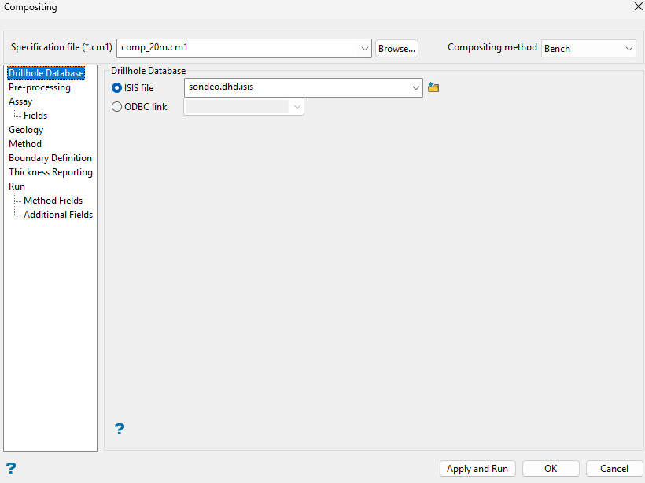{ width="360" loading=lazy }
  <figcaption>Menú Geology → Compositing (izquierda) y base de sondajes con método Bench (derecha).</figcaption>
</figure>

<figure markdown="span">
  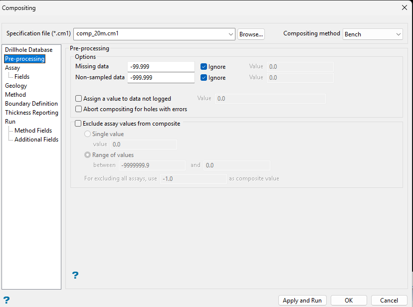{ width="360" loading=lazy }
  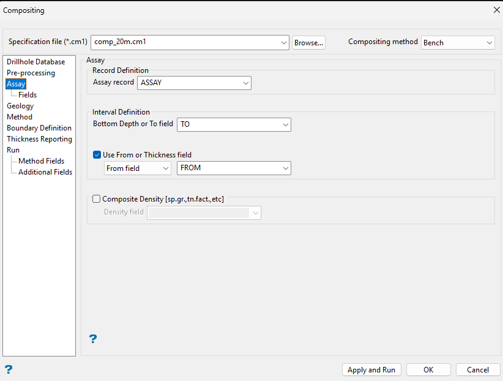{ width="360" loading=lazy }
  <figcaption>Pre-processing con datos faltantes ignorados (izquierda) y registro Assay con FROM y TO (derecha).</figcaption>
</figure>

<figure markdown="span">
  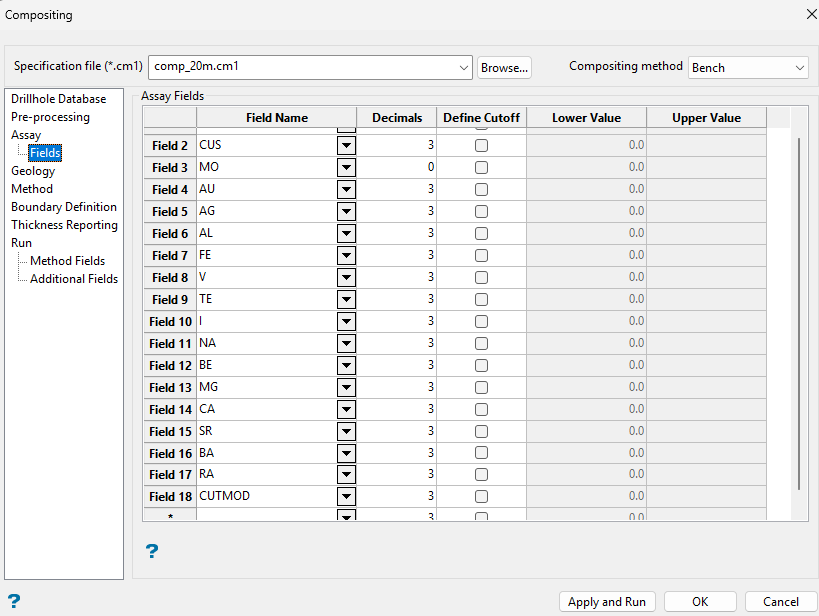{ width="360" loading=lazy }
  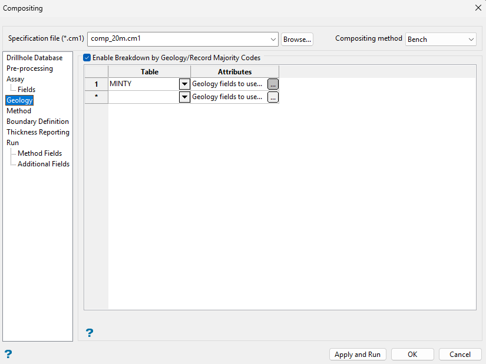{ width="360" loading=lazy }
  <figcaption>Leyes a compositar (izquierda) y corte por código geológico MINTY (derecha).</figcaption>
</figure>

<figure markdown="span">
  { width="383" loading=lazy }
  <figcaption>Geology Fields To Use: cortar los intervalos por geología con el campo MINTY.</figcaption>
</figure>

<figure markdown="span">
  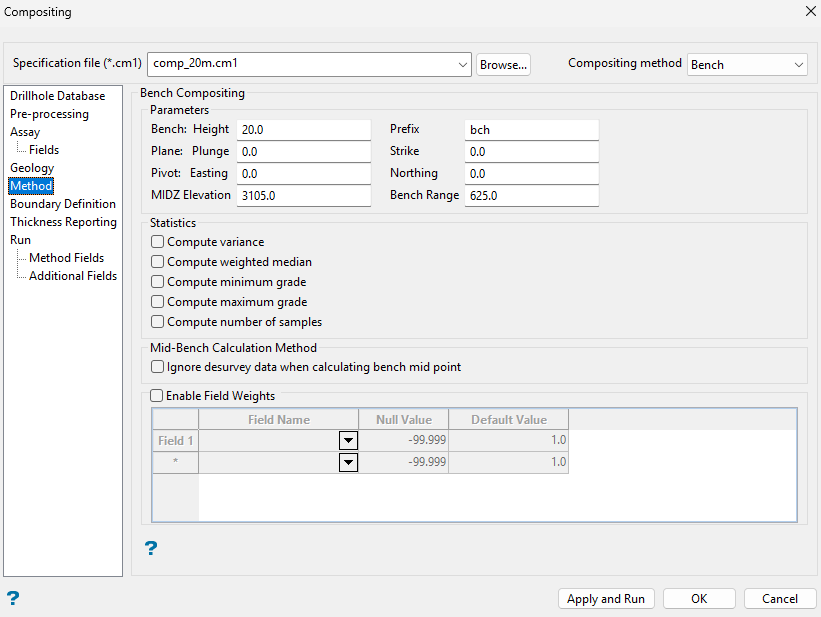{ width="360" loading=lazy }
  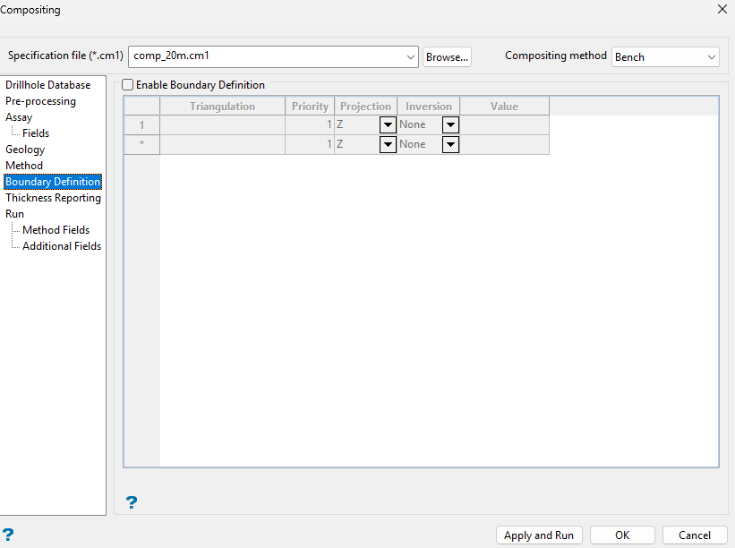{ width="360" loading=lazy }
  <figcaption>Method: bancos de 20 m (izquierda) y Boundary Definition (derecha).</figcaption>
</figure>

<figure markdown="span">
  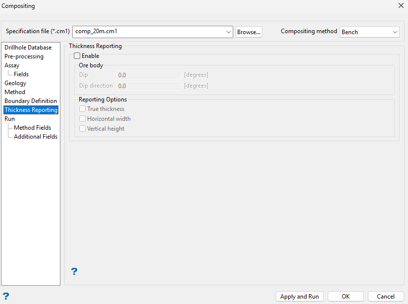{ width="360" loading=lazy }
  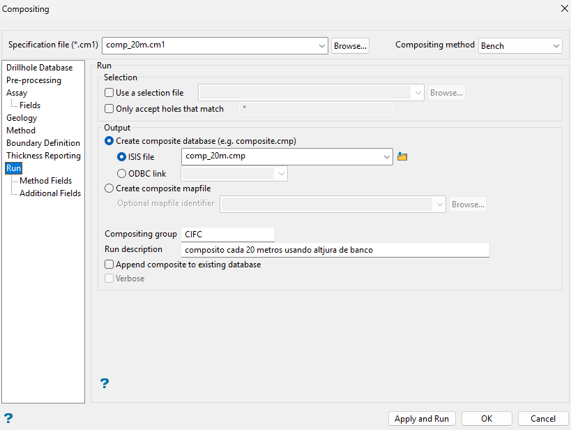{ width="360" loading=lazy }
  <figcaption>Thickness Reporting (izquierda) y Run: salida comp_20m.cmp con grupo CIFC (derecha).</figcaption>
</figure>

<figure markdown="span">
  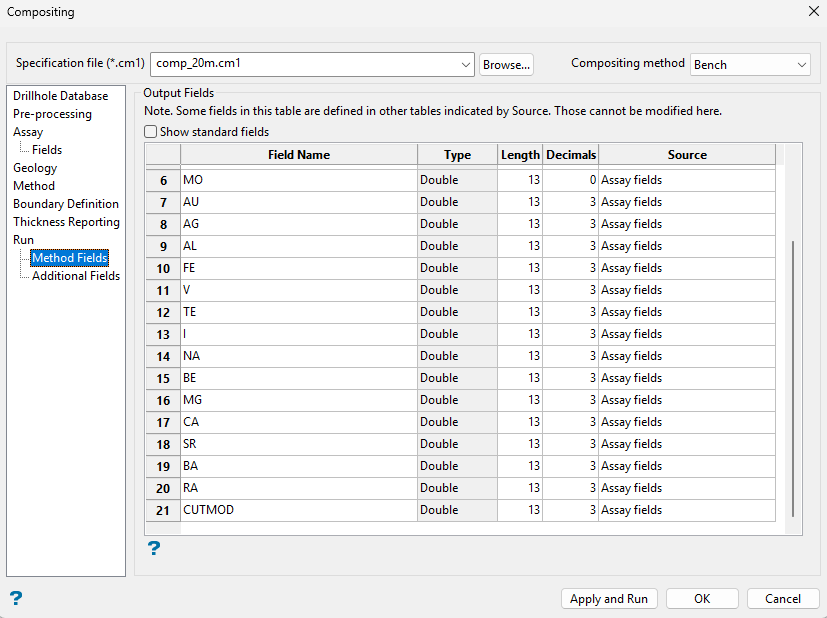{ width="360" loading=lazy }
  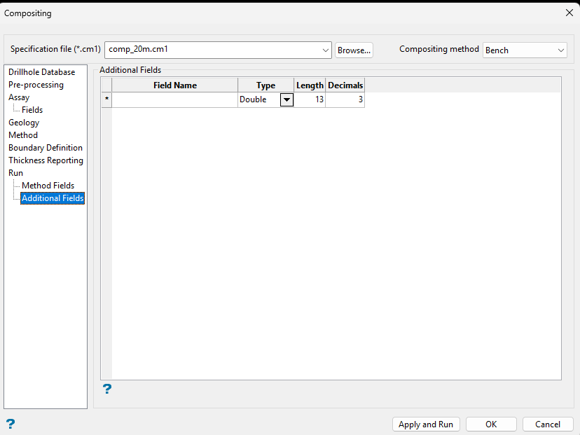{ width="360" loading=lazy }
  <figcaption>Campos de salida (izquierda) y campos adicionales (derecha).</figcaption>
</figure>

<figure markdown="span">
  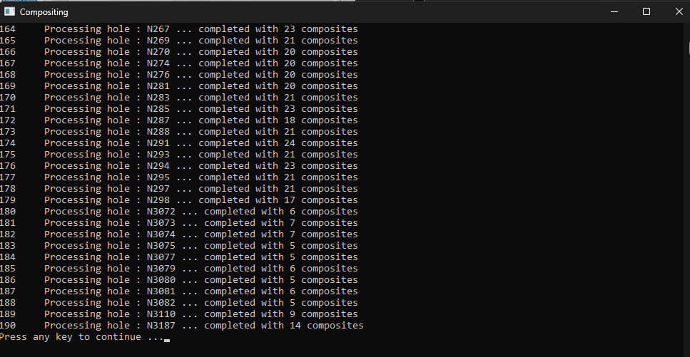{ width="588" loading=lazy }
  <figcaption>Consola: cada sondaje procesado y la cantidad de compósitos generados.</figcaption>
</figure>

## 7.5 Revisar los compósitos sin dominio (NONE)

Con los compósitos recién creados se revisa **en qué lugar del yacimiento** quedaron los tramos sin código geológico (**NONE**).

1. Abrir la base de compósitos (`simcomp_20m.cmp.isis`) y cargar el grupo **CIFC**.
1. *Setup Display*: colorear por **GEOCOD** con la leyenda GEOCOD (se crea en **Analyse → Legend Editor**).
1. Revisar la distribución en planta y en sección.
1. Para ver solo los NONE: quitar los compósitos (**Geology → Sampling → Remove**), volver a cargarlos y en **Select using Field restrictions** poner GEOCOD = NONE.
1. **Analyse → Data Analyser** → gráfico de torta (*Pie Chart*) de GEOCOD, para ver qué proporción tiene cada código.

<figure markdown="span">
  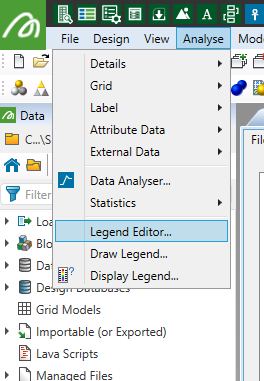{ width="360" loading=lazy }
  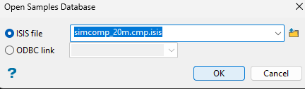{ width="360" loading=lazy }
  <figcaption>Analyse → Legend Editor (izquierda) y apertura de la base simcomp_20m.cmp.isis (derecha).</figcaption>
</figure>

<figure markdown="span">
  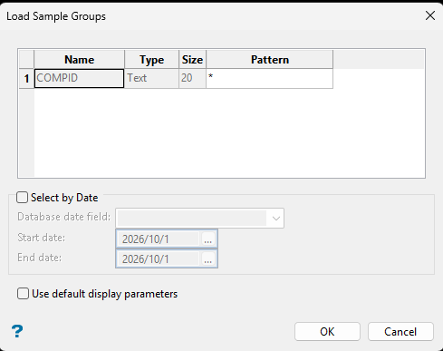{ width="360" loading=lazy }
  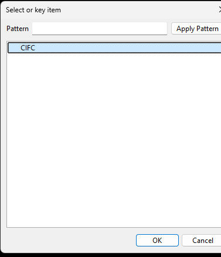{ width="360" loading=lazy }
  <figcaption>Load Sample Groups (izquierda) y selección del grupo CIFC (derecha).</figcaption>
</figure>

<figure markdown="span">
  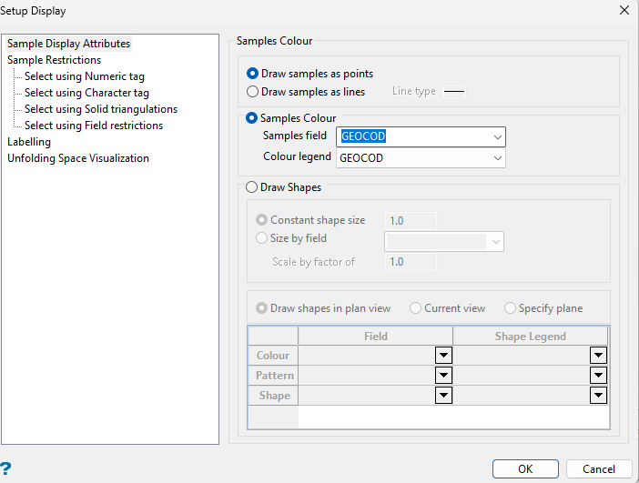{ width="539" loading=lazy }
  <figcaption>Setup Display: compósitos coloreados por GEOCOD.</figcaption>
</figure>

<figure markdown="span">
  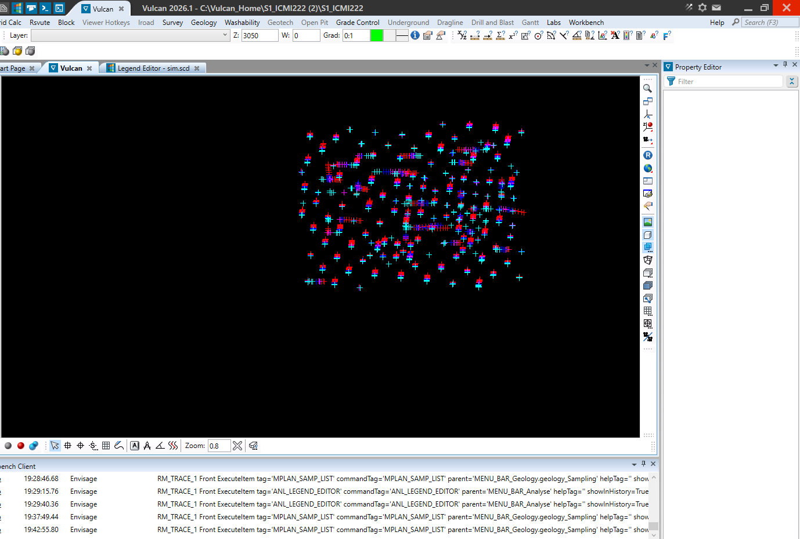{ width="360" loading=lazy }
  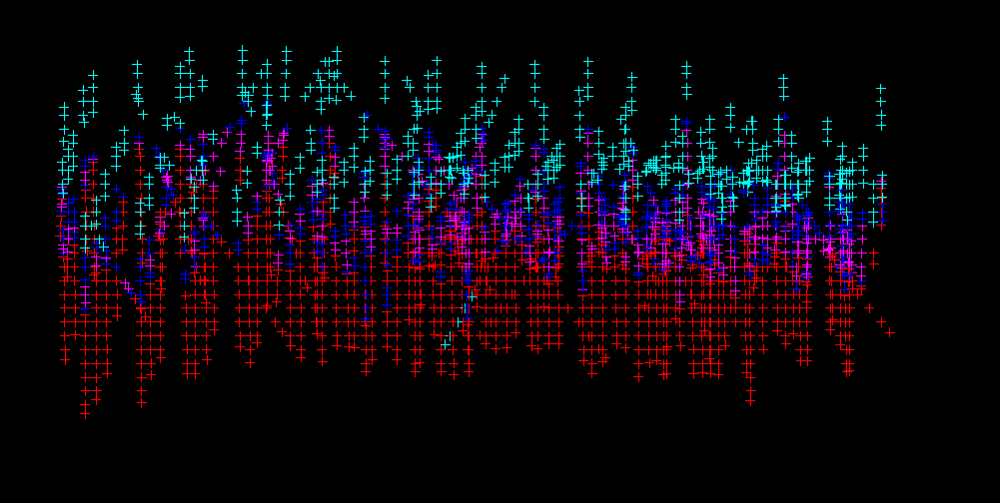{ width="360" loading=lazy }
  <figcaption>Compósitos por GEOCOD en planta (izquierda) y en sección (derecha).</figcaption>
</figure>

<figure markdown="span">
  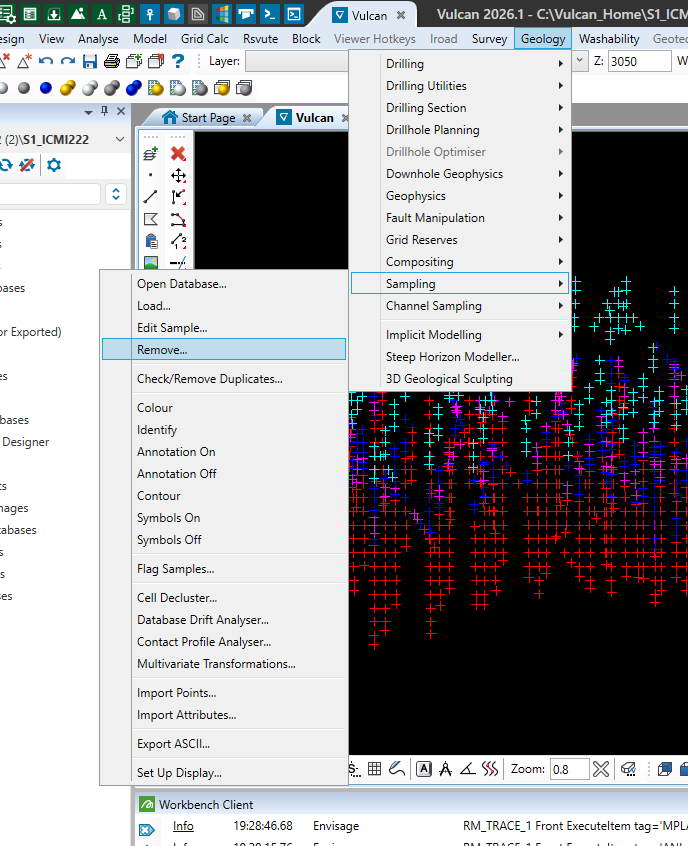{ width="360" loading=lazy }
  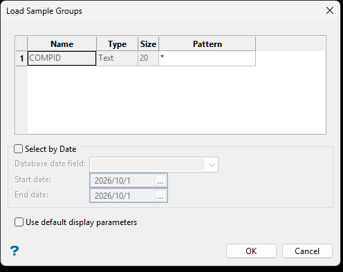{ width="360" loading=lazy }
  <figcaption>Geology → Sampling para quitar y volver a cargar (izquierda) y Load Sample Groups (derecha).</figcaption>
</figure>

<figure markdown="span">
  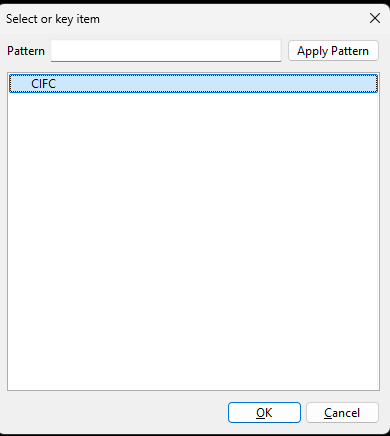{ width="360" loading=lazy }
  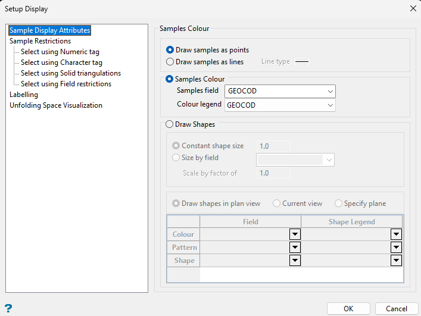{ width="360" loading=lazy }
  <figcaption>Grupo CIFC (izquierda) y Setup Display por GEOCOD (derecha).</figcaption>
</figure>

<figure markdown="span">
  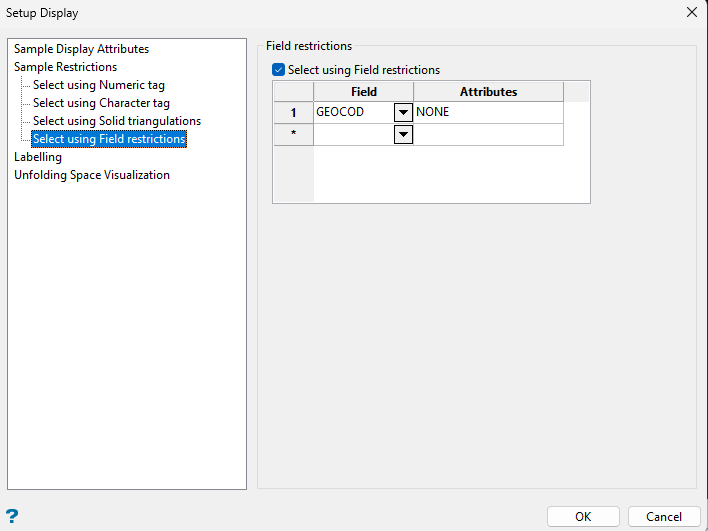{ width="539" loading=lazy }
  <figcaption>Select using Field restrictions: mostrar solo GEOCOD = NONE.</figcaption>
</figure>

<figure markdown="span">
  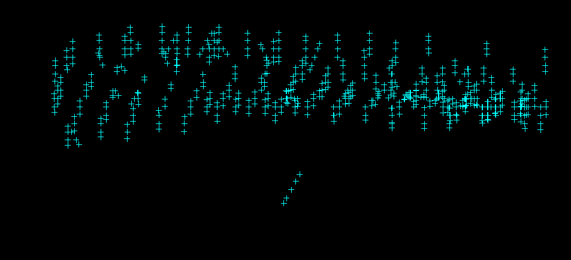{ width="637" loading=lazy }
  <figcaption>Solo los compósitos NONE: se ve en qué parte del yacimiento quedaron sin código.</figcaption>
</figure>

<figure markdown="span">
  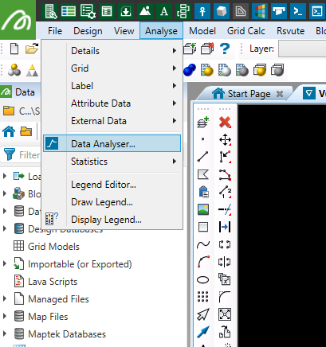{ width="360" loading=lazy }
  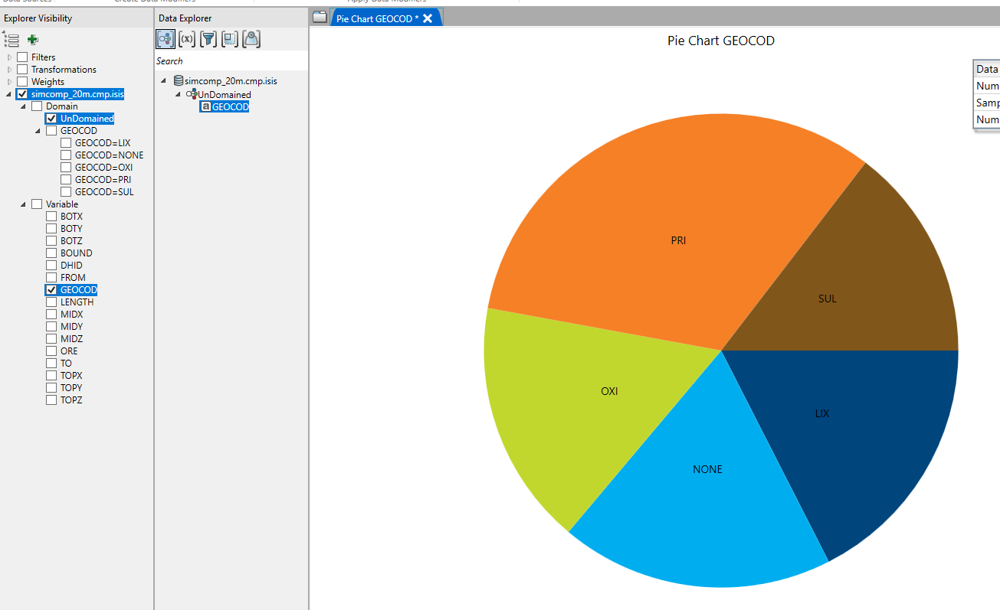{ width="360" loading=lazy }
  <figcaption>Analyse → Data Analyser (izquierda) y gráfico de torta de GEOCOD (derecha).</figcaption>
</figure>

El paso siguiente es el **Implicit Modelling Editor**, para modelar los dominios a partir de estos compósitos (ver la sección 6.3).

<figure markdown="span">
  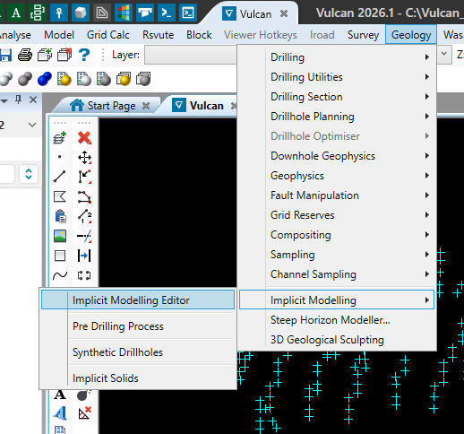{ width="441" loading=lazy }
  <figcaption>Geology → Implicit Modelling → Implicit Modelling Editor.</figcaption>
</figure>

!!! note "Complemento · Por qué importan los NONE"
    - Un compósito sin código no pertenece a ningún dominio: si se deja así, queda fuera de todas las estimaciones o termina mezclado en el dominio equivocado.
    - Ver dónde están (en los bordes, en zonas sin logueo o en un contacto) ayuda a decidir si se reclasifican, se asignan con el modelo implícito o se excluyen.
