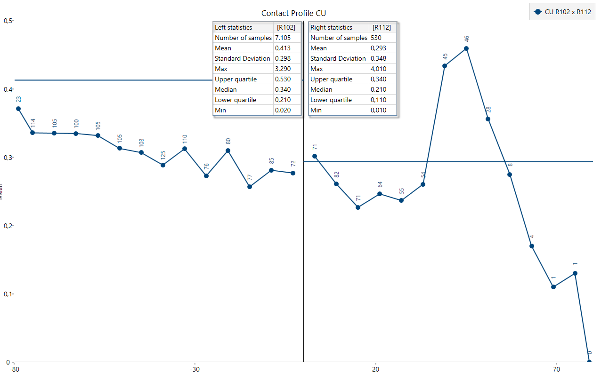
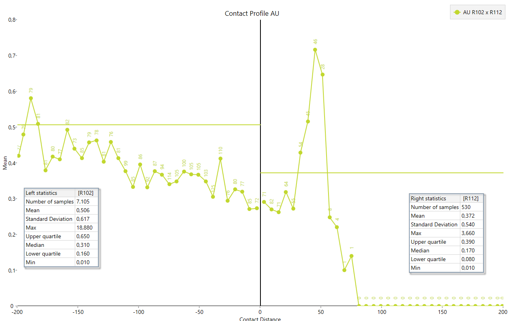
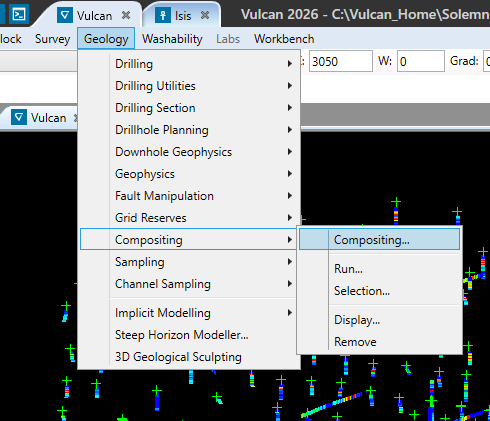
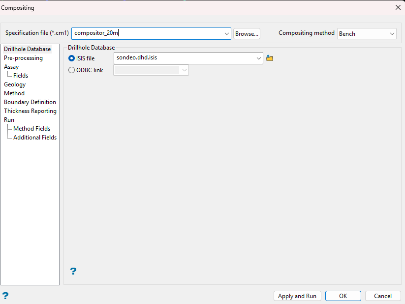
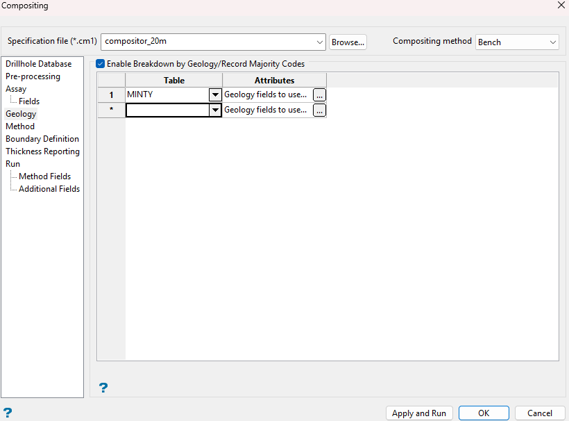
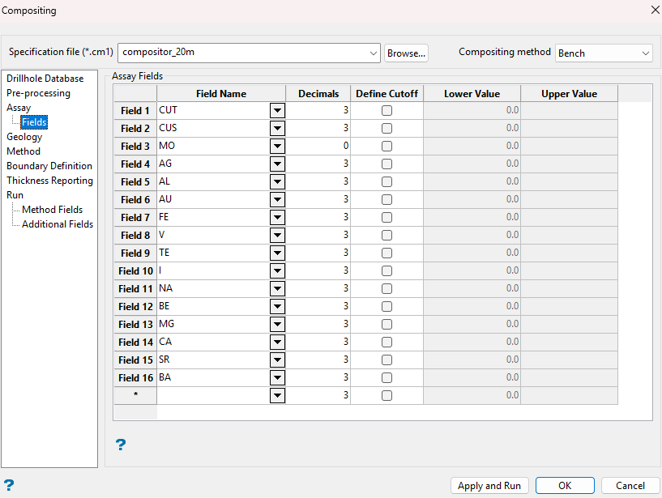
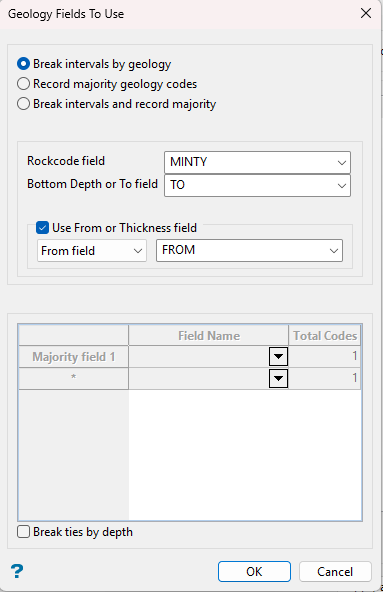
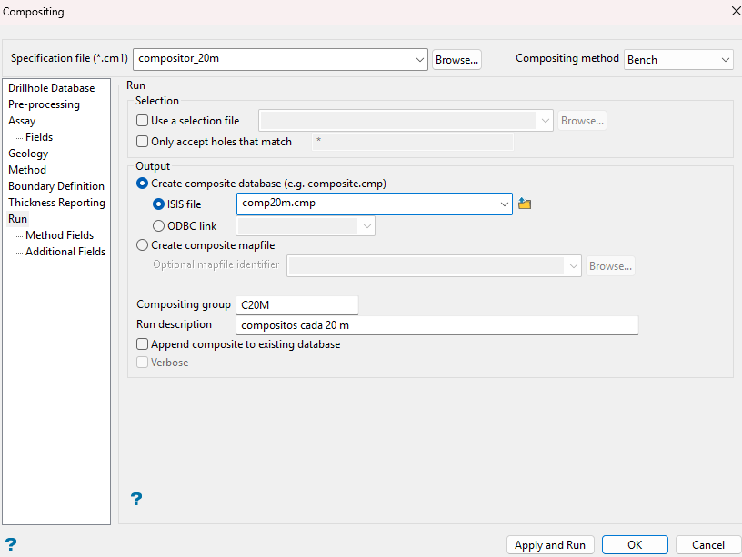

---
tags:
  - ICMI222
  - Cuaderno
---

# Estacionariedad, dominios y compositación (semana 7 · 14/09)

!!! quote "Cuaderno de clases"
    Mis apuntes de esa clase, ordenados y corregidos. Las capturas son de Vulcan y de los laboratorios.
    Las 4 diapositivas del curso que acompañaban estas notas no se publican: su contenido está resumido en [el apunte de clase](../clases/05-dominios-compositacion.md).

- La **estacionariedad** es una hipótesis estadística: se decide, se justifica y se documenta.
- Los dominios pueden variar entre minerales: los del cobre no siempre sirven para el oro.

## 7.1 Definición y comparación de dominios

*Esta parte de la clase se vio con diapositivas: está resumida en el [apunte de clase](../clases/05-dominios-compositacion.md).*

## 7.2 Análisis de contactos en el dataset del curso

<figure markdown="span">
  { width="686" loading=lazy }
  <figcaption>Perfil de contacto de Cu entre R102 y R112.</figcaption>
</figure>

- Según este gráfico, se pueden tomar datos del dominio **112** para estimar el **102**, porque es un **contacto blando**.
- Para estimar el dominio **102** se usan aproximadamente **25 m** del dominio 112.
- Para estimar el dominio **112** se pueden tomar hasta **75 a 100 m** del dominio 102.
- En un contacto blando se debe considerar que la **ley media es parecida** a ambos lados del contacto.

<figure markdown="span">
  { width="686" loading=lazy }
  <figcaption>Perfil de contacto de Au entre R102 y R112.</figcaption>
</figure>

## 7.3 Soporte y compositación

- **Soporte:** el largo de los datos de un sondaje (o el área, en una superficie).
- La **compositación** permite hacer estadística con datos comparables.
- Su desventaja es que **reduce la variabilidad** (suaviza los datos).

!!! note "Complemento · Cómo se calcula un compósito"
    - Se pondera por el **largo** de cada tramo: un tramo largo representa más roca.
    *z_c = Σ(lᵢ · zᵢ) / Σ lᵢ*
    
    - Ejemplo: 1 m a 1,2 %, 3 m a 0,4 % y 1 m a 0,6 % dan 0,60 % (no 0,73 %, que sería el promedio simple).
    - Si la densidad cambia entre tramos (contacto óxido-sulfuro), se pondera por masa: largo × densidad.
    - El largo se elige según la selectividad de la mina: en rajo, normalmente la **altura de banco**.

## 7.4 Compositación en Vulcan

1. **Geology → Compositing → Compositing...**
1. Elegir la base de sondajes y el método (*Bench*, por banco).
1. *Geology*: activar el corte por código geológico (campo de litología o dominio).
1. *Assay → Fields*: elegir las leyes a compositar.
1. *Run*: definir la base de salida y el grupo de compósitos → **Apply and Run**.

<figure markdown="span">
  { width="360" loading=lazy }
  { width="360" loading=lazy }
  <figcaption>Menú de compositación (izquierda) y especificación por banco a 20 m (derecha).</figcaption>
</figure>

<figure markdown="span">
  { width="360" loading=lazy }
  { width="360" loading=lazy }
  <figcaption>Corte por código geológico (izquierda) y leyes a compositar (derecha).</figcaption>
</figure>

<figure markdown="span">
  { width="360" loading=lazy }
  { width="360" loading=lazy }
  <figcaption>Campos geológicos (izquierda) y base de salida comp20m con grupo C20M (derecha).</figcaption>
</figure>
