---
tags:
  - ICMI222
  - Cuaderno
---

# Modelamiento variográfico (semana 9 · 28/09)

!!! quote "Cuaderno de clases"
    Mis apuntes de esa clase, ordenados y corregidos. Las capturas son de Vulcan y de los laboratorios.
    Las 13 diapositivas del curso que acompañaban estas notas no se publican: su contenido está resumido en [el apunte de clase](../clases/07-modelamiento-variogramas.md).

## 9.1 Del variograma experimental al modelo

- Partes: **efecto pepita** (subida al principio), **meseta** (eje y) y **alcance** (eje x).
- El modelo es una función continua que permite conocer γ a cualquier distancia, no solo donde hubo pares.

## 9.2 Modelos con meseta

\[ \text{Esférico: } \gamma(h) = C\left[\tfrac{3}{2}\tfrac{h}{a} - \tfrac{1}{2}\left(\tfrac{h}{a}\right)^3\right] \ (h < a); \qquad \gamma(h) = C \ (h \ge a) \]

\[ \text{Exponencial: } \gamma(h) = C\left[1 - e^{-3h/a}\right] \qquad \text{Gaussiano: } \gamma(h) = C\left[1 - e^{-3h^2/a^2}\right] \]

- Si la función es asintótica y no llega nunca a la meseta (exponencial, gaussiano), se usa el **alcance práctico**: donde llega al **95 %** de la meseta.
- El **modelo gaussiano debe tener un efecto pepita**; sin él, el kriging se vuelve inestable.

Al comparar modelos hay que **centrarse en el origen** (las distancias pequeñas), que es lo que más influye en la estimación.

## 9.3 Modelos sin meseta y anisotropía

Cuando la **meseta cambia con la dirección** (anisotropía zonal), suele deberse a la diferencia de dominios o a que el depósito está **estratificado**.

## 9.4 Del modelo a la estimación

*Esta parte de la clase se vio con diapositivas: está resumida en el [apunte de clase](../clases/07-modelamiento-variogramas.md).*

## 9.5 Generar un variograma en Vulcan, paso a paso

Procedimiento completo, desde la revisión de los datos hasta el fan variogram, con los valores usados para el **Cu del dominio R101**.

### Paso 1 · Revisar los datos antes de calcular

- Primero se revisa la **cantidad de datos**.
- Se mira la diferencia entre la **media y la mediana** y su influencia, y si existen **valores negativos** o **atípicos**.
- Para encontrar los atípicos se usan el **box plot** (valores sobre el percentil 97,5) y el **probability plot** (cambios de pendiente y quiebres).

1. **Analyse → Data Analyser**.
1. *Open Data Source* → `ld.cmp.isis`.
1. En *Explorer Visibility*, marcar la variable **CU** y el dominio (**RTTEXT**).
1. Clic derecho en CU de R101 → **Stats** → **Create General Statistics**, **Create Box Plot** y **Create Log Normal Probability**.

<figure markdown="span">
  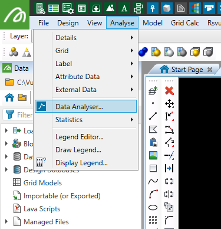{ width="360" loading=lazy }
  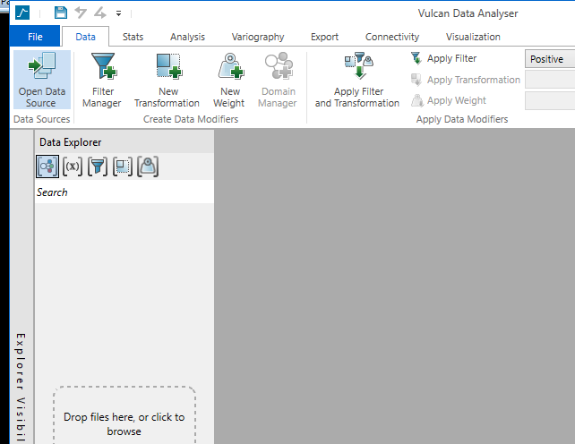{ width="360" loading=lazy }
  <figcaption>Analyse → Data Analyser (izquierda) y ventana del Data Analyser vacía (derecha).</figcaption>
</figure>

<figure markdown="span">
  { width="360" loading=lazy }
  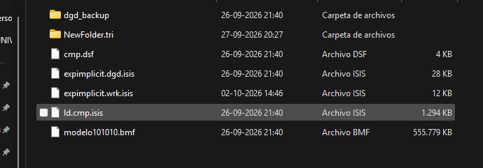{ width="360" loading=lazy }
  <figcaption>Open Data Source (izquierda) y la base ld.cmp.isis en la carpeta del proyecto (derecha).</figcaption>
</figure>

<figure markdown="span">
  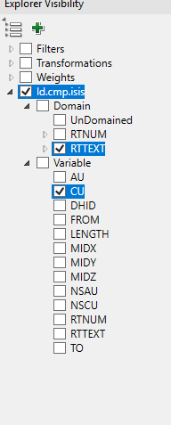{ width="360" loading=lazy }
  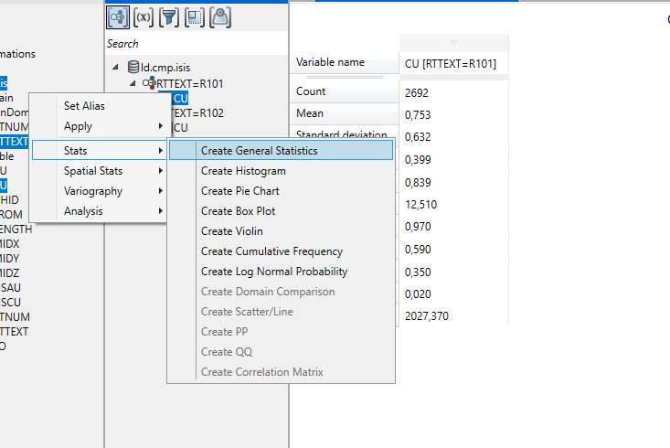{ width="360" loading=lazy }
  <figcaption>Explorer Visibility con CU y RTTEXT (izquierda) y menú Stats (derecha).</figcaption>
</figure>

<figure markdown="span">
  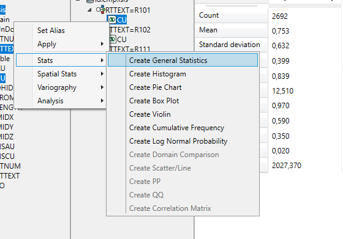{ width="360" loading=lazy }
  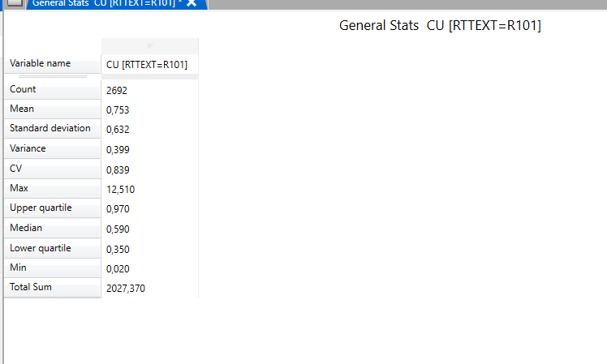{ width="360" loading=lazy }
  <figcaption>Create General Statistics (izquierda) y resultado para Cu en R101: 2.692 datos, media 0,753, mediana 0,590 y máximo 12,51 (derecha).</figcaption>
</figure>

<figure markdown="span">
  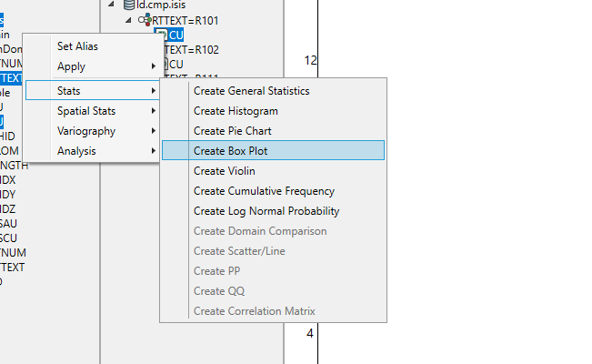{ width="360" loading=lazy }
  { width="360" loading=lazy }
  <figcaption>Create Box Plot (izquierda) y box plot de Cu en R101 (derecha).</figcaption>
</figure>

<figure markdown="span">
  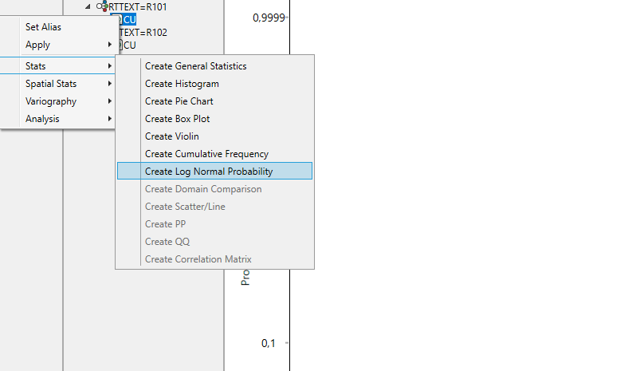{ width="360" loading=lazy }
  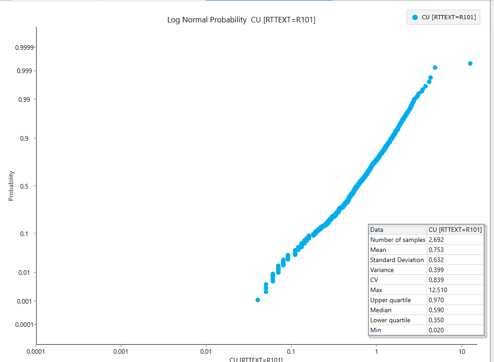{ width="360" loading=lazy }
  <figcaption>Create Log Normal Probability (izquierda) y gráfico de probabilidad de Cu en R101 (derecha).</figcaption>
</figure>

### Paso 2 · Filtrar los valores atípicos

La idea es encontrar los valores atípicos: los que quedan sobre el **97,5 %** del box plot, los puntos donde el **probability plot** cambia de pendiente o se quiebra, o los valores más alejados.

<figure markdown="span">
  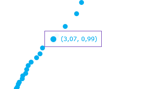{ width="330" loading=lazy }
  <figcaption>Quiebre en el gráfico de probabilidad: el punto (3,07 ; 0,99) marca el inicio de los valores atípicos.</figcaption>
</figure>

1. Abrir el **Filter Manager**.
1. Crear un filtro (por ejemplo, *cu 101 rec*) sobre la variable, con **Use Range** de 0 a **3,07**.
1. **Apply Filter**, para que lo que se calcule después use solo los datos filtrados.

<figure markdown="span">
  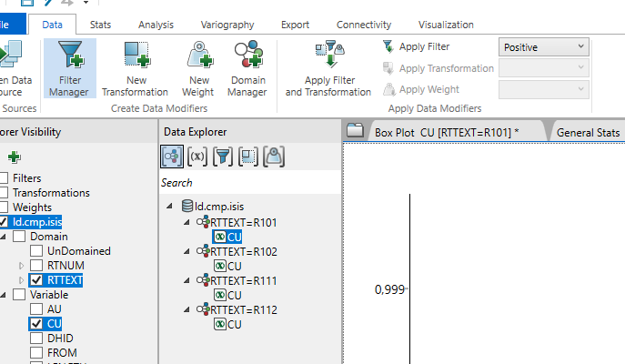{ width="360" loading=lazy }
  { width="360" loading=lazy }
  <figcaption>Filter Manager (izquierda) y filtro por rango: Cu entre 0 y 3,07 (derecha).</figcaption>
</figure>

<figure markdown="span">
  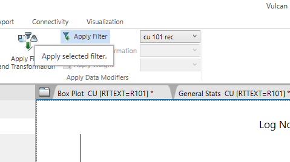{ width="479" loading=lazy }
  <figcaption>Apply Filter con el filtro cu 101 rec.</figcaption>
</figure>

En la clase se comentó que los valores típicos de cobre van de **0 a 1,5 %**.

!!! note "Complemento · El filtro no es capping"
    - El filtro saca los atípicos **solo para calcular el variograma**, para que unos pocos pares extremos no deformen la curva. La estimación sigue usando todos los datos, salvo que además se aplique capping.
    - El umbral (aquí 3,07 % para R101) depende de cada dominio: la revisión se repite en cada uno.

### Paso 3 · Medir el dominio y la distancia entre compósitos

Antes de llenar los parámetros hay que conocer dos distancias: el **tamaño del dominio**, para el radio de búsqueda, y la **distancia entre compósitos**, para el lag.

1. Cargar el sólido del dominio (por ejemplo, `R101.00t`).
1. Activar el **snap al punto**.
1. Usar la herramienta **Distance Between Points** y hacer clic en los extremos del dominio.
1. La distancia aparece en la ventana de mensajes: en este caso **~835 m** (se tomó ~800 m como referencia).

<figure markdown="span">
  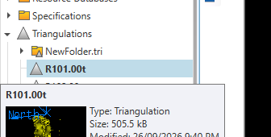{ width="360" loading=lazy }
  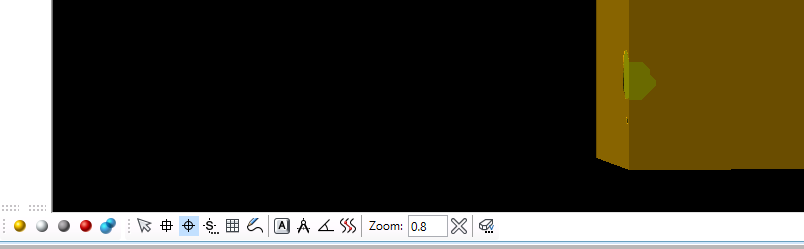{ width="360" loading=lazy }
  <figcaption>Sólido R101 en Triangulations (izquierda) y cargado en pantalla (derecha).</figcaption>
</figure>

<figure markdown="span">
  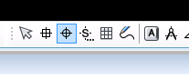{ width="360" loading=lazy }
  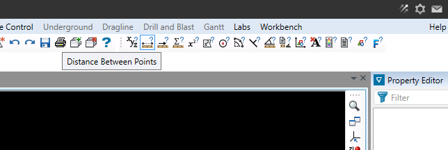{ width="360" loading=lazy }
  <figcaption>Botón de snap al punto (izquierda) y herramienta Distance Between Points (derecha).</figcaption>
</figure>

<figure markdown="span">
  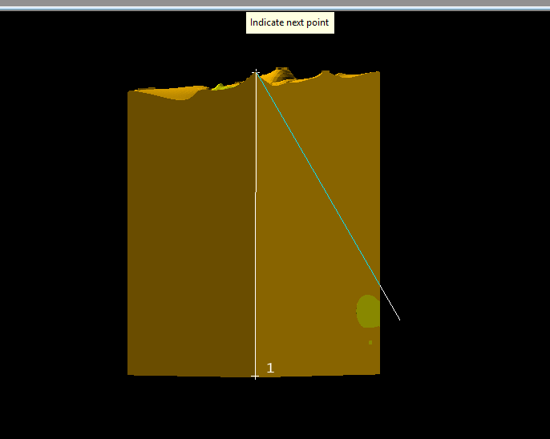{ width="360" loading=lazy }
  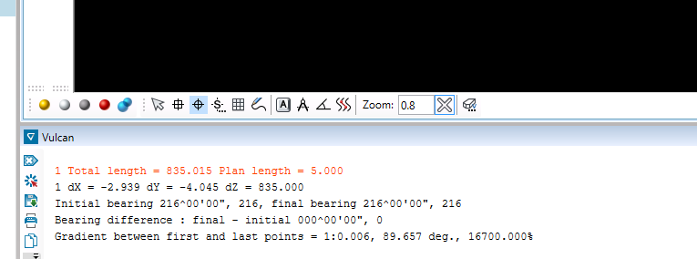{ width="360" loading=lazy }
  <figcaption>Medición sobre el sólido (izquierda) y resultado en la consola: 835 m (derecha).</figcaption>
</figure>

1. Cargar los compósitos: **Geology → Sampling → Load**, base `ld.cmp.isis`, grupo LD.
1. Con el snap al punto y **Distance Between Points**, medir de un compósito al siguiente.
1. Medir en **más de un sondaje** para comprobar: en este caso **~5 m**, que es el largo del compósito.

<figure markdown="span">
  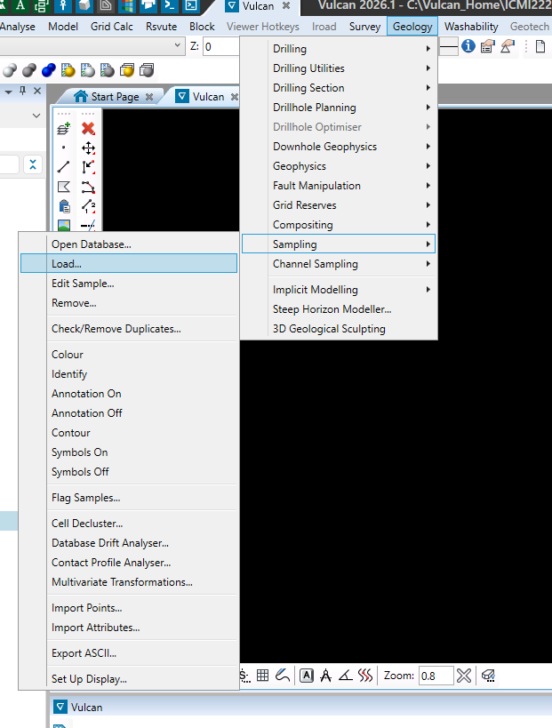{ width="360" loading=lazy }
  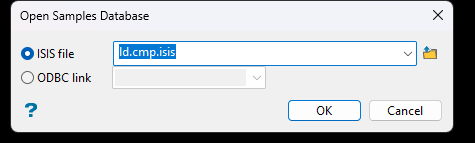{ width="360" loading=lazy }
  <figcaption>Geology → Sampling → Load (izquierda) y Open Samples Database con ld.cmp.isis (derecha).</figcaption>
</figure>

<figure markdown="span">
  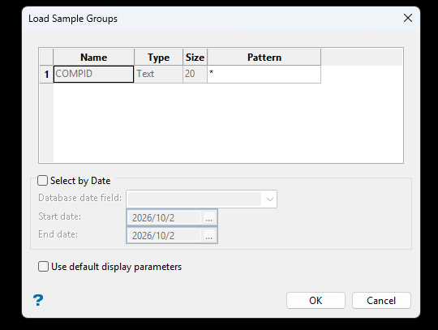{ width="360" loading=lazy }
  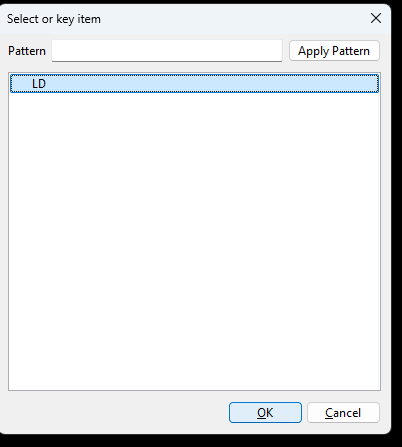{ width="360" loading=lazy }
  <figcaption>Load Sample Groups (izquierda) y grupo LD (derecha).</figcaption>
</figure>

<figure markdown="span">
  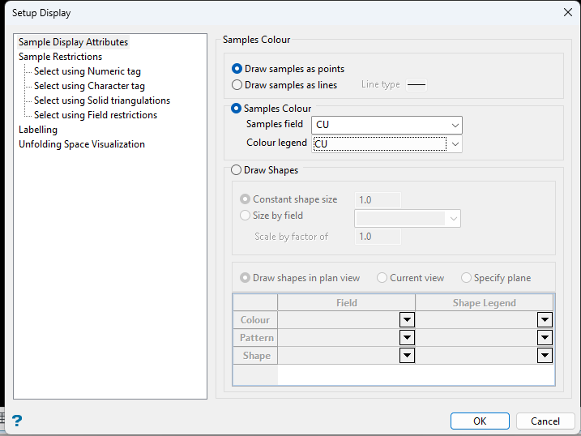{ width="360" loading=lazy }
  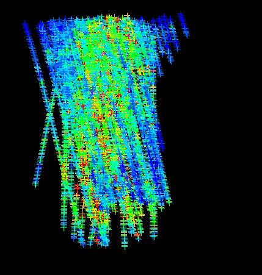{ width="360" loading=lazy }
  <figcaption>Setup Display por CU (izquierda) y compósitos cargados (derecha).</figcaption>
</figure>

<figure markdown="span">
  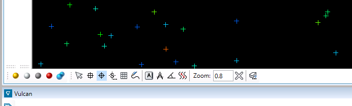{ width="360" loading=lazy }
  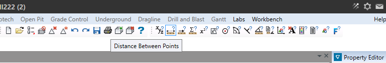{ width="360" loading=lazy }
  <figcaption>Barra de vista con el snap (izquierda) y Distance Between Points (derecha).</figcaption>
</figure>

<figure markdown="span">
  { width="360" loading=lazy }
  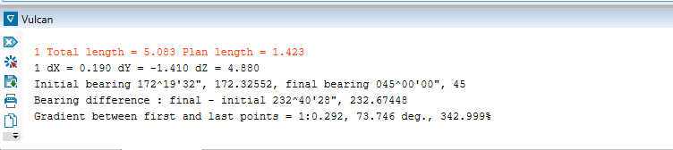{ width="360" loading=lazy }
  <figcaption>Medición entre dos compósitos (izquierda) y resultado: 5,05 m (derecha).</figcaption>
</figure>

### Paso 4 · Medir la malla con una sección

1. Con los compósitos cargados: **View → Create Section...**
1. Pinchar **Digitise** y hacer clic en el punto de vista.
1. **Step size**: distancia entre secciones. **Width either side**: tolerancia para encontrar los puntos a cada lado.
1. OK y medir la distancia entre puntos vecinos de la sección: sirve para la *horizontal tolerance*.

<figure markdown="span">
  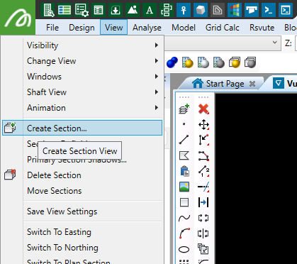{ width="360" loading=lazy }
  { width="360" loading=lazy }
  <figcaption>View → Create Section (izquierda) y ventana Create Section (derecha).</figcaption>
</figure>

<figure markdown="span">
  { width="360" loading=lazy }
  { width="360" loading=lazy }
  <figcaption>Vulcan pide el primer punto (izquierda) y compósitos dentro de la sección (derecha).</figcaption>
</figure>

### Paso 5 · Crear el fan variogram

1. En el Data Analyser, clic derecho en la variable filtrada → **Variography → Create Fan Variogram**.
1. Llenar los parámetros (tabla de abajo) y revisar el resultado.

<figure markdown="span">
  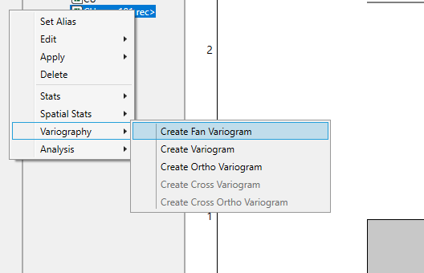{ width="441" loading=lazy }
  <figcaption>Variography → Create Fan Variogram.</figcaption>
</figure>

<figure markdown="span">
  { width="360" loading=lazy }
  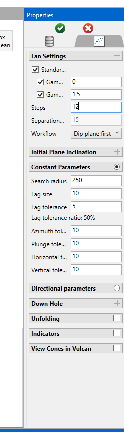{ width="360" loading=lazy }
  <figcaption>Panel de propiedades del fan variogram.</figcaption>
</figure>

<figure markdown="span">
  { width="360" loading=lazy }
  { width="360" loading=lazy }
  <figcaption>Más vistas del panel: Steps, Workflow y parámetros constantes.</figcaption>
</figure>

| Parámetro | Qué es | Valor usado (R101) |
|---|---|---|
| **Steps** | Cantidad de direcciones que se calculan. Depende de la potencia del computador: a más steps, más fino el abanico y más lento el cálculo. La separación se calcula sola (180 / steps) y define cuántos grados hay entre direcciones en la brújula. | 90 → separación de 2° |
| **Workflow** | Se elige *Major direction* para buscar primero la dirección de mayor continuidad. | Major direction |
| **Search radius** | Radio de búsqueda de pares. La teoría dice entre **1/3 y la mitad** del tamaño del dominio. | 400 m (dominio ≈ 800 m) |
| **Lag size** | La distancia h del variograma: un **múltiplo de la distancia entre compósitos**. Muy bajo da un variograma alterado y ruidoso; muy alto, uno demasiado suavizado. | 25 m (compósitos ≈ 5 m) |
| **Lag tolerance** | Por defecto, la mitad del lag size. | 12,5 m |
| **Azimuth tolerance** | Margen angular en el plano horizontal. Como las muestras no están en una grilla perfecta, se fija una dirección principal (por ejemplo, el rumbo de una veta a 45°) y una tolerancia para capturar los puntos cercanos a esa línea. | 22,5° |
| **Plunge tolerance** | Lo mismo que el azimut, pero en el plano vertical. Se busca que azimut + plunge sumen 45°. | 22,5° |
| **Horizontal tolerance** | Depende del tamaño de la malla de muestras. Corta el cono a gran distancia para que no se abra demasiado y los pares sigan en la misma franja geológica. | 25 m |
| **Vertical tolerance** | La mitad de la horizontal tolerance: distancia máxima hacia arriba y hacia abajo del plano central para considerar que dos puntos están a la misma altura (la mitad del ancho de banda). | 12,5 m |
| **Depth field** | Campo de profundidad del sondaje. | TO |

<figure markdown="span">
  { width="760" loading=lazy }
  <figcaption>Resultado para Cu en R101: abanico de variogramas (izquierda) y variograma en la dirección principal (derecha).</figcaption>
</figure>

!!! note "Complemento · Cómo leer el resultado"
    - El **abanico** muestra γ en todas las direcciones a la vez: la dirección con colores fríos más lejos del centro es la de **mayor continuidad** (mayor alcance).
    - En la curva de R101 los puntos sobre ~250 m saltan mucho: a esa distancia hay pocos pares y no se interpretan (regla de los 30 pares y de la mitad del campo).
    - Después se calculan variogramas en la dirección **principal, semi-principal y menor**, y se ajusta un modelo a cada uno (sección 9.2).

### Otras capturas de la clase del 28/09

**Steps:** cuántos pasos de separación angular se calculan. Mientras más pasos, más lento es el cálculo.

<figure markdown="span">
  { width="760" loading=lazy }
  <figcaption>Fan variogram de la clase: abanico (izquierda) y variograma en la dirección principal (derecha).</figcaption>
</figure>

<figure markdown="span">
  { width="760" loading=lazy }
  <figcaption>Gráfico de probabilidad log usado en clase para buscar los atípicos.</figcaption>
</figure>

<figure markdown="span">
  { width="360" loading=lazy }
  { width="360" loading=lazy }
  <figcaption>Filter Manager (izquierda) y panel de parámetros (derecha) de la clase.</figcaption>
</figure>

<figure markdown="span">
  { width="343" loading=lazy }
  <figcaption>View → Create Section.</figcaption>
</figure>
