---
tags:
  - ICMI222
  - Cuaderno
---

# Modelamiento variográfico (semana 9 · 28/09)

!!! quote "Cuaderno de clases"
    Mis apuntes de esa clase, ordenados y corregidos. Las capturas son de Vulcan y de los laboratorios.
    Las 13 diapositivas del curso que acompañaban estas notas no se publican: su contenido está resumido en [el apunte de clase](../clases/07-modelamiento-variogramas.md).

## 9.1 Del variograma experimental al modelo

- Partes: **efecto pepita** (subida al principio), **meseta** (eje y) y **alcance** (eje x).
- El modelo es una función continua que permite conocer γ a cualquier distancia, no solo donde hubo pares.

## 9.2 Modelos con meseta

\[ \text{Esférico: } \gamma(h) = C\left[\tfrac{3}{2}\tfrac{h}{a} - \tfrac{1}{2}\left(\tfrac{h}{a}\right)^3\right] \ (h < a); \qquad \gamma(h) = C \ (h \ge a) \]

\[ \text{Exponencial: } \gamma(h) = C\left[1 - e^{-3h/a}\right] \qquad \text{Gaussiano: } \gamma(h) = C\left[1 - e^{-3h^2/a^2}\right] \]

- Si la función es asintótica y no llega nunca a la meseta (exponencial, gaussiano), se usa el **alcance práctico**: donde llega al **95 %** de la meseta.
- El **modelo gaussiano debe tener un efecto pepita**; sin él, el kriging se vuelve inestable.

Al comparar modelos hay que **centrarse en el origen** (las distancias pequeñas), que es lo que más influye en la estimación.

## 9.3 Modelos sin meseta y anisotropía

Cuando la **meseta cambia con la dirección** (anisotropía zonal), suele deberse a la diferencia de dominios o a que el depósito está **estratificado**.

## 9.4 Del modelo a la estimación

*Esta parte de la clase se vio con diapositivas: está resumida en el [apunte de clase](../clases/07-modelamiento-variogramas.md).*

## 9.5 Variografía en Vulcan (Data Analyser)

1. Abrir el **Data Analyser** con la base de compósitos y elegir la variable y el dominio.
1. Revisar los valores atípicos en el histograma o en el gráfico de probabilidad.
1. Con el **Filter Manager** crear un filtro que **elimine** esos valores atípicos del cálculo.
1. Clic derecho en la variable → **Variography → Create Fan Variogram**.
1. Configurar los parámetros (tabla de abajo) y revisar el variograma resultante.

<figure markdown="span">
  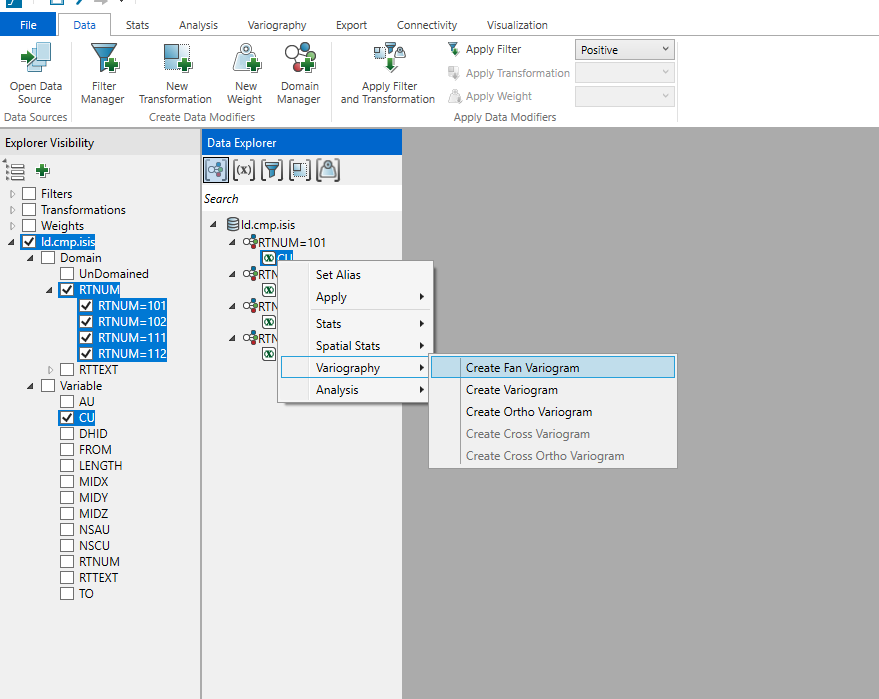{ width="637" loading=lazy }
  <figcaption>Data Analyser → Variography → Create Fan Variogram.</figcaption>
</figure>

<figure markdown="span">
  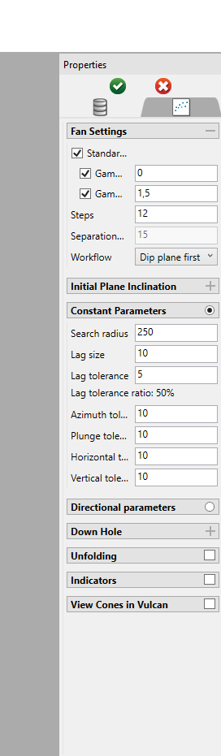{ width="360" loading=lazy }
  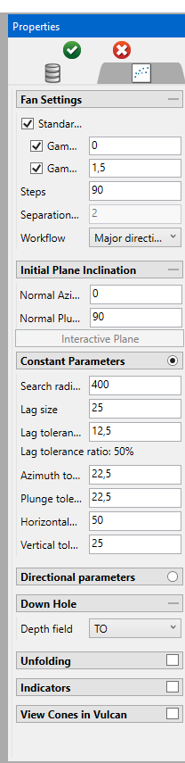{ width="360" loading=lazy }
  <figcaption>Panel de propiedades del fan variogram: Steps, Workflow y parámetros constantes.</figcaption>
</figure>

<figure markdown="span">
  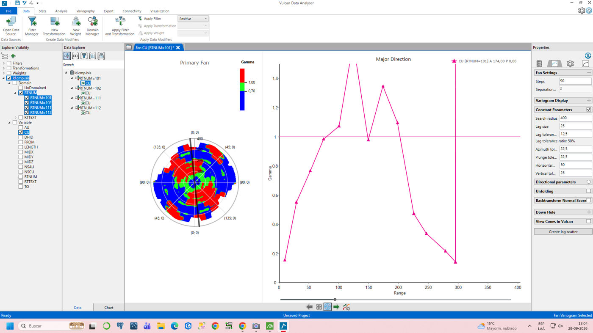{ width="760" loading=lazy }
  <figcaption>Resultado: abanico de variogramas (izquierda) y variograma en la dirección principal (derecha).</figcaption>
</figure>

<figure markdown="span">
  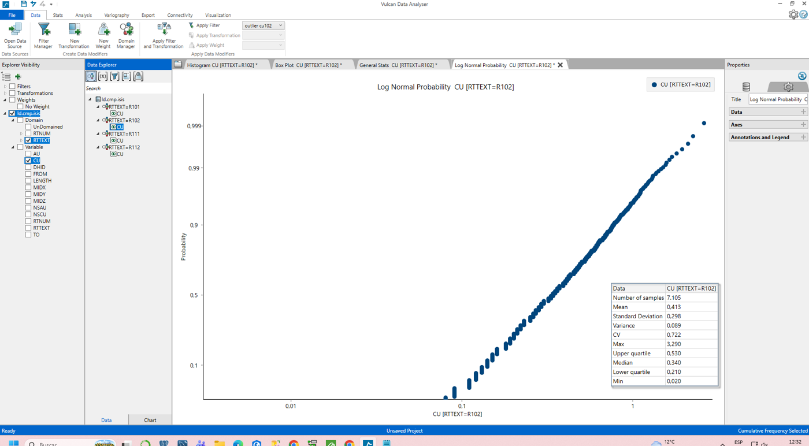{ width="760" loading=lazy }
  <figcaption>Gráfico de probabilidad log para encontrar los valores atípicos que se filtrarán.</figcaption>
</figure>

<figure markdown="span">
  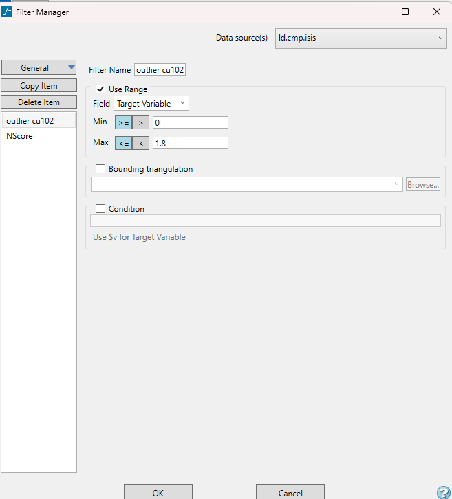{ width="441" loading=lazy }
  <figcaption>Filter Manager: filtro por rango de la variable.</figcaption>
</figure>

<figure markdown="span">
  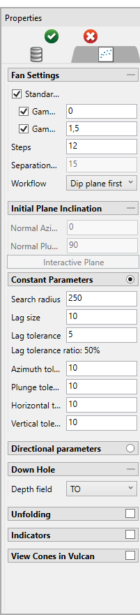{ width="360" loading=lazy }
  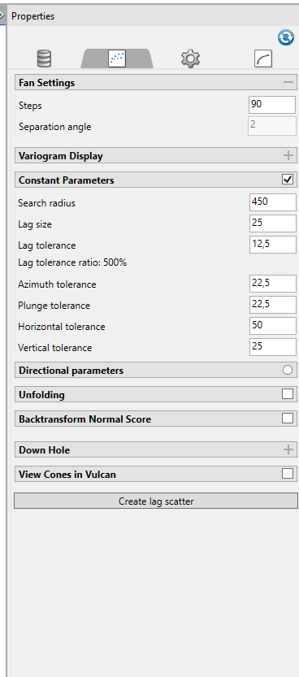{ width="360" loading=lazy }
  <figcaption>Parámetros usados: 90 steps y tolerancias de búsqueda.</figcaption>
</figure>

| Parámetro | Qué es |
|---|---|
| **Steps** | Cantidad de direcciones (pasos de separación angular) que se calculan. A más steps, más fino el abanico y más lento el computador; en clase se usaron 90. |
| **Workflow** | Se elige *Major direction* para buscar primero la dirección de mayor continuidad. |
| **Search radius** | Radio máximo de búsqueda de pares. Como regla, no más de la mitad del campo. |
| **Lag size** | La distancia h del variograma. Debe ser múltiplo del largo de compósito: muy corto da un variograma ruidoso; muy largo, uno demasiado suavizado. |
| **Lag tolerance** | Por defecto, la mitad del lag size. |
| **Azimuth tolerance** | Margen angular en el plano horizontal. Como las muestras no están en una grilla perfecta, se fija una dirección principal (por ejemplo, el rumbo de la veta) y una tolerancia para capturar los puntos cercanos a esa línea. |
| **Plunge tolerance** | Lo mismo que el azimut, pero medido en el plano vertical. |
| **Horizontal tolerance** | Distancia lateral máxima: corta el cono a gran distancia para que no se abra demasiado y los pares sigan en la misma franja geológica. |
| **Vertical tolerance** | Distancia máxima hacia arriba y hacia abajo del plano central para considerar que dos puntos están a la misma altura estructural (la mitad del ancho de banda). |

### Sección para digitalizar la dirección

1. **View → Create Section...**
1. Definir la sección por cota (*Level*) con recorte simétrico (*Width either side*) y el espaciado (*Step size*, distancia entre secciones).
1. Pinchar **Digitise** y hacer clic en los puntos de la vista para marcar la dirección.

<figure markdown="span">
  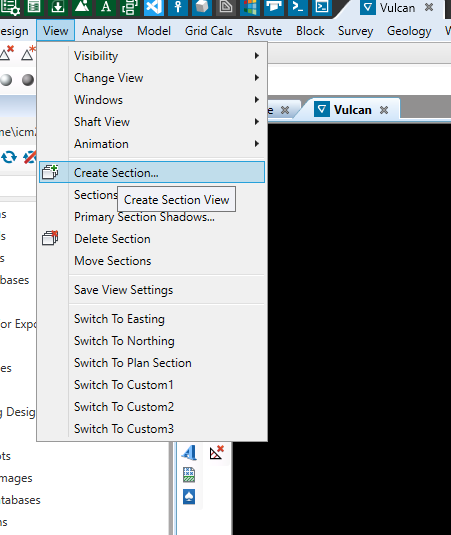{ width="360" loading=lazy }
  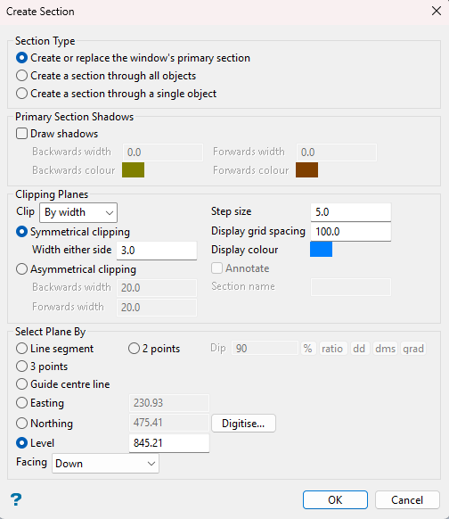{ width="360" loading=lazy }
  <figcaption>View → Create Section (izquierda) y ventana Create Section por cota (derecha).</figcaption>
</figure>

<figure markdown="span">
  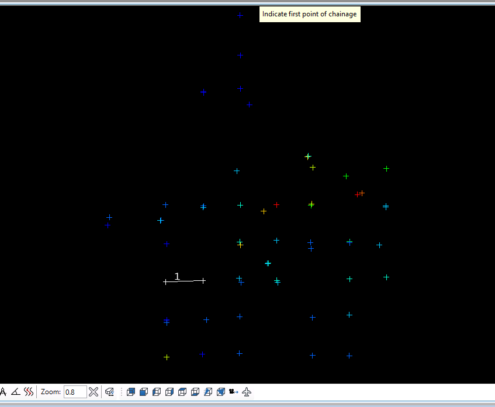{ width="539" loading=lazy }
  <figcaption>Vulcan pide indicar el primer punto (Indicate first point of chainage).</figcaption>
</figure>
