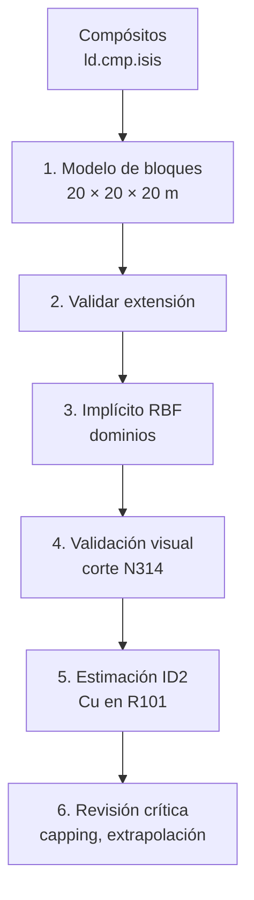
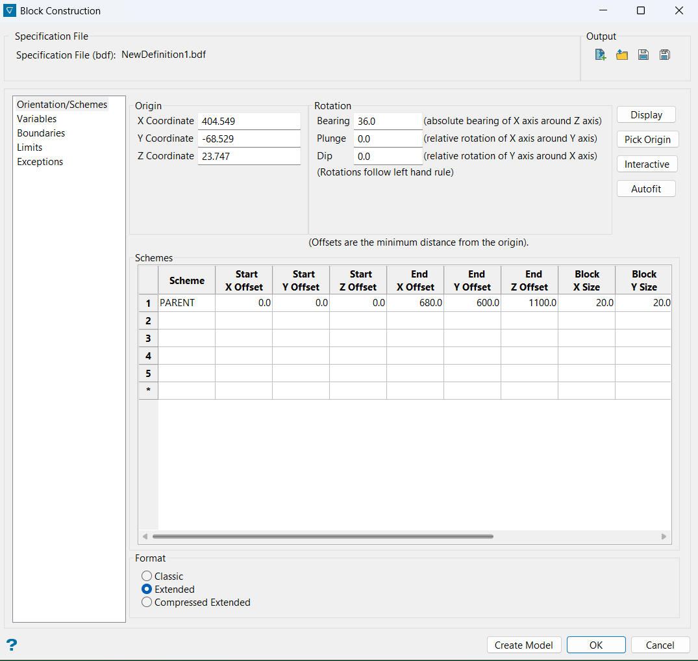
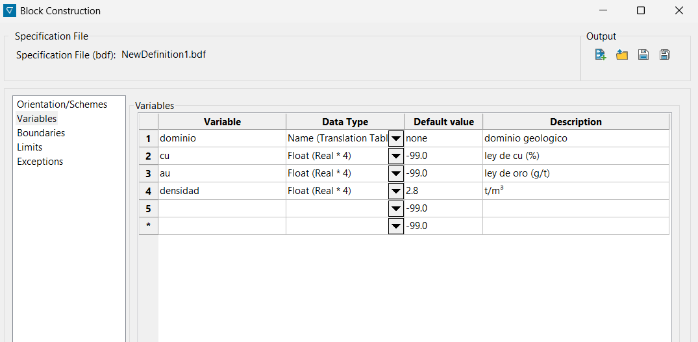
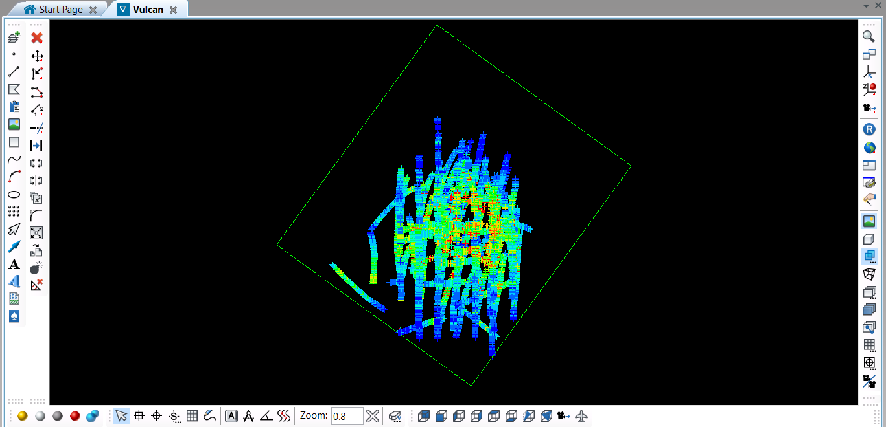
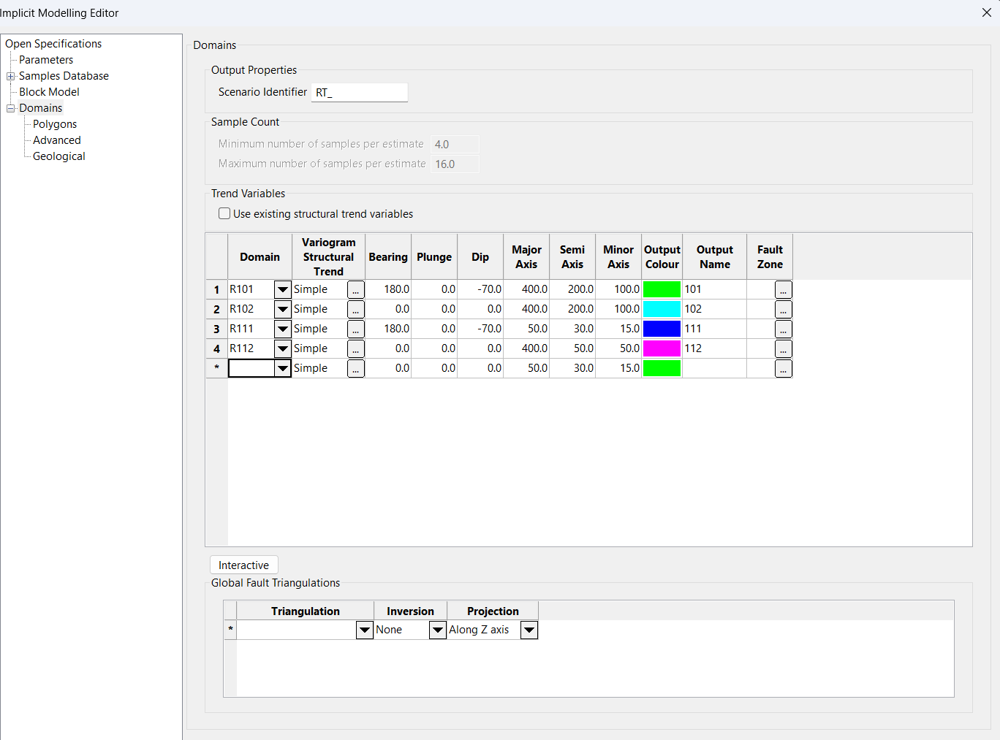
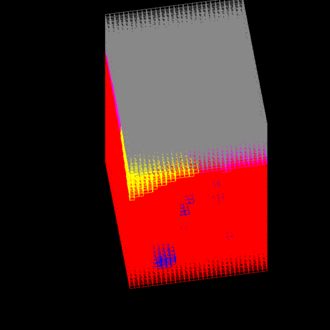
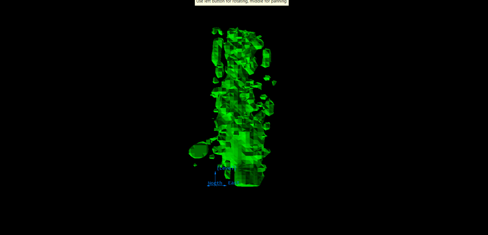
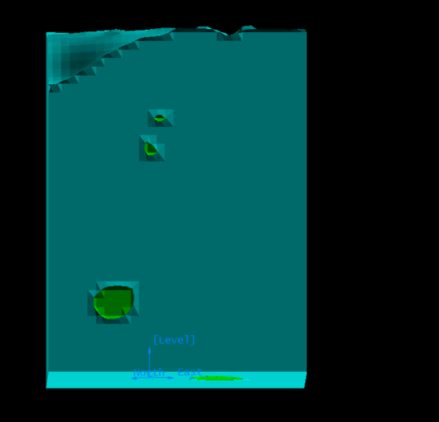
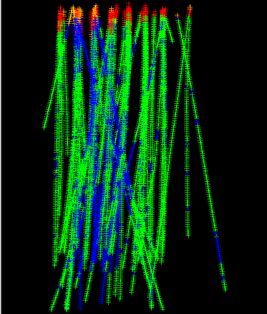
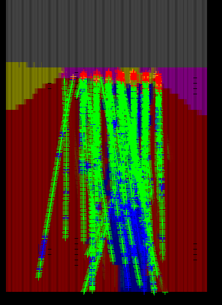

---
tags:
  - ICMI222
  - Vulcan
  - Modelo de bloques
  - Modelamiento implícito
  - Inverso a la distancia
  - Dominios
---

# Lab · Modelo de bloques, dominios implícitos y estimación ID2

!!! abstract "En una línea"
    Se construye un modelo de bloques de 20 m, se le asigna a cada bloque su **dominio geológico**
    con modelamiento implícito (RBF) y se estima la **ley de Cu** del dominio R101 por
    **inverso a la distancia al cuadrado**, respetando el contacto con los demás dominios.

| | |
|---|---|
| **Ramo** | ICMI222 · Evaluación de yacimientos |
| **Clase** | Laboratorio del 08/09, desarrollado el 29 y 30/09/2026 |
| **Software** | Maptek Vulcan 2026.1 |
| **Proyecto** | `C:\Vulcan_Home\icmi222\ICMI222` |
| **Datos de entrada** | `ld.cmp.isis` (10.478 compósitos), `topo.00t` (topografía) |
| **Resultados** | `modelo202020.bmf`, sólidos `RT_101…RT_112.00t`, estimación `icmi222.bef / ID2_101` |

## Flujo general

!!! info "La idea de fondo"
    Primero se definen **dónde** están los dominios (etapas 1 a 4) y recién después se estima
    **cuánta ley** hay dentro de cada uno (etapa 5). Así cada dominio se estima solo con sus
    propias muestras: eso es un **contacto duro**.

---

## 1. Modelo de bloques

### En Vulcan

1. **Block** → *Construction* → *New Definition...*
2. Pestaña **Orientation/Schemes** → botón **Autofit** (con los compósitos cargados).
3. Revisar que se creó el esquema `PARENT` y ajustar el tamaño de bloque a 20 m.
4. Pestaña **Variables**: crear las variables de la tabla de abajo.
5. Guardar la definición con el disquete de *Output* → `modelo202020.bdf`.
6. **Create Model** → `modelo202020.bmf` con *Index model* marcado.

### Parámetros

| Parámetro | Valor |
|---|---|
| Origen X / Y / Z | 404.549 / −68.529 / 23.747 |
| Bearing / Plunge / Dip | 36° / 0° / 0° |
| Extensión X × Y × Z | 680 × 600 × 1100 m |
| Tamaño de bloque | 20 × 20 × 20 m |
| Número de bloques | 34 × 30 × 55 = **56.100** |
| Formato | Extended |

| Variable | Tipo | Valor por defecto | Descripción |
|---|---|---|---|
| `dominio` | Name (Translation Table) | `none` | dominio geológico |
| `cu` | Float (Real × 4) | `-99` | ley de Cu (%) |
| `au` | Float (Real × 4) | `-99` | ley de Au (g/t) |
| `densidad` | Float (Real × 4) | `2.8` | t/m3 |

!!! note "Teoría: qué es un modelo de bloques"
    El modelo de bloques **discretiza** el yacimiento en celdas donde se guardan atributos
    (ley, dominio, densidad). El tamaño de bloque se elige según:

    - **La malla de sondajes**: del orden de ½ a ⅓ del espaciamiento. Un bloque mucho más chico
      que la malla da un *falso detalle*, porque bloques vecinos se estiman con casi las mismas muestras.
    - **La selectividad minera** (SMU, *selective mining unit*): el volumen mínimo que la mina
      puede separar como mineral o estéril.

    El **bearing** rota los ejes del modelo para alinearlos con el cuerpo mineralizado.

!!! warning "−99 no es ley cero"
    El valor por defecto `-99` (o `none` en variables de texto) significa **sin información**.
    Si se usara `0`, los bloques no estimados se promediarían como estéril y se **subestimaría**
    el recurso.

---

## 2. Validar la extensión

### En Vulcan

1. **Block** → *Viewing* → *Blocks...* → **Load model extent** (solo dibuja la caja).
2. Cargar los compósitos y la topografía, y revisar en planta y en varias secciones.

### Comprobación en coordenadas

Pasando los compósitos a los ejes del modelo (rotados 36°):

| Eje | Rango de los datos | Tamaño del modelo | Margen |
|---|---|---|---|
| X (dirección 36°) | 0,4 – 527 m | 680 m | ~153 m |
| Y (dirección 306°) | 0,4 – 461 m | 600 m | ~139 m |
| Z | 0,2 – 836 m | 1100 m | ~264 m |

!!! note "Teoría: por qué validar la extensión"
    Un sondaje que queda fuera del modelo es información perdida. *Autofit* pone el origen en el
    mínimo de los datos y **redondea hacia arriba** la extensión, por eso sobra un margen sin
    sondajes. Esos bloques existen, pero no hay datos que respalden su ley.

!!! tip "La perspectiva engaña"
    En la vista 3D la cara de arriba de la caja se ve más grande que la de abajo. Para saber si un
    dato está dentro, conviene comprobarlo en coordenadas o en vistas ortogonales.

---

## 3. Dominios con modelamiento implícito (RBF)

### En Vulcan

1. **Geology** → *Implicit Modelling* → *Implicit Modelling Editor*.
2. Completar cada sección del panel izquierdo según la tabla.
3. **Save** y después **Apply and Run**.

| Sección | Valor |
|---|---|
| Open Specifications | `dominios202020` · *Use radial basis function interpolation* · **Categorical** · `ld.cmp.isis` · Record `ENTRY` · Field `RTTEXT` · X/Y/Z `MIDX`/`MIDY`/`MIDZ` · grupo `LD` |
| Parameters | **As source** ✔ · *Limit Solids by Topography* `topo.00t` (Full cell) · smoothing 5 / 5 · fine adjustment 50 / 50 |
| Block Model | `modelo202020.bmf` (debe mostrar bearing 36° y bloques de 20) |
| Samples Database | sin filtros |

**Domains** (Scenario Identifier `RT_`):

| Dominio | Bearing | Plunge | Dip | Mayor | Semi | Menor | Output |
|---|---|---|---|---|---|---|---|
| R101 | 180 | 0 | −70 | 400 | 200 | 100 | 101 |
| R102 | 0 | 0 | 0 | 400 | 200 | 100 | 102 |
| R111 | 180 | 0 | −70 | 50 | 30 | 15 | 111 |
| R112 | 0 | 0 | 0 | 400 | 50 | 50 | 112 |

### Qué genera

- Sólidos `RT_101.00t`, `RT_102.00t`, `RT_111.00t`, `RT_112.00t`.
- En el modelo de bloques, la variable **`rt_rocktype`** con valores de texto
  `df101`, `df102`, `df111`, `df112` y `non` (sin dominio, sobre la topografía).
- Variables auxiliares `rt_df101…rt_df112` (las funciones de distancia).

{ width="48%" }
{ width="48%" }

!!! note "Teoría: dominios y RBF"
    Un **dominio de estimación** es un volumen donde la ley se comporta como **una sola población**
    (misma media y variabilidad). Es el supuesto de **estacionariedad**.

    El RBF categórico calcula, para cada dominio, una **función de distancia con signo**
    \(f(x)\) a partir de los compósitos: positiva dentro del dominio y negativa fuera. El contacto es
    la superficie donde la función vale cero:

    \[ \text{contacto} = \{\, x : f_{\text{dominio}}(x) = 0 \,\} \]

    El **elipsoide de tendencia** indica hacia dónde se alarga cada cuerpo (anisotropía geológica).

!!! warning "El implícito no escribe en la variable `dominio`"
    Crea su propia variable `rt_rocktype`. La variable `dominio` que creamos queda en `none`:
    para estimar se usa `rt_rocktype` o los sólidos.

!!! bug "Errores comunes"
    - **As source desmarcado**: Vulcan recompósita a 1 m y el cálculo se vuelve lento sin ganar nada.
    - **La ventana no cabe en la pantalla** y no se ven los botones: ++alt+space++ → ++m++ → flecha ↑ → ++enter++.
    - **Output Name mal escrito** (en clase quedó `10` en vez de `102`).

---

## 4. Validación visual

### En Vulcan

1. **Compósitos por dominio:** **Geology** → *Sampling* → *Load...* y, en la ventana
   *Setup Display* que aparece **al cargar**, poner *Samples field* `RTTEXT` y leyenda `RT`.
2. **Bloques por dominio:** **Block** → *Viewing* → *Blocks...* → *Load individual blocks* →
   variable `rt_rocktype`, *By Colour Scheme* `exp.scd` / `block_colour` / leyenda `RT_ROCKTYPE`,
   *Use solid shading*, translucidez ~40.
3. **Solo una tajada:** en *Block Selection* → *Select specific blocks by* → **Section thickness** `20`.
4. **Plano del corte:** *Section Plane* → Dip `90` → *Select by grid coordinate* → **By Northing** `314`.
5. Mirar el corte de frente (hacia el norte) y comparar colores.

### Colores usados

| Dominio | Compósitos (leyenda `RT`) | Bloques (leyenda `RT_ROCKTYPE`) |
|---|---|---|
| R101 · sulfuros alta ley | azul | azul |
| R102 · sulfuros halo | verde | rojo |
| R111 · óxidos alta ley | naranjo | amarillo |
| R112 · óxidos halo | rojo | magenta |
| sin dominio (aire) | — | gris |

!!! note "Teoría: validar contra los datos"
    Ningún modelo se acepta sin compararlo con los datos. En secciones se revisa que cada
    compósito caiga sobre bloques de su mismo dominio y se buscan **zonas extrapoladas**
    (dominio asignado sin sondajes cerca).

!!! bug "Errores comunes"
    - **Set Up Display no cambia los colores**: solo se aplica al cargar. Hay que quitar los compósitos
      (*Sampling → Remove*) y volver a cargarlos.
    - **Bloques todos grises**: la leyenda no reconoce los valores. `rt_rocktype` guarda `df101`, `df102`…
      y la leyenda `ROCKTYPE` original usa `r101`, `r102`… Se agregó una leyenda nueva `RT_ROCKTYPE`
      en `exp.scd` (Vulcan lee el archivo al abrir: reiniciar si no aparece).
    - **El *Slice* no dibuja nada**: la ventana *Slice Sections* quedó en *Select section by line*
      (Vulcan espera que dibujes una línea). Elegir *Select by grid coordinate*.
    - **El corte se ve como una línea**: se está mirando de canto; girar la vista.

---

## 5. Estimación de Cu por inverso a la distancia (ID2)

### En Vulcan

1. **Block** → *Grade Estimation* → **Univariate Estimation Editor**.
2. Estimation file `ICMI222` (crea `icmi222.bef`) → ícono **New** → ID `ID2_101`.
3. Completar las secciones de la tabla y pinchar **Save and Run**.

| Sección | Valor |
|---|---|
| Arriba | Block Model Estimation · **Inverse Distance** · `modelo202020.bmf` |
| Samples Selection | `ld.cmp.isis` · grupo `LD` · `MIDX`/`MIDY`/`MIDZ` · Grade field `CU` |
| Select Using Filter | **Character Filter** · `RTTEXT` · Include · `R101` → *Find All* |
| Estimation Result Variables | Grade variable `cu` · default `-99` |
| Search Region | Elipsoide · bearing 180 · plunge 0 · dip −70 · 400 / 200 / 100 m |
| Inverse Distance | **Normalize** → 1 / 0,5 / 0,25 · potencia `2` |
| Sample Count | mínimo 2 · máximo 16 |
| Block Selection | **Use Bounding Triangulation** `RT_101.00t` |

### Resultado (reporte `icmi222_id2_101.bef_report`)

| Dato | Valor |
|---|---|
| Muestras seleccionadas | 2.692 de 10.478 |
| Cu de las muestras | media 0,753 % · DE 0,632 · mín 0,02 · **máx 12,51** |
| Bloques dentro de `RT_101` | 2.266 (4,0 % del modelo) |
| Bloques estimados | **2.266 (100 %)** |
| Discretización | 4 × 4 × 1 = 16 puntos por bloque |

!!! note "Teoría: inverso a la distancia"
    La ley del bloque es un **promedio ponderado** de las muestras vecinas:

    \[ z^*(B) = \sum_{i=1}^{n} \lambda_i \, z_i \qquad
       \lambda_i = \frac{1/d_i^{\,p}}{\sum_{j=1}^{n} 1/d_j^{\,p}} \]

    - Las muestras cercanas pesan más y los pesos suman 1.
    - Con \(p = 2\) (ID2), una muestra al doble de distancia pesa la cuarta parte.
    - **Distancia anisotrópica**: se mide en el espacio del elipsoide. Con 1 / 0,5 / 0,25, una muestra
      a 100 m sobre el eje menor pesa lo mismo que una a 400 m sobre el eje mayor.
    - **Discretización**: el bloque se estima como el promedio de 16 puntos internos, porque se busca
      la ley del **volumen** del bloque y no la de un punto (**soporte**).

!!! note "Teoría: ID2 frente a kriging"
    El inverso a la distancia es un método **geométrico**:

    - no usa el variograma, así que no sabe hasta qué distancia las leyes están correlacionadas;
    - no considera la **redundancia**: muestras agrupadas en un mismo sondaje suman peso como si
      fueran independientes;
    - no entrega una **varianza de estimación**.

    El kriging resuelve estas tres cosas usando el variograma.

!!! info "Contacto duro"
    El filtro `RTTEXT = R101` (solo muestras del dominio) sumado al sólido `RT_101` (solo bloques del
    dominio) hacen que R101 se estime **sin mezclarse** con el halo R102.

---

## 6. Revisión crítica y pendientes

- **Valor extremo sin capping.** El máximo de R101 es 12,51 % Cu (sondaje 154, Z 218 m, con solo
  0,46 g/t de Au). Duplica al segundo valor más alto de la base y el reporte dice
  *"Sample values are not cut"*: ese dato infla los bloques de su alrededor.
- **Extrapolación hacia los bordes.** R102 llena toda la caja, y las cuñas de óxidos (R111, R112)
  crecen hacia los costados donde no hay sondajes. Es un efecto del RBF categórico sobre el margen
  vacío del modelo.
- **Efecto del tamaño de bloque.** Bajo los sondajes, la capa de óxidos mide menos de 20 m y casi
  no se asigna a bloques de 20 m.
- **Estimación incompleta.** Falta estimar R102, R111 y R112 (misma receta, cambiando filtro,
  elipsoide y sólido) si se necesita el modelo completo.
- **Falta validar la estimación**: comparar la media de bloques con la media desagrupada de los
  compósitos, revisar *swath plots* y secciones.

| Estimation ID | Filtro `RTTEXT` | Búsqueda (B / P / D · mayor / semi / menor) | Sólido |
|---|---|---|---|
| `ID2_102` | R102 | 0 / 0 / 0 · 400 / 200 / 100 | `RT_102.00t` |
| `ID2_111` | R111 | 180 / 0 / −70 · 50 / 30 / 15 | `RT_111.00t` |
| `ID2_112` | R112 | 0 / 0 / 0 · 400 / 50 / 50 | `RT_112.00t` |

---

## Preguntas de repaso

??? question "¿Por qué el valor por defecto de `cu` es −99 y no 0?"
    Porque −99 marca **sin estimar**. Si fuera 0, los bloques sin información se tratarían como
    estéril: bajarían la ley media y el recurso quedaría subestimado. Además no se podría distinguir
    un bloque realmente pobre de uno que simplemente no tiene datos cerca.

??? question "¿Qué le pasa a un bloque del margen que no tiene muestras dentro del elipsoide?"
    No alcanza el mínimo de muestras (2) y queda en −99, sin estimar. Si el elipsoide sí alcanza
    algún sondaje lejano, el bloque se estima, pero por **extrapolación**: la ley existe en el
    modelo, pero tiene poco respaldo y no debería reportarse con la misma confianza.

??? question "¿Por qué el sólido R102 terminó llenando toda la caja?"
    El RBF categórico asigna cada punto del espacio al dominio cuya función de distancia es mayor.
    Lejos de los datos no hay nada que contradiga al dominio que lo rodea todo (el halo R102), así
    que se extiende hasta los límites del modelo. Es **extrapolación**, no geología observada.

??? question "¿Por qué hay compósitos verdes sobre bloques azules en el corte si el modelo está bien?"
    Por dos razones:

    1. Los bloques son una franja de 20 m en N314, pero los compósitos en pantalla son **todos**,
       proyectados desde cualquier Northing.
    2. **Soporte**: cada bloque de 20 m recibe un solo dominio (según su centro). Cerca de un contacto,
       el bloque puede contener compósitos de los dos dominios.

??? question "Si subo la potencia del ID de 2 a 3, ¿el modelo queda más suave o más concentrado?"
    Más **concentrado alrededor de los sondajes** (menos suavizado): la muestra más cercana gana
    todavía más peso. En el extremo, con una potencia muy alta, el método tiende a **vecino más
    cercano** (polígonos). Con potencia 0 todos los pesos son iguales y el bloque recibe la
    **media simple** de las muestras encontradas.

??? question "¿Cómo se justifica un capping para el Cu de R101?"
    Se busca el valor donde la distribución deja de ser continua: el **quiebre** en el gráfico de
    probabilidad log-normal, apoyado en el histograma y en percentiles altos (P98–P99,5). Después se
    reporta cuántas muestras se recortaron y **cuánto metal se pierde** al recortarlas. En este caso,
    el 12,51 % aislado, que además no se acompaña de Au alto, es candidato claro a recorte o a
    revisión en la base (QA/QC).
