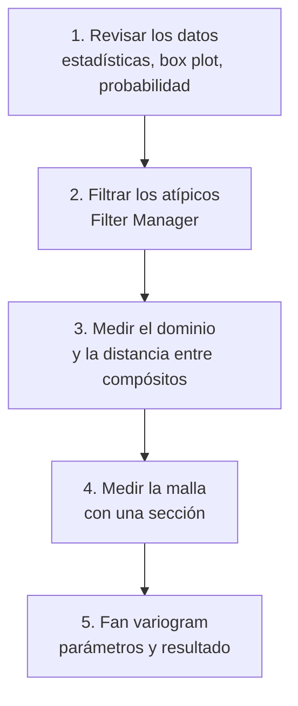

---
tags:
  - ICMI222
  - Vulcan
  - Variografía
  - Análisis exploratorio
---

# Tutorial · Cómo generar un variograma en Vulcan

!!! abstract "En una línea"
    Se revisan y filtran los datos de un dominio, se miden el dominio y la distancia entre
    compósitos, y con eso se llenan los parámetros del **fan variogram** del Data Analyser.
    Ejemplo: **Cu del dominio R101**.

| | |
|---|---|
| **Ramo** | ICMI222 · Evaluación de yacimientos |
| **Clases** | Semanas 8 y 9 (21/09 y 28/09) |
| **Software** | Maptek Vulcan 2026.1 · Data Analyser |
| **Datos de entrada** | `ld.cmp.isis` (compósitos de ~5 m) y el sólido del dominio `R101.00t` |
| **Resultado** | Fan variogram de Cu en R101 y la dirección de mayor continuidad |
| **Teoría** | [PPT 06 · Variograma experimental](clases/06-variograma-experimental.md) · [PPT 07 · Modelamiento](clases/07-modelamiento-variogramas.md) |

## Flujo general

---

## 1. Revisar los datos antes de calcular

1. **Analyse → Data Analyser**.
2. *Open Data Source* → `ld.cmp.isis`.
3. En *Explorer Visibility*, marcar la variable **CU** y el dominio (**RTTEXT**).
4. Clic derecho en CU de R101 → **Stats** → **Create General Statistics**, **Create Box Plot** y **Create Log Normal Probability**.

Qué se revisa:

- la **cantidad de datos**;
- la diferencia entre **media y mediana**, y su influencia;
- si hay **valores negativos** o **atípicos**.

<figure markdown="span">
  { width="320" }
  { width="420" }
  <figcaption>Analyse → Data Analyser (izquierda) y estadísticas de Cu en R101: 2.692 datos, media 0,753, mediana 0,590, máximo 12,51 (derecha).</figcaption>
</figure>

<figure markdown="span">
  { width="380" }
  { width="380" }
  <figcaption>Box plot (izquierda) y gráfico de probabilidad log (derecha) de Cu en R101.</figcaption>
</figure>

!!! note "Teoría: por qué revisar antes"
    El variograma promedia **diferencias al cuadrado**: un solo valor extremo forma pares con
    todas sus muestras vecinas y dispara γ en varias distancias. Por eso los atípicos se revisan
    antes de calcular. Ver [AED II: valores extremos](clases/03-aed-decisiones.md#valores-extremos-y-capping).

## 2. Filtrar los valores atípicos

Los candidatos a atípicos son los valores sobre el **percentil 97,5** del box plot, los puntos
donde el **gráfico de probabilidad** cambia de pendiente o se quiebra, y los valores más alejados.

<figure markdown="span">
  { width="260" }
  { width="460" }
  <figcaption>Quiebre del gráfico de probabilidad en 3,07 % Cu (izquierda) y filtro en el Filter Manager con Use Range de 0 a 3,07 (derecha).</figcaption>
</figure>

1. Abrir el **Filter Manager**.
2. Crear un filtro (por ejemplo, *cu 101 rec*) sobre la variable, con **Use Range** de 0 a **3,07**.
3. **Apply Filter**: lo que se calcule después usa solo los datos filtrados.

!!! warning "El filtro no es capping"
    El filtro saca los atípicos **solo para calcular el variograma**. La estimación sigue usando
    todos los datos, salvo que además se aplique capping. El umbral depende de cada dominio
    (3,07 % es el de R101), así que la revisión se repite en cada uno.

## 3. Medir el dominio y la distancia entre compósitos

Estas dos distancias definen el **search radius** y el **lag size**.

**Tamaño del dominio**

1. Cargar el sólido del dominio (`R101.00t`).
2. Activar el **snap al punto** y usar **Distance Between Points**.
3. Hacer clic en los extremos del dominio: la distancia aparece en la ventana de mensajes.

<figure markdown="span">
  { width="340" }
  { width="420" }
  <figcaption>Medición sobre el sólido R101 (izquierda): la consola da 835 m (derecha); se usó ~800 m como referencia.</figcaption>
</figure>

**Distancia entre compósitos**

1. Cargar los compósitos (**Geology → Sampling → Load**, `ld.cmp.isis`, grupo LD).
2. Con el snap y **Distance Between Points**, medir de un compósito al siguiente.
3. Repetir en **más de un sondaje** para comprobar.

<figure markdown="span">
  { width="380" }
  { width="380" }
  <figcaption>Medición entre dos compósitos (izquierda): 5,05 m, el largo del compósito (derecha).</figcaption>
</figure>

## 4. Medir la malla con una sección

1. **View → Create Section...**, **Digitise** y clic en el punto de vista.
2. **Step size**: distancia entre secciones. **Width either side**: tolerancia para encontrar los puntos a cada lado.
3. Medir la distancia entre puntos vecinos de la sección: es la referencia para la **horizontal tolerance**.

<figure markdown="span">
  { width="360" }
  <figcaption>Compósitos dentro de la sección, para medir el espaciamiento de la malla.</figcaption>
</figure>

## 5. Crear el fan variogram

1. En el Data Analyser, clic derecho en la variable filtrada → **Variography → Create Fan Variogram**.
2. Llenar los parámetros de la tabla y revisar el resultado.

<figure markdown="span">
  { width="380" }
  <figcaption>Variography → Create Fan Variogram.</figcaption>
</figure>

| Parámetro | Qué es | Cómo se elige | R101 |
|---|---|---|---|
| **Steps** | Cantidad de direcciones del abanico | Según la potencia del computador; la separación es 180 / steps | 90 → 2° |
| **Workflow** | Orden de búsqueda | *Major direction*: primero la dirección de mayor continuidad | Major direction |
| **Search radius** | Distancia máxima de los pares | Entre **1/3 y la mitad** del tamaño del dominio | 400 m |
| **Lag size** | La distancia h entre clases | **Múltiplo** de la distancia entre compósitos | 25 m |
| **Lag tolerance** | Cuánto puede variar la distancia del par | La mitad del lag | 12,5 m |
| **Azimuth tolerance** | Apertura del cono en planta | Por defecto 22,5° | 22,5° |
| **Plunge tolerance** | Apertura del cono en la vertical | 22,5°; con el azimut suman 45° | 22,5° |
| **Horizontal tolerance** | Ancho máximo del cono en planta | Según el tamaño de la malla | 25 m |
| **Vertical tolerance** | Alto máximo del cono | La mitad de la horizontal | 12,5 m |
| **Depth field** | Profundidad del sondaje | Campo hasta | TO |

<figure markdown="span">
  
  <figcaption>Resultado para Cu en R101: abanico de variogramas (izquierda), variograma en la dirección principal (centro) y parámetros usados (derecha).</figcaption>
</figure>

!!! note "Teoría: cómo leer el resultado"
    - El **abanico** muestra γ en todas las direcciones a la vez: la dirección donde γ se mantiene
      bajo hasta más lejos es la de **mayor continuidad** (mayor alcance).
    - En la curva de R101, los puntos sobre ~250 m saltan mucho: a esa distancia hay pocos pares
      y **no se interpretan** (regla de los 30 pares y de la mitad del campo).
    - Después se calculan variogramas en las direcciones **principal, semi-principal y menor**, y se
      ajusta un modelo a cada uno: ver [modelamiento](clases/07-modelamiento-variogramas.md#como-ajustar-un-modelo-paso-a-paso).

## Errores comunes

- **Lag mucho menor o mayor que la distancia entre compósitos.** Con un lag muy chico el variograma sale ruidoso y alterado; con uno muy grande, demasiado suavizado.
- **Search radius mayor que la mitad del dominio.** Los últimos puntos tienen pocos pares y la curva se vuelve errática.
- **No filtrar los atípicos.** Unos pocos valores extremos inflan γ y esconden la estructura.
- **Medir la distancia entre compósitos en un solo sondaje.** Conviene comprobar en varios.

## Preguntas de repaso

??? question "¿Por qué el lag debe ser múltiplo de la distancia entre compósitos?"
    Porque los pares a lo largo del sondaje están separados por múltiplos de ese largo (5, 10, 15 m…).
    Si el lag no calza, algunas clases de distancia quedan casi vacías y otras mezclan pares de
    distancias distintas.

??? question "El dominio mide ~800 m. ¿Qué search radius usarías y por qué?"
    Entre 270 y 400 m (de 1/3 a la mitad del dominio). Más allá, quedan pocos pares en cada clase y
    los puntos del variograma no son confiables.

??? question "¿Qué diferencia hay entre filtrar los atípicos y aplicar capping?"
    El filtro los excluye solo del cálculo del variograma. El capping recorta su valor para la
    estimación de los bloques. Son decisiones distintas, aunque usan las mismas herramientas para
    encontrar el umbral.

??? question "¿Para qué sirve la vertical tolerance si ya hay plunge tolerance?"
    La plunge tolerance es un ángulo: el cono se sigue abriendo con la distancia. La vertical
    tolerance pone un tope en metros, para que a gran distancia los pares no salgan de la misma
    franja o nivel geológico.
