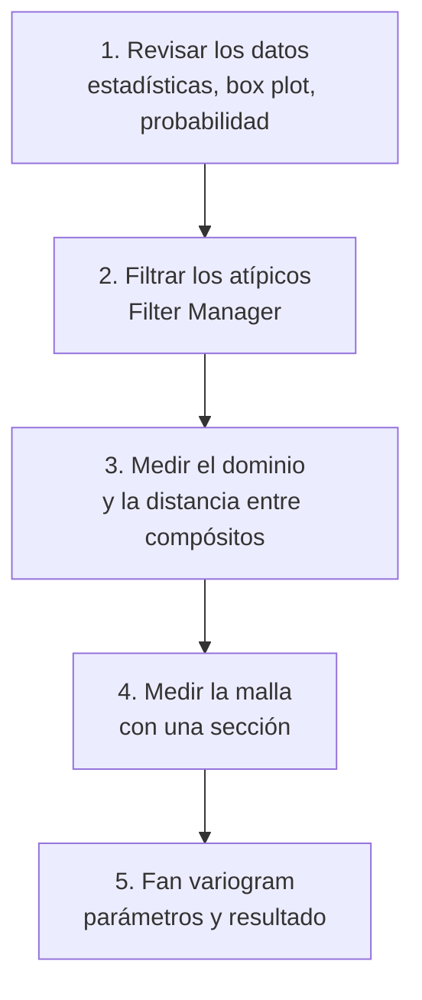
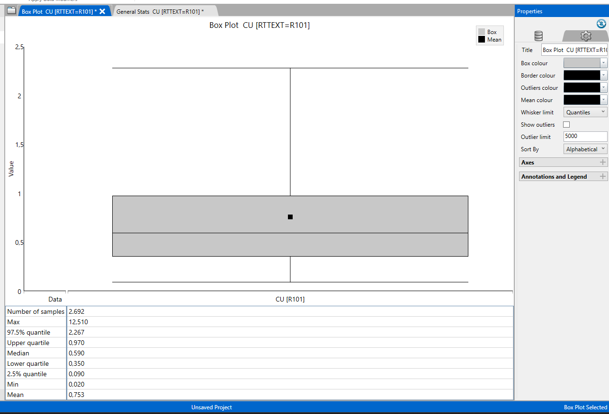
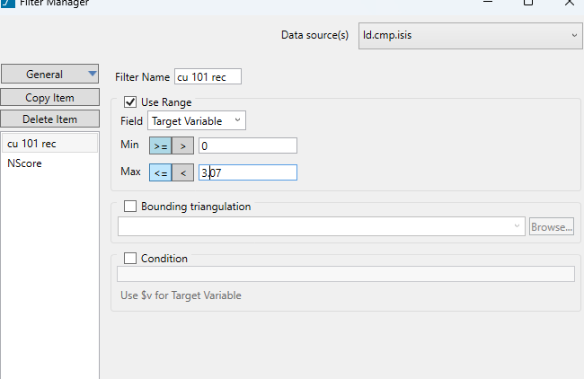
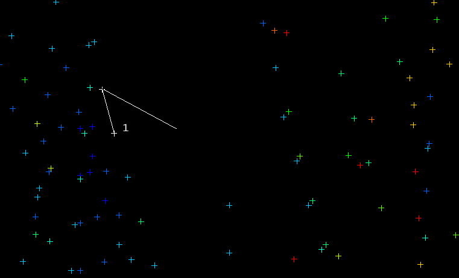
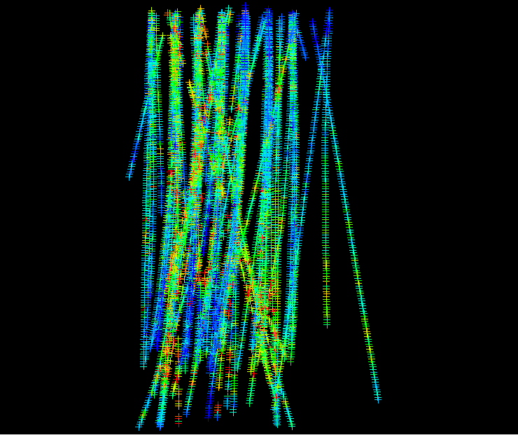
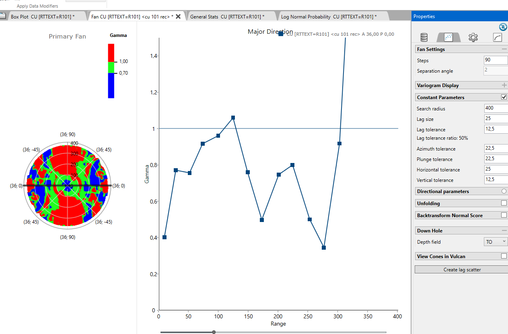

---
tags:
  - ICMI222
  - Vulcan
  - Variografía
  - Análisis exploratorio
---

# Tutorial · Cómo generar un variograma en Vulcan

!!! abstract "En una línea"
    Se revisan y filtran los datos de un dominio, se miden el dominio y la distancia entre
    compósitos, y con eso se llenan los parámetros del **fan variogram** del Data Analyser.
    Ejemplo: **Cu del dominio R101**.

| | |
|---|---|
| **Ramo** | ICMI222 · Evaluación de yacimientos |
| **Clases** | Semanas 8 y 9 (21/09 y 28/09) |
| **Software** | Maptek Vulcan 2026.1 · Data Analyser |
| **Datos de entrada** | `ld.cmp.isis` (compósitos de ~5 m) y el sólido del dominio `R101.00t` |
| **Resultado** | Fan variogram de Cu en R101 y la dirección de mayor continuidad |
| **Teoría** | [PPT 06 · Variograma experimental](clases/06-variograma-experimental.md) · [PPT 07 · Modelamiento](clases/07-modelamiento-variogramas.md) |

## Flujo general

---

## 1. Revisar los datos antes de calcular

1. **Analyse → Data Analyser**.
2. *Open Data Source* → `ld.cmp.isis`.
3. En *Explorer Visibility*, marcar la variable **CU** y el dominio (**RTTEXT**).
4. Clic derecho en CU de R101 → **Stats** → **Create General Statistics**, **Create Box Plot** y **Create Log Normal Probability**.

Qué se revisa:

- la **cantidad de datos**;
- la diferencia entre **media y mediana**, y su influencia;
- si hay **valores negativos** o **atípicos**.

<figure markdown="span">
  { width="320" }
  { width="420" }
  <figcaption>Analyse → Data Analyser (izquierda) y estadísticas de Cu en R101: 2.692 datos, media 0,753, mediana 0,590, máximo 12,51 (derecha).</figcaption>
</figure>

<figure markdown="span">
  { width="380" }
  { width="380" }
  <figcaption>Box plot (izquierda) y gráfico de probabilidad log (derecha) de Cu en R101.</figcaption>
</figure>

!!! question "¿Por qué se revisa cada cosa?"
    - **Cantidad de datos:** cada punto del variograma necesita al menos **30 pares**. Un dominio con
      pocos datos da un variograma ruidoso, imposible de modelar. R101 tiene 2.692 compósitos y no
      hay problema; R111 tiene solo 151, y ahí sí puede haberlo.
    - **Media contra mediana:** si la media está muy por encima de la mediana (en R101, 0,753 contra
      0,590), hay una **cola de valores altos**. Esa cola va a pesar mucho en el variograma, porque
      el variograma eleva al cuadrado las diferencias.
    - **Valores negativos:** una ley no puede ser negativa. Si aparecen, casi siempre son **códigos de
      dato faltante** (−99, −999). Un par con un −99 aporta una diferencia de ~100, que al cuadrado
      es 10.000: arruina el variograma completo.
    - **Box plot y gráfico de probabilidad:** son dos formas independientes de ver dónde la cola alta
      deja de comportarse como el resto de los datos. Si ambos apuntan al mismo valor, el umbral
      está bien justificado.

    Ver también [AED II: valores extremos](clases/03-aed-decisiones.md#valores-extremos-y-capping).

## 2. Filtrar los valores atípicos

Los candidatos a atípicos son los valores sobre el **percentil 97,5** del box plot, los puntos
donde el **gráfico de probabilidad** cambia de pendiente o se quiebra, y los valores más alejados.

<figure markdown="span">
  { width="260" }
  { width="460" }
  <figcaption>Quiebre del gráfico de probabilidad en 3,07 % Cu (izquierda) y filtro en el Filter Manager con Use Range de 0 a 3,07 (derecha).</figcaption>
</figure>

1. Abrir el **Filter Manager**.
2. Crear un filtro (por ejemplo, *cu 101 rec*) sobre la variable, con **Use Range** de 0 a **3,07**.
3. **Apply Filter**: lo que se calcule después usa solo los datos filtrados.

!!! question "¿Por qué hay que filtrar los datos en un rango?"
    **1. El variograma eleva al cuadrado las diferencias, así que los extremos pesan muchísimo.**
    Un par formado por 12,51 % y 0,75 % aporta (12,51 − 0,75)² ≈ **138**. Un par típico de R101 a
    5 m de distancia aporta ~0,12. Es decir, **un solo par extremo pesa como ~1.100 pares normales**.

    **2. Con pocos datos se deforma toda la curva.** En R101 hay solo **18 compósitos sobre 3,07 %**
    (el 0,67 % de los datos). Calculando el variograma a lo largo de los sondajes, con y sin ellos:

    | Distancia (≈) | γ con todos los datos | γ sin los 18 atípicos | Diferencia |
    |---|---|---|---|
    | 5 m | 0,085 | 0,061 | +39 % |
    | 10 m | 0,129 | 0,088 | +47 % |
    | 15 m | 0,145 | 0,108 | +34 % |
    | 20 m | 0,170 | 0,122 | +39 % |
    | Varianza (≈ meseta) | 0,399 | 0,278 | +44 % |

    Menos del 1 % de los datos sube el variograma ~40 % en todas las distancias. Con ellos, el
    efecto pepita parece más alto y la estructura real queda escondida. En cambio, la **media casi
    no cambia** (0,753 contra 0,728): los extremos afectan mucho más la variabilidad que el promedio.

    **3. Por qué el límite inferior es 0:** deja fuera los negativos y los códigos de dato faltante
    (−99), que son valores imposibles para una ley.

    **4. Por qué el límite superior es 3,07:** es el punto donde el **gráfico de probabilidad se
    quiebra**. Sobre ese valor los datos ya no siguen la misma población: pueden ser otra población
    (vetillas, un dominio mal asignado) o errores. El umbral no es arbitrario, lo marca el gráfico.

    **5. Por qué con un filtro y no borrando los datos:** el Filter Manager no modifica la base. Solo
    excluye esos valores del cálculo, y el filtro se puede cambiar o quitar en cualquier momento.

!!! warning "El filtro no es capping"
    El filtro saca los atípicos **solo para calcular el variograma**. La estimación sigue usando
    todos los datos, salvo que además se aplique capping. El umbral depende de cada dominio
    (3,07 % es el de R101), así que la revisión se repite en cada uno.

## 3. Medir el dominio y la distancia entre compósitos

Estas dos distancias definen el **search radius** y el **lag size**.

**Tamaño del dominio**

1. Cargar el sólido del dominio (`R101.00t`).
2. Activar el **snap al punto** y usar **Distance Between Points**.
3. Hacer clic en los extremos del dominio: la distancia aparece en la ventana de mensajes.

<figure markdown="span">
  { width="340" }
  { width="420" }
  <figcaption>Medición sobre el sólido R101 (izquierda): la consola da 835 m (derecha); se usó ~800 m como referencia.</figcaption>
</figure>

**Distancia entre compósitos**

1. Cargar los compósitos (**Geology → Sampling → Load**, `ld.cmp.isis`, grupo LD).
2. Con el snap y **Distance Between Points**, medir de un compósito al siguiente.
3. Repetir en **más de un sondaje** para comprobar.

<figure markdown="span">
  { width="380" }
  { width="380" }
  <figcaption>Medición entre dos compósitos (izquierda): 5,05 m, el largo del compósito (derecha).</figcaption>
</figure>

!!! question "¿Por qué se miden estas dos distancias?"
    - **El tamaño del dominio fija el search radius (entre 1/3 y la mitad):** a distancias cercanas al
      tamaño del dominio, solo forman pares las muestras de bordes opuestos. Quedan pocos pares y no
      representan al dominio. Además, el variograma solo interesa hasta el alcance, que siempre es
      menor que el dominio. Con ~800 m, el radio razonable va de 270 a 400 m.
    - **La distancia entre compósitos fija el lag (un múltiplo):** a lo largo de un sondaje, los pares
      están a 5, 10, 15, 20 m… Con un lag de 25 m, cada clase de distancia recibe pares completos.
      Con un lag de 3 m habría clases casi vacías (no hay pares a 3, 6 o 9 m), y con uno de 100 m se
      mezclarían pares cercanos y lejanos y se perdería la forma cerca del origen, que es lo más
      importante del variograma.
    - **Se mide en varios sondajes** porque el último compósito de cada tramo puede ser más corto que
      el resto.
## 4. Medir la malla con una sección

1. **View → Create Section...**, **Digitise** y clic en el punto de vista.
2. **Step size**: distancia entre secciones. **Width either side**: tolerancia para encontrar los puntos a cada lado.
3. Medir la distancia entre puntos vecinos de la sección: es la referencia para la **horizontal tolerance**.

<figure markdown="span">
  { width="360" }
  <figcaption>Compósitos dentro de la sección, para medir el espaciamiento de la malla.</figcaption>
</figure>

!!! question "¿Por qué se mide la malla?"
    La *horizontal tolerance* es el ancho máximo del cono de búsqueda. Si es **menor** que la
    distancia entre sondajes vecinos, casi no se forman pares entre sondajes distintos y el variograma
    en planta queda vacío. Si es **mucho mayor**, el cono se abre tanto que mezcla direcciones y borra
    la anisotropía. Medir el espaciamiento real da el punto de partida.
## 5. Crear el fan variogram

1. En el Data Analyser, clic derecho en la variable filtrada → **Variography → Create Fan Variogram**.
2. Llenar los parámetros de la tabla y revisar el resultado.

<figure markdown="span">
  { width="380" }
  <figcaption>Variography → Create Fan Variogram.</figcaption>
</figure>

| Parámetro | Qué es | Cómo se elige | R101 |
|---|---|---|---|
| **Steps** | Cantidad de direcciones del abanico | Según la potencia del computador; la separación es 180 / steps | 90 → 2° |
| **Workflow** | Orden de búsqueda | *Major direction*: primero la dirección de mayor continuidad | Major direction |
| **Search radius** | Distancia máxima de los pares | Entre **1/3 y la mitad** del tamaño del dominio | 400 m |
| **Lag size** | La distancia h entre clases | **Múltiplo** de la distancia entre compósitos | 25 m |
| **Lag tolerance** | Cuánto puede variar la distancia del par | La mitad del lag | 12,5 m |
| **Azimuth tolerance** | Apertura del cono en planta | Por defecto 22,5° | 22,5° |
| **Plunge tolerance** | Apertura del cono en la vertical | 22,5°; con el azimut suman 45° | 22,5° |
| **Horizontal tolerance** | Ancho máximo del cono en planta | Según el tamaño de la malla | 25 m |
| **Vertical tolerance** | Alto máximo del cono | La mitad de la horizontal | 12,5 m |
| **Depth field** | Profundidad del sondaje | Campo hasta | TO |

!!! question "¿Por qué estos valores?"
    - **Fan variogram primero:** casi ningún depósito es isótropo. El abanico calcula todas las
      direcciones a la vez y muestra cuál es la de **mayor continuidad**, antes de calcular los
      variogramas direccionales.
    - **90 steps (2°):** una resolución angular fina, sin que el cálculo se haga eterno.
    - **Lag tolerance = mitad del lag:** así las clases de distancia quedan pegadas, sin huecos ni
      traslapes. Con lag 25 y tolerancia 12,5, la clase de 25 m va de 12,5 a 37,5 m y la de 50 m, de
      37,5 a 62,5 m: cada par cae en una sola clase.
    - **Azimut ±22,5°:** el cono tiene 45° de apertura. Con cuatro direcciones (0°, 45°, 90° y 135°)
      se cubre toda la planta sin que un par se cuente dos veces. Con menos tolerancia quedan pocos
      pares; con más, se mezclan direcciones y se borra la anisotropía.
    - **Plunge ±22,5°:** el mismo criterio en la vertical.
    - **Vertical tolerance = mitad de la horizontal:** mantiene la banda "aplanada", para comparar
      muestras que están a la misma altura estructural y no mezclar niveles geológicos distintos.
    - **Depth field = TO:** Vulcan usa la profundidad a lo largo del sondaje para ubicar cada muestra.

<figure markdown="span">
  
  <figcaption>Resultado para Cu en R101: abanico de variogramas (izquierda), variograma en la dirección principal (centro) y parámetros usados (derecha).</figcaption>
</figure>

!!! note "Teoría: cómo leer el resultado"
    - El **abanico** muestra γ en todas las direcciones a la vez: la dirección donde γ se mantiene
      bajo hasta más lejos es la de **mayor continuidad** (mayor alcance).
    - En la curva de R101, los puntos sobre ~250 m saltan mucho: a esa distancia hay pocos pares
      y **no se interpretan** (regla de los 30 pares y de la mitad del campo).
    - Después se calculan variogramas en las direcciones **principal, semi-principal y menor**, y se
      ajusta un modelo a cada uno: ver [modelamiento](clases/07-modelamiento-variogramas.md#como-ajustar-un-modelo-paso-a-paso).
    - Para sacar conclusiones del resultado, ver [cómo interpretar un variograma](../interpretacion/variograma.md).

## Errores comunes

- **Lag mucho menor o mayor que la distancia entre compósitos.** Con un lag muy chico el variograma sale ruidoso y alterado; con uno muy grande, demasiado suavizado.
- **Search radius mayor que la mitad del dominio.** Los últimos puntos tienen pocos pares y la curva se vuelve errática.
- **No filtrar los atípicos.** Unos pocos valores extremos inflan γ y esconden la estructura.
- **Medir la distancia entre compósitos en un solo sondaje.** Conviene comprobar en varios.

## Preguntas de repaso

??? question "¿Por qué el lag debe ser múltiplo de la distancia entre compósitos?"
    Porque los pares a lo largo del sondaje están separados por múltiplos de ese largo (5, 10, 15 m…).
    Si el lag no calza, algunas clases de distancia quedan casi vacías y otras mezclan pares de
    distancias distintas.

??? question "El dominio mide ~800 m. ¿Qué search radius usarías y por qué?"
    Entre 270 y 400 m (de 1/3 a la mitad del dominio). Más allá, quedan pocos pares en cada clase y
    los puntos del variograma no son confiables.

??? question "¿Qué diferencia hay entre filtrar los atípicos y aplicar capping?"
    El filtro los excluye solo del cálculo del variograma. El capping recorta su valor para la
    estimación de los bloques. Son decisiones distintas, aunque usan las mismas herramientas para
    encontrar el umbral.

??? question "¿Para qué sirve la vertical tolerance si ya hay plunge tolerance?"
    La plunge tolerance es un ángulo: el cono se sigue abriendo con la distancia. La vertical
    tolerance pone un tope en metros, para que a gran distancia los pares no salgan de la misma
    franja o nivel geológico.
