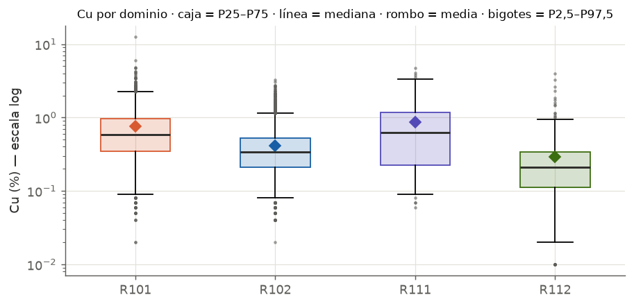

---
tags:
  - Interpretación
  - Análisis exploratorio
---

# Box plot (diagrama de caja)

## Qué muestra

Un resumen de la distribución en cinco números, ideal para **comparar varios dominios lado a lado**.

| Elemento | Qué representa |
|---|---|
| Borde inferior de la caja | Percentil 25 (P25, primer cuartil) |
| Línea dentro de la caja | **Mediana** (P50) |
| Borde superior de la caja | Percentil 75 (P75, tercer cuartil) |
| Punto o rombo | **Media** (si el software la dibuja) |
| Bigotes | Hasta dónde llegan los datos "normales" |
| Puntos sueltos | Datos fuera de los bigotes: candidatos a atípicos |

!!! warning "En Vulcan los bigotes no son los de Tukey"
    En la definición clásica (Tukey), los bigotes llegan hasta 1,5 veces el rango intercuartil. En
    el Data Analyser de Vulcan llegan a los **percentiles 2,5 y 97,5**. Por eso, en Vulcan, "sobre el
    bigote superior" significa "sobre el **P97,5**": el 2,5 % más alto de los datos.

## Cómo leerlo

1. **Posición de la caja:** dónde está la mayoría de los datos (el 50 % central).
2. **Largo de la caja:** la dispersión. Una caja larga indica una variable más variable.
3. **Posición de la mediana dentro de la caja:** si está más cerca del borde inferior, hay asimetría
   positiva.
4. **Media contra mediana:** si la media está por encima de la mediana, la cola alta pesa.
5. **Bigote superior más largo que el inferior:** otra señal de asimetría positiva.
6. **Puntos sobre el bigote superior:** los candidatos a atípicos.
7. **Comparar dominios:** ¿se solapan las cajas? Si no se solapan, son poblaciones claramente
   distintas.

## Patrones típicos

| Lo que ves | Qué significa | Qué hacer |
|---|---|---|
| Cajas de dos dominios que no se solapan | Poblaciones distintas | Mantenerlos separados |
| Cajas casi iguales | Distribuciones parecidas | Evaluar juntarlos (confirmar con Q-Q y geología) |
| Media muy sobre la mediana | Cola alta importante | Revisar atípicos y capping |
| Muchos puntos sobre el bigote, uno muy lejos | Cola alta con un valor extremo | Verificar ese valor en la base (QA/QC) |
| Caja muy aplastada cerca del mínimo | Muchos valores bajos o bajo el límite de detección | Revisar el registro del límite de detección |

## Ejemplo con datos reales

- **R101 y R111** (alta ley) tienen cajas más altas que **R102 y R112** (halos): la separación entre
  alta ley y halo está bien justificada.
- Las cajas de **R101** (0,35–0,97 %) y **R102** (0,21–0,53 %) se solapan solo entre 0,35 y 0,53 %,
  y la **mediana de R101 (0,59 %) queda sobre toda la caja de R102**: son dos poblaciones distintas.
- En todos los dominios la **media (rombo) está sobre la mediana**: asimetría positiva.
- R101 tiene un punto aislado en **12,51 %**, muy lejos del resto: es el valor que hay que revisar.

## Qué escribir en un informe

- Cómo se comparan los dominios: "la mediana de R101 queda sobre toda la caja de R102, lo que
  confirma poblaciones distintas".
- Dónde empiezan los atípicos (P97,5) y cuáles son los más extremos.
- La relación media / mediana como evidencia de asimetría.
