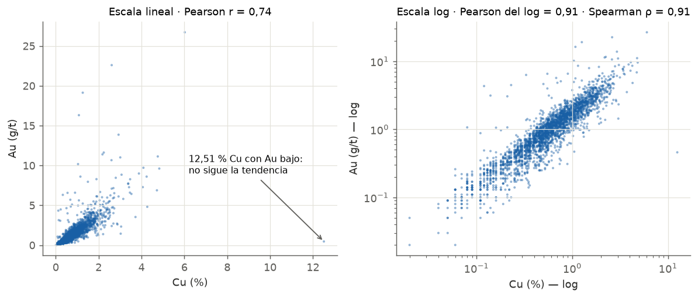

---
tags:
  - Interpretación
  - Análisis exploratorio
---

# Gráfico de dispersión y correlación

## Qué muestra

Cada punto es una muestra con el valor de una variable en el eje X y el de otra en el eje Y (por
ejemplo, Cu y Au). Muestra si las dos variables **varían juntas** y de qué forma.

## Cómo leerlo

1. **Dirección de la nube:** si sube hacia la derecha, la relación es positiva; si baja, negativa.
2. **Forma:** ¿es una recta o una curva? Pearson solo mide relaciones rectas.
3. **Ancho de la nube:** una nube angosta indica una relación fuerte; una nube ancha, una débil.
4. **Puntos fuera de la nube:** valores que no siguen la tendencia (errores, otra población).
5. **La nube se abre a la derecha (forma de cono):** la variabilidad crece con la ley, que es el
   **efecto proporcional**, típico de leyes lognormales.
6. **Grupos separados:** dos nubes distintas indican dos poblaciones (mezcla de dominios).
7. **Recién al final, los coeficientes.** Ningún número se interpreta sin mirar antes el gráfico.

## Cómo leer Pearson y Spearman juntos

| Se observa | Significa | Qué hacer |
|---|---|---|
| r ≈ ρ, ambos altos | Relación lineal limpia | Usar la regresión con confianza |
| r bajo, ρ alto | Relación fuerte pero curva | Mirar en escala log o usar rangos |
| r alto, ρ bajo | Unos pocos extremos fabrican la correlación | Revisar esos datos |
| r ≈ 0 y ρ ≈ 0 | Sin relación monótona | Mirar el gráfico: podría ser en U |
| Signos opuestos | Señal de alarma | Buscar atípicos o mezcla de dominios |

| \|r\| o \|ρ\| | Lectura habitual |
|---|---|
| 0,0 – 0,3 | Despreciable |
| 0,3 – 0,5 | Débil |
| 0,5 – 0,7 | Moderada |
| 0,7 – 0,9 | Fuerte |
| > 0,9 | Muy fuerte: revisar que una variable no se calcule a partir de la otra |

## Ejemplo con datos reales

- En **escala lineal** (izquierda) la nube es un cono que se abre hacia la derecha: hay **efecto
  proporcional**. Pearson da **0,74**.
- En **escala log** (derecha) la nube es una banda recta y angosta: Pearson del logaritmo sube a
  **0,91** y Spearman es **0,91**. La relación Cu-Au es **muy fuerte**; en escala lineal se veía
  más débil solo por la forma lognormal de los datos.
- El **12,51 % Cu con solo 0,46 g/t Au** queda fuera de la tendencia. En una muestra real de este
  depósito, tanto cobre debería venir con más oro: es otra razón para revisar ese dato.

!!! question "¿Por qué Spearman da más alto que Pearson aquí?"
    Pearson mide qué tan bien los puntos se ajustan a una **recta**. Con leyes lognormales, la
    relación es curva en escala lineal y unos pocos valores altos dominan el cálculo. Spearman usa los
    **rangos** (el orden de los datos), así que no le afecta la forma de la curva ni la magnitud de
    los extremos.

## Qué escribir en un informe

- "Cu y Au presentan una correlación muy fuerte en R101 (Spearman 0,91; Pearson del logaritmo 0,91).
  La correlación lineal es menor (Pearson 0,74) por la asimetría de ambas variables."
- La presencia de efecto proporcional, si lo hay.
- Las muestras que se salen de la tendencia y qué se hizo con ellas.
