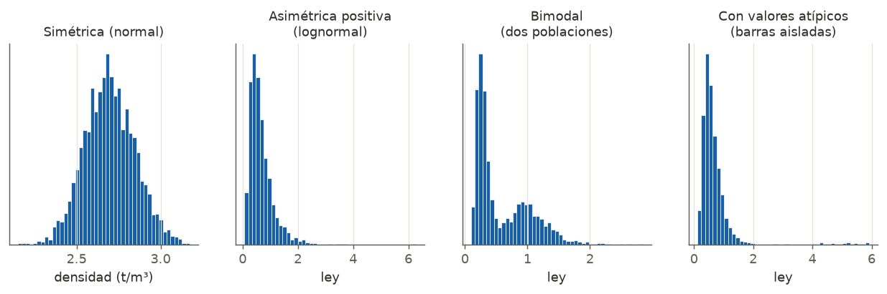
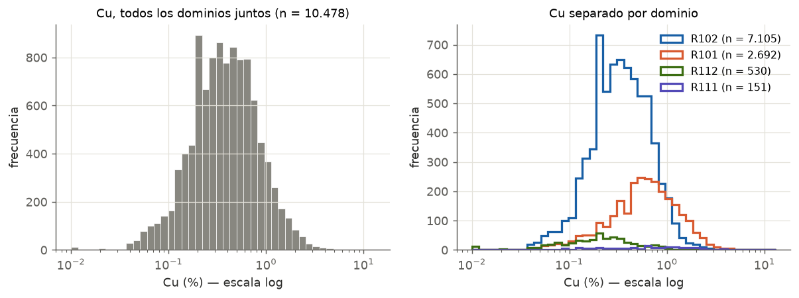
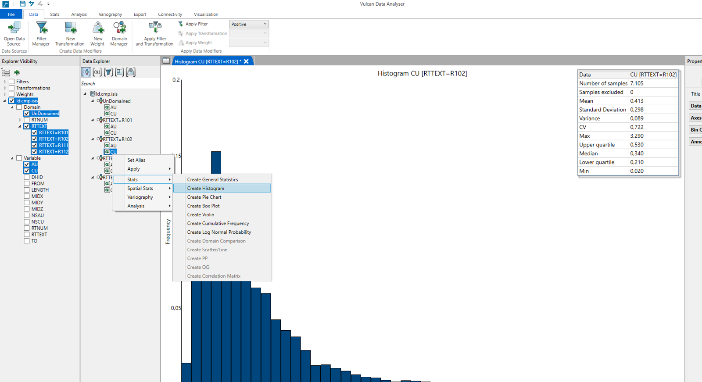

---
tags:
  - Interpretación
  - Análisis exploratorio
---

# Histograma

## Qué muestra

Cuántos datos caen en cada rango de ley. Es la **forma** de la distribución: dónde se concentran los
valores, qué tan dispersos están y si hay colas o grupos separados.

## Cómo leerlo

1. **Ejes y unidades.** Revisa qué variable es, en qué unidad, cuántos datos hay (*n*) y si el eje X
   está en escala lineal o logarítmica.
2. **Forma general.** ¿Es simétrico o tiene una cola hacia la derecha?
3. **Cuántas modas (picos) tiene.** Un pico sugiere una población; dos picos, dos poblaciones.
4. **La cola alta.** ¿Baja de a poco o hay barras aisladas muy lejos del resto?
5. **Valores imposibles.** Barras en cero, negativos o en −99 son errores o códigos de dato faltante.
6. **Compara con las estadísticas.** Si la media está muy por encima de la mediana, la cola alta pesa.

## Patrones típicos

| Lo que ves | Qué significa | Qué hacer |
|---|---|---|
| Campana simétrica | Distribución normal. Raro en leyes; común en densidad o potencias | Trabajar en escala lineal |
| Cola larga a la derecha | Distribución **lognormal**, la típica de leyes. Media > mediana | Mirarlo en escala log; reportar también la mediana |
| Dos picos | **Mezcla de poblaciones**: dos dominios, óxidos y sulfuros, dos litologías… | Separar por dominio antes de seguir |
| Barras aisladas muy a la derecha | **Valores atípicos** | Verificar el dato y evaluar capping |
| Pico en el valor mínimo | Muchos valores en el **límite de detección** | Revisar cómo se registraron (LD, LD/2…) |
| Barras en cero o negativas | Códigos de dato faltante (−99) mal cargados | Filtrarlos: no son leyes reales |
| Histograma "cortado" en un valor | Datos ya filtrados o recortados (capping) | Confirmar qué filtro se aplicó |

!!! question "¿Por qué mirar el histograma en escala logarítmica?"
    En escala lineal, una distribución lognormal se ve como un pico pegado al cero con una cola
    larga, y no se distingue nada. En escala log se "abre" y se ve una campana: ahí se notan mejor
    las modas y los grupos.

## Ejemplo con datos reales

- **Todos los datos juntos** (izquierda) parecen una sola campana en escala log. No hay dos picos
  evidentes.
- **Separados por dominio** (derecha), se ve que R101 está **desplazado hacia leyes más altas** que
  R102 (mediana 0,59 % contra 0,34 %). La mezcla estaba escondida porque las poblaciones se
  solapan.

!!! warning "Un solo pico no garantiza una sola población"
    Si dos poblaciones se solapan mucho, el histograma conjunto puede verse unimodal. Por eso el
    histograma siempre se mira **por dominio**, y se complementa con el box plot y el gráfico de
    probabilidad.

## Qué escribir en un informe

- El tipo de distribución: "asimétrica positiva, consistente con una distribución lognormal".
- Si hay una o varias poblaciones y cómo se resolvió: "se separó por dominio".
- La presencia de una cola alta o de atípicos, con su valor.
- Siempre junto con *n*, la media, la mediana y el CV.

!!! info "En Vulcan"
    *Data Analyser* → clic derecho en la variable → **Stats → Create Histogram**. En *Properties*,
    **Label values** muestra la cantidad de datos en cada barra. Ver el
    [cuaderno de la semana 4](../icmi222/cuaderno/04-aed-bivariado.md).
