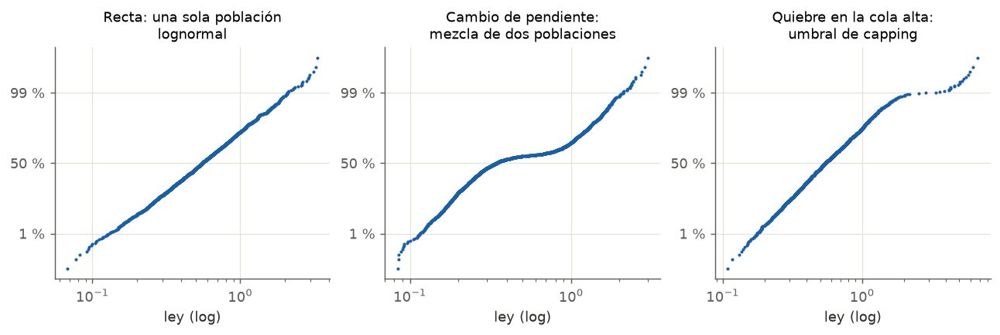
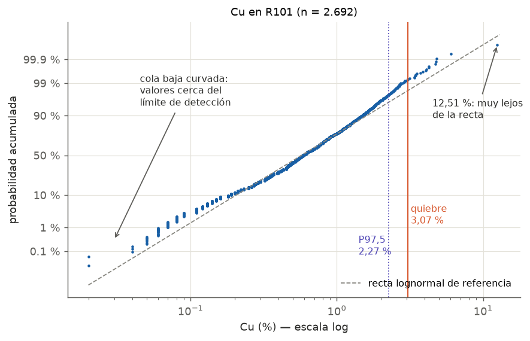

---
tags:
  - Interpretación
  - Análisis exploratorio
  - Capping
---

# Gráfico de probabilidad (lognormal)

## Qué muestra

Los datos ordenados de menor a mayor contra su **probabilidad acumulada**, con el eje vertical
deformado para que una distribución teórica (normal o lognormal) se vea como una **línea recta**.

- En el gráfico **log normal probability** de Vulcan, el eje X está en escala logarítmica.
- Si los puntos forman una recta, los datos siguen una distribución **lognormal**.
- Cualquier curva, cambio de pendiente o quiebre indica que los datos **se apartan** de esa
  distribución, y ahí está la información.

!!! question "¿Por qué es la mejor herramienta para los atípicos?"
    En el histograma, la cola alta son barras diminutas que casi no se ven. En el gráfico de
    probabilidad, cada dato es un punto y la cola alta queda estirada en la parte superior: es fácil
    ver dónde los datos dejan de seguir la recta.

## Cómo leerlo

1. **El tramo central** (entre 10 % y 90 %): ¿es una recta? Si lo es, la población principal es
   lognormal.
2. **Cambios de pendiente:** una "S" o un tramo con otra inclinación indica **dos poblaciones**
   mezcladas.
3. **La cola alta** (sobre 97–99 %): ¿los puntos siguen la recta o se despegan? El punto donde se
   despegan es el **umbral de capping** o de filtro.
4. **La cola baja:** si se curva o forma escalones, suele haber valores en el límite de detección o
   redondeados.
5. **Escalones horizontales:** muchos datos con el mismo valor (redondeo, límite de detección).

## Patrones típicos

| Lo que ves | Qué significa | Qué hacer |
|---|---|---|
| Una recta en todo el rango | Una sola población lognormal | Dominio bien definido |
| Cambio de pendiente en el medio | Mezcla de dos poblaciones | Revisar los dominios |
| Quiebre en la cola alta | Valores que no pertenecen a la población principal | Umbral de capping o de filtro en ese valor |
| Un punto solo, muy lejos | Valor extremo aislado | Verificar en la base (QA/QC) antes de recortar |
| Cola baja curvada o en escalones | Límite de detección o redondeo | Normalmente no afecta: documentarlo |

## Ejemplo con datos reales

- Entre ~1 % y ~97 % los puntos siguen bastante bien la recta: la población principal de R101 es
  **lognormal**.
- Sobre **3,07 %** los puntos se despegan de la recta: ese es el **quiebre**, y se usó como límite
  del filtro para el variograma.
- El **P97,5 (2,27 %)** está un poco antes del quiebre. Los dos criterios apuntan a la misma zona,
  lo que da confianza en el umbral.
- El **12,51 %** queda muy lejos de todo: es un valor para revisar en la base, no solo para recortar.

!!! info "Umbral de capping o de filtro: dos usos del mismo análisis"
    El quiebre sirve para **filtrar** los datos al calcular el variograma (no se usan) y para hacer
    **capping** en la estimación (se recortan a ese valor). Ver el
    [tutorial del variograma](../icmi222/tutorial-variograma.md#2-filtrar-los-valores-atipicos).

## Qué escribir en un informe

- "La distribución de Cu en R101 es aproximadamente lognormal; el gráfico de probabilidad muestra un
  quiebre en 3,07 % Cu, que coincide con la zona del P97,5 (2,27 %)."
- Cuántos datos quedan sobre el umbral (en R101: 18 de 2.692, el 0,67 %).
- Qué se hizo con ellos (filtro para variografía, capping en la estimación) y por qué.
