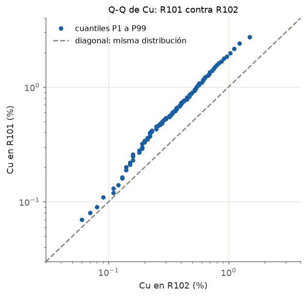

---
tags:
  - Interpretación
  - Análisis exploratorio
  - Dominios
---

# Gráfico Q-Q

## Qué muestra

Los **cuantiles** de una población contra los de otra: el P1 de A contra el P1 de B, el P2 contra
el P2, y así hasta el P99. Responde una sola pregunta: **¿estas dos poblaciones tienen la misma
distribución?**

A diferencia de la dispersión, aquí las muestras **no tienen que estar emparejadas**: se pueden
comparar dos dominios, dos campañas de sondajes o dos laboratorios con distinto número de datos.

## Cómo leerlo

1. **Dibuja (o busca) la diagonal** de 45°: es la línea de "distribuciones iguales".
2. **¿Los puntos siguen la diagonal?** Entonces las dos poblaciones son iguales.
3. **¿Siguen una recta paralela a la diagonal pero desplazada?** Misma forma, distinta ley media: una
   población es sistemáticamente más alta.
4. **¿Siguen una recta con otra pendiente?** Distinta dispersión.
5. **¿Se separan solo en los extremos?** Las poblaciones difieren solo en la cola (atípicos).

## Patrones típicos

| Lo que ves | Qué significa | Qué hacer |
|---|---|---|
| Puntos sobre la diagonal | Misma distribución | Se pueden juntar (si la geología lo permite) |
| Paralela y desplazada | Misma forma, distinta media | Dominios distintos; o sesgo entre campañas |
| Otra pendiente | Distinta variabilidad | Dominios distintos |
| Igual al centro, distinto en las colas | Diferencia solo en los extremos | Revisar atípicos y capping |
| Nube bajo la diagonal en campañas | Una campaña da leyes más bajas | Sesgo de laboratorio o de muestreo: investigar antes de juntar |

## Ejemplo con datos reales

- Todos los puntos quedan **sobre la diagonal**: en cada cuantil, R101 tiene más Cu que R102.
- La nube es casi **paralela a la diagonal** (en escala log): las dos tienen una forma parecida, pero
  R101 está desplazada hacia arriba, con leyes ~1,7 veces más altas en la zona central.
- Conclusión: **son poblaciones distintas** y está bien estimarlas por separado (contacto duro o, al
  menos, dominios distintos).

## Qué escribir en un informe

- "El gráfico Q-Q de Cu entre R101 y R102 muestra que todos los cuantiles de R101 superan a los de
  R102, lo que confirma dos poblaciones distintas y justifica estimarlas por separado."
- Si se juntaron dominios o campañas, mostrar el Q-Q que lo justifica.
