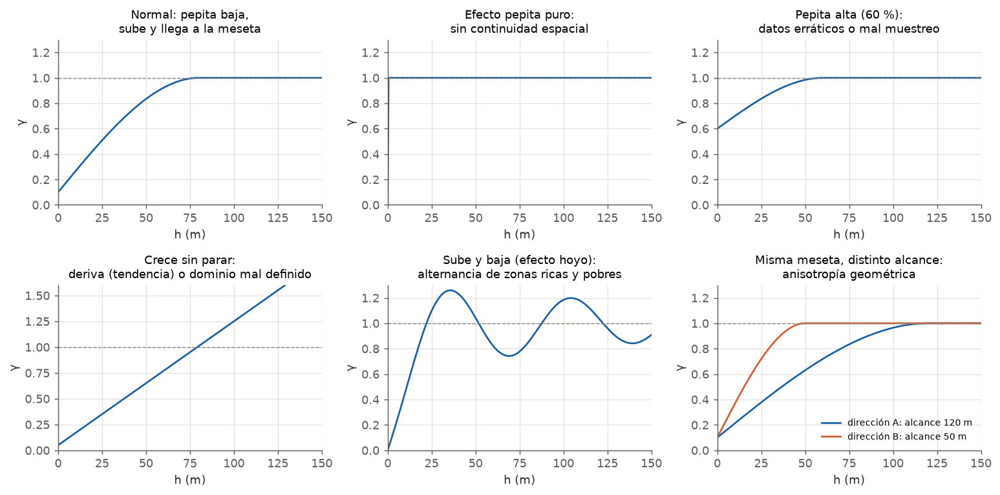
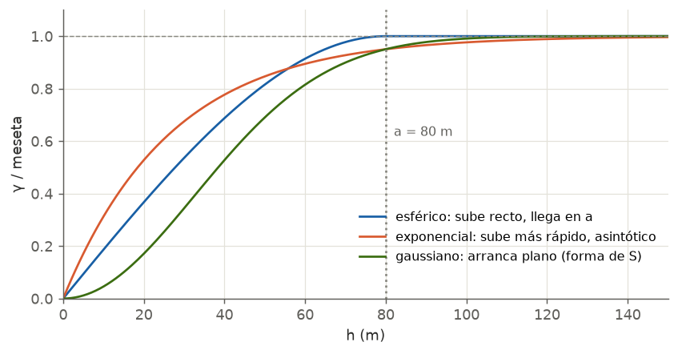
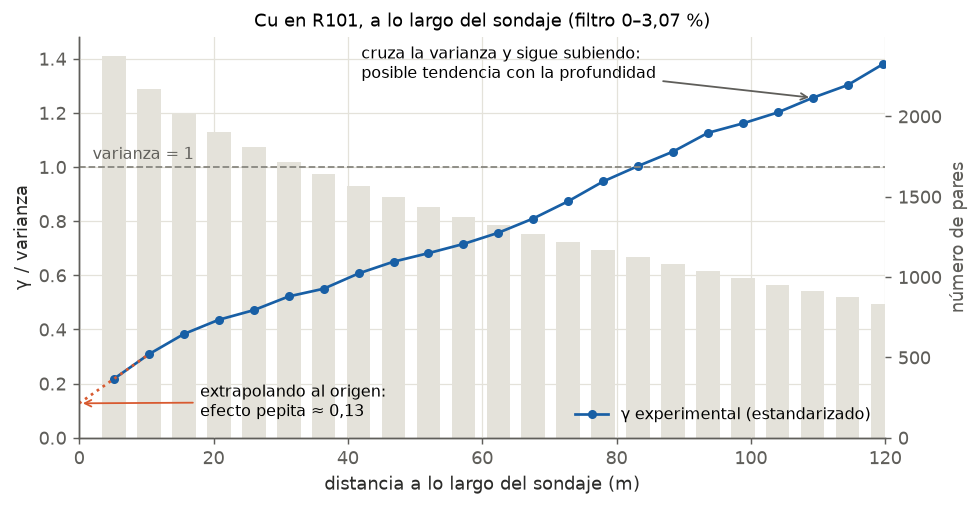
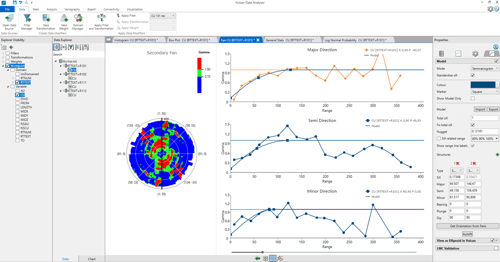

---
tags:
  - Interpretación
  - Variografía
---

# Variograma

## Qué muestra

Cuánto se diferencian, en promedio, dos muestras según la **distancia h** que las separa. En el eje
X va la distancia y en el eje Y, γ(h): la mitad del promedio de las diferencias al cuadrado.

- **Bajo** = las muestras a esa distancia se parecen.
- **Alto** = ya no se parecen.

Hay dos curvas que se leen juntas:

- **Experimental** (puntos): calculada con los pares de muestras reales. Tiene ruido.
- **Modelo** (línea continua): la función matemática que se ajusta a los puntos y que usa la
  estimación.

Si la **meseta está estandarizada** (*Standardise sill* en Vulcan), γ se divide por la varianza: la
meseta esperada es **1**.

## Cómo leerlo, paso a paso

1. **Número de pares de cada punto.** Si un punto tiene menos de ~30 pares, no se interpreta.
2. **El origen (efecto pepita).** ¿Dónde cortaría la curva al eje Y si se prolongan los primeros
   puntos? Ese valor es la pepita.
3. **La forma cerca del origen.** ¿Sube recto (esférico), curvo y rápido (exponencial) o arranca plano
   (gaussiano)?
4. **El alcance.** ¿A qué distancia deja de subir?
5. **La meseta.** ¿A qué valor llega? ¿Se parece a la varianza (1 si está estandarizado)?
6. **Las distancias grandes.** ¿Se mantiene plano, sube sin parar o sube y baja?
7. **Las direcciones.** ¿El alcance cambia según la dirección (anisotropía)?

## Patrones típicos

| Lo que ves | Qué significa | Qué hacer |
|---|---|---|
| Pepita baja, sube y llega a la meseta | Continuidad espacial clara | Modelar normalmente |
| Plano desde el origen (efecto pepita puro) | No hay continuidad a la escala del muestreo | La geoestadística no aporta: la mejor estimación es la media del dominio |
| Pepita alta (> 50 % de la meseta) | Datos erráticos o mucho error de muestreo | Revisar QA/QC, compósitos y atípicos antes de modelar |
| Crece sin detenerse | **Deriva**: la ley media cambia en el espacio (por ejemplo, con la profundidad) | Revisar el dominio o modelar la tendencia |
| Sube y baja (efecto hoyo) | Alternancia de zonas ricas y pobres a una escala regular | No forzar el modelo; puede reflejar estructuras repetidas |
| Misma meseta, distinto alcance según la dirección | Anisotropía **geométrica** | Elipsoide con alcances distintos |
| Distinta meseta según la dirección | Anisotropía **zonal** (estratificación) | Agregar una estructura en una sola dirección |
| Puntos que saltan a distancias grandes | Pocos pares | No interpretar más allá de la mitad del campo |

## Los modelos y su forma cerca del origen

| Modelo | Cómo se reconoce | Qué representa |
|---|---|---|
| **Esférico** | Sube casi recto y llega a la meseta justo en el alcance, con un "hombro" marcado | El más usado para leyes: continuidad moderada y bien comportada |
| **Exponencial** | Sube más rápido al principio y nunca toca la meseta (alcance práctico al 95 %) | Fenómenos más erráticos a corta distancia |
| **Gaussiano** | Arranca casi plano, forma de S | Fenómenos muy continuos (potencias, cotas). Siempre con un poco de pepita |

La elección se hace mirando **los primeros puntos**, que son los que más influyen en la estimación.

## El efecto pepita relativo

| Pepita / meseta | Continuidad | Consecuencia en la estimación |
|---|---|---|
| < 0,15 | Muy buena | Estimación precisa |
| 0,15 – 0,30 | Buena | Estimación confiable |
| 0,30 – 0,50 | Moderada | Suavizamiento notorio |
| > 0,50 | Errática | Revisar QA/QC y compósitos antes que el modelo |

!!! question "¿Por qué la pepita se define a lo largo del sondaje?"
    Es la dirección con **más pares a distancias cortas** (las muestras son consecutivas, cada ~5 m).
    En las otras direcciones, los pares más cercanos están entre sondajes distintos, a decenas de
    metros, y no hay información para saber qué pasa cerca del origen.

## Cómo leer un fan variogram de Vulcan

- **El abanico (*fan*)**: un mapa polar donde el color es γ (rojo = alto, verde = medio, azul = bajo).
  La dirección donde los colores bajos llegan **más lejos del centro** es la de mayor continuidad.
- **Los tres gráficos direccionales**: *Major*, *Semi* y *Minor direction*. La leyenda dice la
  orientación de cada uno, por ejemplo `A 0,90 P -40,07` = azimut 0,9°, plunge −40°.
- **Los cuadraditos sobre la curva del modelo** marcan el **alcance de cada estructura en esa
  dirección**. Son la forma más rápida de comprobar qué alcance está usando de verdad el modelo.

## Revisión antes de dar por bueno un modelo

| Revisar | Por qué |
|---|---|
| La pepita calza con el variograma a lo largo del sondaje | Es la dirección que mejor la define |
| La meseta total es 1 (si está estandarizada) | La suma de pepita y estructuras debe igualar la varianza |
| En cada estructura: alcance mayor ≥ semi ≥ menor | Si no, los nombres de los ejes no corresponden |
| La orientación del modelo es la de los variogramas (**Get Orientation from Fans**) | Si no, los alcances reales en cada dirección no son los escritos (ver el ejemplo) |
| El modelo sigue los primeros puntos, no los lejanos | Los cercanos al origen son los que mandan en la estimación |
| La dirección de mayor continuidad tiene sentido geológico | Si contradice la geología, revisar el dominio |

## Ejemplo con datos reales: Cu en R101

**1. Variograma a lo largo del sondaje**

- A 5 m, γ ya vale **0,22** de la varianza. Prolongando al origen, la **pepita ≈ 0,13**.
- Sube de forma continua y cruza la varianza cerca de los **85 m**.
- Después **sigue subiendo** (1,4 a 120 m): a lo largo del sondaje hay una posible **tendencia con la
  profundidad**. Conviene revisar la ley contra la cota antes de asumir estacionariedad en la vertical.

**2. Primer ajuste: pepita demasiado alta**

Pepita **0,38** y una estructura esférica. El modelo queda **por encima** de los primeros puntos de
la dirección mayor (el primero está cerca de 0,1). Comparado con el variograma a lo largo del sondaje,
la pepita estaba sobreestimada: se habría concluido "continuidad moderada" cuando es buena.

**3. Segundo ajuste: pepita corregida y dos estructuras**

Pepita **0,12** + esférico 1 (sill 0,17) + esférico 2 (sill 0,70) = **1,00** ✔. Pero la orientación
quedó en bearing 0 / plunge 0 / dip 90, mientras que los variogramas están inclinados −40° y +50°.
Los cuadraditos muestran los alcances **reales** en cada dirección:

| Dirección | Escrito en el modelo (estr. 1 / 2) | Real en el gráfico (cuadraditos) |
|---|---|---|
| Mayor (az 1°, −40°) | 69,5 / 148,7 m | **≈ 58 / 126 m** |
| Semi (az 1°, +50°) | 49,2 / 106,5 m | **≈ 55 / 119 m** |
| Menor (az 91°, horizontal) | 81,5 / 90,8 m | 82 / 91 m |

Lectura final: continuidad **buena** (pepita 12 %), dos escalas (~55 m y ~120 m), algo más continua
en el plano vertical norte-sur (~120–126 m) que en dirección este-oeste (~91 m): anisotropía
geométrica débil.

## Qué escribir en un informe

Una conclusión de variografía completa responde, en este orden:

1. **Con qué datos:** dominio, variable, filtro de atípicos y si la meseta se estandarizó.
2. **El modelo:** tipo, pepita, estructuras y sus alcances, y la orientación.
3. **La continuidad:** pepita relativa y su consecuencia (precisión, suavizamiento).
4. **La anisotropía:** dirección de mayor continuidad, razón de anisotropía y si tiene sentido
   geológico.
5. **La estacionariedad:** si la meseta coincide con la varianza o si hay deriva.
6. **Qué no se interpretó:** puntos con pocos pares, distancias sobre la mitad del campo.
7. **La consecuencia para la estimación:** el elipsoide de búsqueda (del orden de los alcances) y su
   orientación.

!!! example "Plantilla"
    El variograma experimental de **[variable]** en el dominio **[dominio]** se calculó sobre los
    compósitos del dominio, excluyendo **[n]** valores sobre **[umbral]** identificados en el gráfico
    de probabilidad, con meseta estandarizada. Se ajustó un modelo **[tipo]** con efecto pepita de
    **[C₀]** y **[estructuras y alcances]**, orientado con azimut **[°]** e inclinación **[°]**. El
    efecto pepita relativo de **[%]** indica una continuidad **[muy buena / buena / moderada /
    errática]**. La anisotropía es **[geométrica / zonal]**, con razón **[mayor/menor]**. La meseta
    **[coincide / no coincide]** con la varianza, lo que **[respalda / cuestiona]** la estacionariedad.
    Los puntos sobre **[distancia]** no se interpretan por el bajo número de pares. Se recomienda un
    elipsoide de búsqueda de **[alcances]** con la orientación del modelo.
