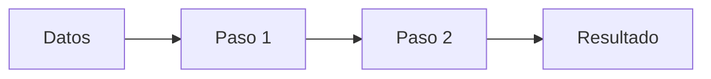

---
tags:
  - RAMO          # ej. ICMI222
  - SOFTWARE      # ej. Vulcan, Excel, Python
  - TEMA          # ej. Variografía
---

# Título del tutorial

!!! abstract "En una línea"
    Qué se hace y para qué sirve.

| | |
|---|---|
| **Ramo** | |
| **Clase** | fecha de la clase / fecha en que se desarrolló |
| **Software** | |
| **Datos de entrada** | |
| **Resultados** | archivos que se generan |

## Flujo general

---

## 1. Nombre de la etapa

### En el software

1. Menú → Submenú → Opción.
2. ...

| Parámetro | Valor |
|---|---|
| | |

!!! note "Teoría: concepto"
    Por qué se hace este paso y qué concepto hay detrás.

!!! bug "Errores comunes"
    - Lo que salió mal y cómo se arregló.

---

## Resultados y observaciones críticas

- Lo que conviene comentar en un informe.

## Preguntas de repaso

??? question "Pregunta"
    Respuesta.
